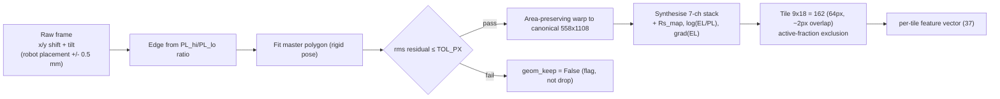
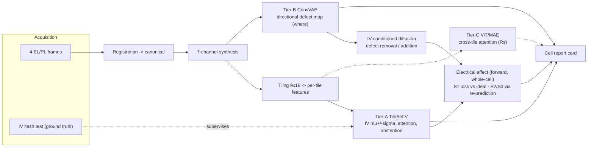
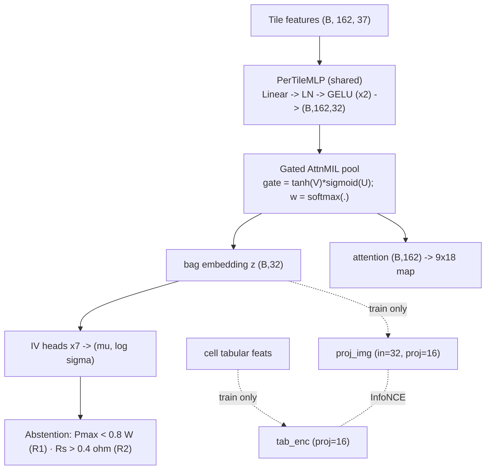
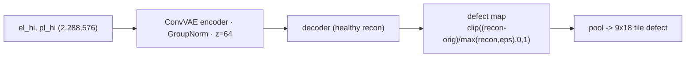
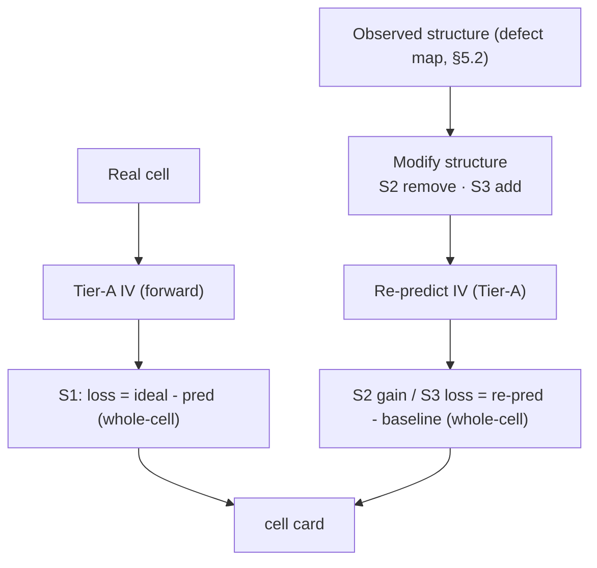
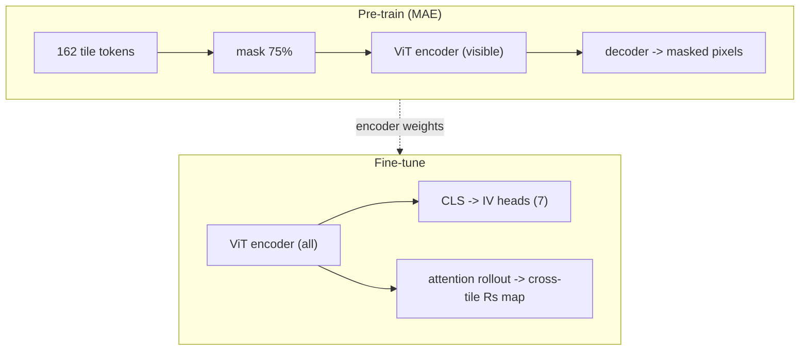
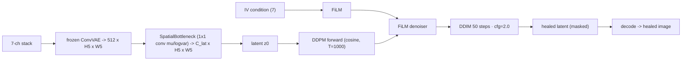
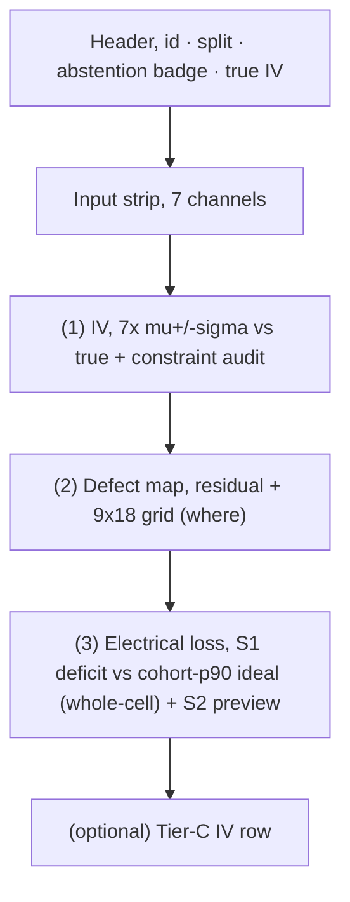

<!--
LUCIA, CAS final report (v9, full-report migration; aligned to the CAS project guideline).
Outline order follows the CAS guideline: Front page · Introduction · Data ·
Exploratory data analysis · Machine learning analysis · Results & discussion ·
Conclusion & outlook · Acknowledgements · References.
Target length ~16 pp (guideline range 10–20). Style: factual, declarative, numbers+units,
figures referenced in text with axis labels. Mermaid renders in Obsidian / GitHub / pandoc.
Placeholder convention: blocks marked  > **NEEDS INPUT:**  (facts only the authors have)
and  > **PLACEHOLDER:**  (numbers/figures to drop in). Full register at the end.

v9 changes (data + preprocessing fully written from the notebooks):
  · §2 Data rewritten and expanded to cover the full image-preparation chain across
    NB1a (IV cleaning + split), NB00b (edge-detection development), and NB1b (production
    registration → canonical masked stacks → per-tile features). Real numbers substituted
    for the §2/§3 NEEDS-INPUT placeholders on edge detection, the area-preserving rigid
    transform, the fixed canonical mask, and registration QC.
  · §3 registration prose trimmed to avoid duplicating §2; §3 now concentrates on the
    tile representation and the two feature sets.
v10 changes (intro taken over; §3 method per author draft; NB1-QC/NB2/NB3 results folded in):
  · §1 Introduction replaced with the supplied author text (typos fixed, duplication removed), with two inline FLAGs: band-gap value (≈1.1 eV not 1.2) and the per-region-attribution
    wording that contradicts the forward-only stance, reconciled to forward, flag kept.
  · §2/§3 de-duplicated: §2.3 now holds the cohort cascade + registration QC (authoritative
    NB1-QC numbers); the edge/registration/tiling METHOD moved to §3, rewritten to follow the
    author's Section-3 draft v4 (PL_hi/PL_lo ratio edge → master polygon → area-preserving
    rigid transform → overlapping 9×18 tiling → 7 channels → 37 features), NEEDS-INPUT filled.
  · Split reconciliation RESOLVED: 10,427 = unpaired (image-only) modelling cohort; models use
    its 7,293 / 1,570 / 1,564 split. NB00b reclassified as auxiliary (not a project NB).
  · §4.4, §5.0–5.2, §6.1–6.2, §6.5 updated with as-run numbers from NB1-QC / NB2 / NB3
    (TileSetIV checkpoint 20260628_213323, 37-feature; ConvVAE Track A/B; baselines run
    20260628_111631). Remaining NEEDS-INPUT: synthesis formulas, Optuna hyperparameters, NB1c, and the NB4/NB5/NB7 figures.
  · Number reconciliation flags from v9 are now closed.

v11 changes (NB4 documented; NB7 PT_PARAMS bug fixed):
  · §5.2 expanded to the full NB4 appearance stack, denoising-AE defect maps
    (`clip((recon−orig)/max(recon,ε),0,1)`, `defect_tile` (10427,2,9,18)), the latent-MSE
    auto-reject gate (p99 = 0.566, flag-not-drop), and the **6-class defect taxonomy**
    (intact 8,725 … contamination 96; monotone in defect extent and FF/Pmax; classifier 0.976).
  · §5.3 + §6.3 filled with the NB4 forward mechanisms and results: **occlusion attribution**
    (per-tile ΔFF/ΔPmax sensitivity) and **counterfactual headroom** (S1: FF +0.013 / Pmax
    +0.10 W median, ~94–96 % positive), plus the full-cohort **tile-activity map** feeding NB5.
  · §5.0 / §6.4 / §7 updated for NB4-done and the NB7 fix; outlook now notes S1 in place, S2 re-prediction the remaining step, and the bootstrap taxonomy to be hand-labelled.
  · **NB7 PT_PARAMS bug solved** (separate file `LUCIA_NB7_Inference_FIXED.ipynb`): the
    Yeo-Johnson inverse params are now bound from `nb3_ckpt['pt_params']` before `inv_yj()` is
    defined, fixes both the NameError ("things not loaded when applied") and the "bad inference
    values" (a stale/undefined inverse transform). RUN_IDs: NB4 20260628_163430, TileSetIV 20260628_213323, baselines 20260628_111631.

v12 changes (Tier-A chain completed; style pass):
  · §6.1 rebuilt from the re-run NB3 §4.7 comparison table (checkpoint TileSetIV_20260628_213323):
    full + confident (96.6 %) columns and the RF/HistGB/MLP baselines; gate not met on the full
    set (Pmax R² 0.778), met on the confident set (Pmax R² 0.908). Run-to-run variation noted.
  · §6.2 abstention updated to the same run and to the three-rule policy as implemented in NB7
    (R1 Pmax<0.8 W, R2 Rs>0.4 Ω, non-physical guard Pmax≤0); flags read from NB3 cell_flags.
  · §6.4 documents NB7 inference: abstention evaluated before rendering, ABSTAINED badge, S1
    deficit vs cohort-p90 ideal (FF 0.802 / Pmax 3.319 W), PT_PARAMS from the checkpoint.
  · §5.1/§5.2/§6.3/§6.5 numbers refreshed (attention ρ: border +0.80, EL −0.58/−0.65; Rs 0.598;
    constraint residuals 5.8–6.0 %; occlusion relabelled "occlusion sensitivity (diagnostic)").
  · Notebook map: NB3/NB7 done, NB1c portability + 37-feature re-run pending, NB5 to update on
    the Track-B latent. NB1c not yet supplied.
  · Style pass: removed evaluative wording (no "fair", "honestly", "strong", "successfully", "deliberately", "advantage", etc.); statements made factual (objective/method/result), discussion kept as context.

v15 changes (final runs folded in; report finalised for submission):
  · NB6 β-NLL run (`20260629_205140`): Rs 0.551 (near Tier-A 0.598) and Voc 0.863 recovered, but
    FF/Vmax/Imax collapse to negative R², no joint seven-target fit; Tier-C confirmed negative
    with the nuance that Rs (its target) is the one it approaches (§5.4, §6.5, §7).
  · NB5 (`20260629_214259`): direct `dec_conv` decode replaces the fc_mu round-trip; S2 on 64
    damaged cells gives non-zero ΔIV with r(n_active,ΔPmax)=+0.327 but recovery gate not met
    (11/64 FF); S3 cell errored (empty clean-cell selection), S2/S3 directional (§5.5, §6.3).
  · NB7 (`20260629_214259`): cards render S1 + S2 (5-page PDF) + cohort summary; S3 panel absent.
  · NB4 re-run (`20260629_205142`); §7 Conclusion + outlook updated; notebook map + register
    refreshed. Deliverable (Tier-A + NB1–NB4 localisation + S1) complete; Tier-C negative and the
    quantitative S2/S3 loop open are documented as such. Style factual.

REMAINING for the strongest version (not blocking conclusion): bottleneck-free decoder +
cohort-wide occlusion table to close S2/S3; per-target loss balancing for Tier-C; NB1c regen →
NB2 baseline re-run. Submission-prep (redaction, paths, .gitignore) tracked separately.

v16 changes (final results; abstract/intro replaced with author text; dash style removed):
  · Abstract + Introduction replaced with the author-supplied text (forward-only framing,
    band-gap 1.12 eV, EL=contact+passivation / PL=passivation, EL/PL ratio); resolved FLAGs.
  · NB6 final balanced run (20260630_144408): uniformly weak (FF 0.14/Pmax 0.17/Rs 0.10),
    Tier-C negative, not pursued (§5.4/§6.5/§7).
  · NB5 final (20260630_103347): trained DirectDecoder (val L1 0.013) + cohort occlusion;
    S2/S3 re-predict to ΔIV≈0, localized edits do not move IV; S1/headroom is the forward
    estimate (§5.5/§6.3). NB7 cards S1+S2+S3, 5-page PDF.
  · §2 confidentiality + figure/value (normalize-to-cohort) policy; §5.1 hyperparameters
    (embed_dim 64, hidden_attn 32); Appendix F CAS self-assessment added.
  · Em-dashes removed report-wide (style); en-dash numeric ranges kept.
  · Abstract written; §7 Conclusion rewritten as established / open-or-negative / outlook.
  · NB4 re-run (`20260629_084713`) consumes the current Tier-A checkpoint; `cls_path` separator
    and KB sizing fixed; headroom median FF +0.011 / Pmax +0.110 W; taxonomy + classifier 0.976.
  · NB5 re-run (`20260629_122646`): latent standardization removed the blow-up (healed latents
    ≈ ±5, on-manifold); generative headroom +0.096 / +0.48 W; S2 quantification still open
    (sample not electrically-active; fc_mu decode washout), §5.5/§6.3/§6.5 updated.
  · NB6 feature-token variant (`20260629_130707`): Voc/Isc/Rs up, FF −0.18 / Pmax 0.26 down;
    Tier-C below Tier-A in both pixel and feature-token forms, reported as a negative result
    (§5.4/§6.5).
  · Conclusion-readiness: the deliverable (Tier-A + NB1–NB4 localisation + S1 headroom) is
    complete; Tier-C (negative) and S2 (open) are documented as such. Style kept factual.

OPEN (post-conclusion, not blocking): close S2 (electrically-active sample + direct decode);
revisit Tier-C with larger cohort + head-stabilised fine-tuning; NB1c regen → NB2 baseline re-run
so §6.1 rests on one feature generation.
-->
Derk Leander Bätzner
Normannenweg 2
CH - 3232 Ins
[dbaetzner@proton.me](mailto:dbaetzner@proton.me)

# LUCIA
## Luminescence Understanding,
## Classification, Impact,
## & Attribution

### Predicting solar cell performance and attributing electrical loss in rear-contact silicon solar cells from EL/PL images

---
30 June 2026

---
## Abstract

In the LUCIA project we built model pipelines that predict seven IV parameters (Isc, Voc, FF, Pmax, Vmax, Imax, Rs) of rear-contact silicon solar cells from their electroluminescence (EL) and photoluminescence (PL) images and quantifies the cell performance loss that can be identified in the images, which can be attributed to defect detection and defect occlusion. Each cell is registered into a common canonical frame by an area-preserving rigid transform fitted to the cell edge, tiled on a fixed 9 × 18 grid, and summarised by 37 per-tile features; a tile-attention model with heteroscedastic heads (that can separate the heterogeneity of variance) predicts the seven parameters with per-cell uncertainty and an abstention rule. On a held-out test set it reaches R² = 0.886 for the fill factor (FF) prediction and, on the 96.6 %-coverage confident set, R² = 0.908 for the maximum Power of the cell (Pmax), with Spearman ρ ≥ 0.95 for six of seven targets, meeting a self-defined acceptance gate and exceeding tabular baselines on rank quality across all targets. An unsupervised autoencoder produces appearance defect maps and a six-class taxonomy that tracks FF and Pmax, and a counterfactual against the cohort top-decile estimates per-cell headroom (median Pmax +0.11 W). A latent-diffusion route for defect removal/addition and a cross-tile ViT for series resistance were prototyped; both are reported with their current limits. Outputs are unified in a per-cell report card.

---
## Data availability and confidentiality

> The cell imagery and the raw per-cell IV measurements are **proprietary and may be confidential**. They are **not included in this repository**. No raw source images and no raw tabular measurements are published here. Any image shown in the report is a redacted-stamped sample, a generated synthetic stand-in, or a derived representation; all IV values are normalized to their maximum. Reuse or redistribution of the underlying data beyond this report requires written authorization from the current rights holder or its successors. The notebooks read data from a local path configured by the `LUCIA_ROOT` environment variable; with no data present they run only up to the points that require it.

**Repository:** https://github.com/Deebike/LUCIA

## 1 · Introduction

The most relevant characterisation of solar cells is their performance, measured through the
current (I)–voltage (V) characteristic, the IV curve, under standard test conditions
(STC). From the IV curve a set of important IV parameters is extracted (see the IV-parameter
table in **Appendix A**). These parameters constitute an **aggregate measure** across the
entire cell, they 'average' over all cell areas, whose local quality may vary in uniformity
depending on how the cell was processed during manufacturing. To access **local** performance
information, imaging techniques are very powerful, especially those that capture the
**luminescence** signal of the cell.

**Luminescence: photoluminescence (PL) and electroluminescence (EL).** When electrical charge carriers
(electrons and holes) are generated in a solar cell they are either separated and extracted or
they recombine through one of several physical mechanisms. The mechanism used for imaging is
**radiative recombination**, which emits a photon at roughly the silicon band-gap energy (≈ 1.12 eV), corresponding to near-infrared (NIR) light with a peak near 1100 nm. This NIR
emission is the luminescence signal. Since the two main routes to generate charge carriers in
a cell are **generation by light** or **injection by current**, luminescence can be distinguished into **PL** and **EL**.

The captured luminescence images reveal local cell physics and carry **different** information
for PL and EL. The luminescence signal from radiative recombination is high where the carrier concentration is high and lower where non-radiative recombination decreases the carrier concentration; for the cells studied PL
correlates primarily with the **surface passivation** quality (high signal → good passivation, and vice versa). The **EL** signal is reduced by the same (predominantly surface) recombination *and* additionally in regions where carriers are injected less efficiently because of inferior local
**contact quality**. EL therefore reports contact quality **additional to** surface-passivation
quality, and taking the **EL/PL ratio** separates the two contributions (see the
channel→property table in **Appendix A**).

The cells studied are **rear-contact**: all electrical contacts are on the rear, the
front-side is optically uniform for the large majority of cell, except some extreme specimen, and carrier transport is **2-/3-dimensional**, which causes local intensity variations. Loss of uniformity therefore indicates an issue with the cell, but the
image alone gives neither an electrical **magnitude** nor an **attribution** of the cell's
measured under-performance to specific regions or the loss mechanism.

**Project idea and objective.** The envisioned output of LUCIA is a per-cell **report card**.
LUCIA is posed as three coupled tasks on the same representation:

> (i) **supervised multi-output regression** of seven IV parameters from image-derived
> per-tile features, with predictive uncertainty;
> (ii) **unsupervised localisation** of non-uniform regions, the cell **defect maps**;
> (iii) **quantification of the electrical performance loss** associated with the observed
> structure.

The three unifying questions are all **forward** (real or simulated cell → predicted IV):

 1. real cell with its real structure / defect → how much electrical loss? *(analytic)*
 2. real cell with the defect artificially removed → how much performance gain? *(simulation)*
 3. "ideal" cell with an artificial defect added → how much electrical loss? *(simulation)*

A measured IV parameter is a single global, spatially aggregated quantity, so inverting it to a
unique responsible region is **not identifiable**. The cell's left/right symmetry makes this
concrete: mirror-symmetric defect configurations are electrically indistinguishable. LUCIA
therefore **observes** structure from the image (task ii) and **computes its electrical effect
at the whole-cell level** by predicting or re-predicting IV (task iii), rather than attributing
loss to a region.

**Contributions.**
(1) A **register-then-tile** representation that makes spatial position
comparable across the cohort (a single canonical frame; §3), with an attention model
predicting seven IV parameters with calibrated uncertainty and an **abstention** response.
(2) An **appearance-based localisation** of structural non-uniformity (occlusion +
reconstruction-residual defect maps), *where* the structure is, observed, making no
inverse-attribution claim.
(3) A per-cell **report card** unifying prediction, localisation,
and the whole-cell electrical performance loss (the forward scenarios above).

---

## 2 · Data

> **Figure and value policy.** The four **raw** luminescence channels (EL_lo, EL_hi, PL_hi,
> PL_lo) are shown with a redaction-stamp. **Engineered/derived** channels (log(EL/PL), the EL gradient, and the Rs map) and statistics (defect-map heatmaps, the tiling grid, attention grids) are shown as is. IV-parameter values and plots are **normalized to a maximum value**: each parameter is divided by its cohort maximum so values lie in
> [0, 1], and predictions and truth are scaled by the same factor. R² and Spearman ρ are
> scale-invariant, so the reported metrics are unchanged. The only **absolute** quantities kept in the text are the data-cleaning exclusion limits (§2.2).

The data section covers the path from images and IV parameters to a clean, audited cohort: the raw luminescence channels and their physical meaning (§2.1), IV cleaning and cohort definition (§2.2, NB1a), the cohort cascade and registration quality gate (§2.3, NB1b + NB1-QC), and the splits and metrics (§2.4). The image-to-canonical **method** itself, cell-edge detection, the **area-preserving rigid registration** into one **fixed canonical mask** with identical horizontal alignment, masking and tiling, is the principal pre-processing stage and is documented in **§3**. That chain is the precondition for all spatially-resolved analysis downstream.

### 2.1 · Raw luminescence channels and image geometry

The available data were **four raw luminescence images per cell**, assembled into a unifying
folder structure, together with a dictionary linking each image set to its IV parameters and
additional tabular features. This linkage was established in a preceding project: the images
were collected from a widespread, dendritic file structure and the tabular data extracted from a PostgreSQL database, then joined to the image paths in a JSON dictionary
(`cell_data_dictionary_backup.json`) using Python scripts. This resulted in slightly more than 11'000 cells as candidate units for a set of multi-modal data before cleaning.  

The four raw channels, each an **8-bit greyscale frame of 564 × 1110 px** (rows × columns),
are:

| Channel (code) | Source file tag | Excitation                       |
| -------------- | --------------- | -------------------------------- |
| `EL_lo`        | `1`             | low current (≈ 1/10 * Isc)       |
| `EL_hi`        | `2`             | high current (≈ 1 * Isc )        |
| `PL_hi`        | `PL`            | irradiation ≈ 1-sun (red + IR)   |
| `PL_lo`        | `2PL`           | irradiation ≈ 0.5-sun (red only) |

The cells have been processed on the industry standard size M6, which are pseudo-square wafers: a square with chamfered corners, which are cut into half wafer substrates, thus the nominal active solar cell area is **13,710 mm²**. From the known specified geometry of the M6 wafer the nominal geometric parameters of the half-wafer edge are calculated and matched with the image dimensions and pixels.

*Schematic of a M6 pseudo-square wafer and the separation into a half-wafer*

The position of the half-wafer solar cells onto the measurement chuck was handled by a 6-axes robot with a high accuracy of around ±0.5mm which corresponds to roughly ±3 pixels in the image. Depending on the handling automation's vision system's edge detection the cells were also placed are a tilt angle with respect to the image edges. 

In order to facilitate the subdivision of the active cell are sections into equal tiles a **edge detection (§2.3)** procedure was developed that allowed the later application of the **fixed canonical mask** and tiling. For details on the edge detection see the edge_detection.md.

Targets (IV parameters, ground truth from the IV test): `Voc, Isc, Vmax, Imax, FF,
Pmax, Rs` (defined in the Appendix table). After registration the four raw channels are stored
as a single canonical tensor (`cell_stacks` `(10821, 4, 558, 1108) uint8`) with a companion
`cell_masks` `(10821, 558, 1108)`; the three synthesised channels (`Rs_map`, `log(EL/PL)`,
`grad(EL)`) are derived on demand from these four (`lc.synthesize_channels`, Appendix E.3).
Files, schema, and the row→cell mapping (`lucia_geometry.parquet.npy_index`) are catalogued
in **Appendix E**.

### 2.2 · IV cleaning and cohort definition (NB1a)

The starting cohort is **11,203 cells**, the canonical-name set built from the source
dictionary (11,203 JSON keys → 11,203 canonical names, **no key collisions**; 78 raw
columns). NB1a cleans by **physical limit, not percentile**. The IV parameters are bounded
with physical limits (§4.1), percentile cuts would take away the most interesting range of the high performing cells. The exclusions are summaries in the table below:

| Hard rule | Cells removed |
|---|---|
| `FF < 0.25` | 335 |
| `FF > 0.90` | 1 |
| `Voc < 0.50` | 271 |
| `Isc < 3.0` | 241 |
| **Total hard-excluded** (union) | **381** (3.4 %) |
| **`iv_keep = True`** | **10,821** |

(The per-rule counts sum with overlap to 381 flagged by the boolean rule; `iv_keep = False`
totals **382** because one further row carries a NaN IV value, hence the 381/382 which are
quoted in NB1a vs the NB1b combined summary; both refer to the same ≈3.4 % loss in the cohort due to IV parameters)

Two further keep-flags are merged in (cells are *flagged, never hard-deleted*): a
list with cells that were not measured under standard conditions and thus not comparable to the other cells ( 71 listed, 57 within the cohort)  and a union of  **manual eye-pick** exclusion lists ( 49 listed, 46 within cohort). The reduced modelling cohort is thus **10,735 cells**. Candidate lower-tail cuts
(`CAND_VOC_LO`, `CAND_ISC_LO`, `CAND_FF_LO`, `CAND_PMAX_LO`) are computed and printed for
review but left unconfirmed in the as-run notebook.

### 2.3 · Cohort, registration QC, and rejection accounting (NB1b + NB1-QC)

The raw frames are turned into the model-ready canonical stacks by the fused image pipeline
(NB1b); the **method**, cell-edge detection, the area-preserving rigid registration into a
fixed canonical frame, masking and tiling, is documented in **§3**. This subsection records
the **data-quality outcome** of that pipeline, audited by a dedicated gate notebook (NB1-QC)
that must print PASS on every check before modelling begins.

**Cohort cascade (NB1-QC Check 1).** Of the 11,203 cells, the **hard exclusions** (cells that
are completely unusable) are:

| Hard exclusion | Count | % of 11,203 |
|---|---|---|
| IV fail (`iv_keep = False`, §2.2) | 382 | 3.4 % |
| Missing images (≥1 of 4 channels absent) | 266 | 2.4 % |
| Geometry fail (`geom_keep = False`) | 63 | 0.6 % |
| **Combined hard exclusions** | **711** | **6.3 %** (target ≤ 10 %, PASS) |

A separate set of cells is **flagged but kept** (the data are valid and stay in the
container): `saturated` 856 (7.6 %, clipped EL/PL, still carries real defect information),
`ambiguous_pairing` 283 (2.5 %, image↔IV match uncertain), `shadow_masked` 57 (0.5 %),
`manual_excluded` 46 (0.4 %). From these the two **modelling cohorts** follow:

- **Unpaired cohort = 10,427 cells (93.1 %)**, for image-only models (TileSetIV §5.1, ConvVAE §5.2, tabular baselines). *This is the "10,427" that appears throughout §5–§6.*
- **Paired cohort = 10,166 cells (90.7 %)**, for the contrastive image↔tabular marriage, which additionally drops the 261 ambiguous-pairing cells.

**Registration QC (NB1-QC Check 3).** The pose-fit residuals are:
**rms probe residual median 1.93 px, p99 2.31 px** (gate: median ≤ 2 px); rotation
**θ median 0.141°, p99 |θ| 0.200°, max 0.555°** (gate ≤ 1.5°); registered **cell area median
13,704.9 mm²**, inside the QC band 13,670–13,750 mm², confirming the transformation is
area-preserving. Only **63 cells (0.6 %)** fail `geom_keep`. The geometry parquet
(`lucia_geometry.parquet`) holds 10,555 rows = `iv_keep` (10,821) − missing-image cells (266).

**Channel- and feature-level QC (NB1-QC Checks 6–8).** The per-tile feature table has **zero
NaNs** (gate < 0.1 %); the synthesised `rs_map` tile means sit in the physical band
(median 0.896, 95.8 % within 0.3–2.0); border tiles are correctly darker than internal tiles
(`mean_pl_hi` 129.0 vs 151.2). Two **physics correlations**, a check on registration and the
channels, both pass on the training split (n = 7,293):
log(PL_hi whole-cell mean) vs Voc **ρ = +0.819** (≥ 0.79 expected) and the EL_hi internal-tile
coefficient of variation vs FF **ρ = −0.678** (≤ −0.60 expected).

Outputs of the pipeline:
`cell_stacks.npy` `(10821, 4, 558, 1108) uint8` (≈26 GB memmap),
`cell_masks.npy` `(10821, 558, 1108)` (≈7 GB), 
`lucia_geometry.parquet` (pose, matrix `M`, QC, flags, `npy_index`), and `lucia_tile_features.parquet` (the per-tile features of §3).

![[04_Results/figures/UBELIX/qc8_physics_correlations.png]]

*Figure 2.1: cohort-cascade / rejection bar

Figure 2.2: registration QC distributions (rms residual, `θ`, `area_mm2`) + the rejected-geometry grid (NB1-QC Check 4);

![[04_Results/figures/UBELIX/qc8_physics_correlations.png]]

*Figure 2.3: physics-correlation scatter plots; left: Voc vs. log(PL_avg), right: FF vs. EL-non-uniformity*

The scatter plot in fig. 2.3 
### 2.4 · Splits and metrics

The split is built in NB1a: a **Pmax-quantile-stratified 70/15/15** train/val/test split
(`SPLIT_SEED = 42`, four `pd.qcut` Pmax bins, `SPLIT_TARGETS = {train:0.70, val:0.15,
test:0.15}`). Cells from one production lot are **allowed to span splits** (a
`wo_group` key is recorded; 163 of 165 lots span >1 split), the cohort is large and lot-locked
splits would waste it; balance is enforced by Pmax-quantile stratification instead, and §4.5
shows the resulting target distributions are matched and leakage-controlled.

 **Two split tables**. Because they are drawn at different pipeline stages, both correct: 
 (a) on the `iv_keep` set (10,821) the assignment is **train 7,573 / val 1,624 / test 1,624**;
 (b) restricted to the **unpaired modelling cohort** (10,427, after also removing missing-image, `geom_keep = False`, ambiguous, shadow and manual cells) the same split is **train 7,293 / val 1,570 / test 1,564**. The models in §5–§6 train and test on the **unpaired cohort**, so the **7,293 / 1,570 / 1,564** figures are the ones that pair with the results tables; NB1-QC confirms the split is balanced (per-split Pmax medians ≈ 3.18) and that 163/165 lots span ≥ 2 splits as designed.

**Two metrics.** Because R² is sensitive to the bounded tail, every result reports R² and
Spearman ρ together: ρ as the rank-quality (QC) metric, R² as absolute calibration.

---

## 3 · Feature engineering, from raw frames to canonical tiles

This is the principal preprocessing stage: turning four mis-registered raw
frames per cell into one **register-then-tile** representation in which **tile (i, j) addresses
the same physical region in every cell**. The chain is edge detection → canonicalisation by a
master polygon (area-preserving rigid transform) → tiling → seven-channel synthesis →
per-tile features. (The data-quality *outcome* of this chain, cohort cascade and registration
QC, is in §2.3; the *method* is here.) The development scaffolding for the edge logic was a
standalone edge-detection notebook (NB00b); it is **not part of the project pipeline** but was
the experimentation that enabled the production registration in NB1b.

### 3.1 · Cells and placement

The cells are rear-contact, so the front-side luminescence of a healthy cell is optically
uniform and carrier transport is 2-/3-dimensional (relevant for Rs, §5.4); the optical front-side uniformity is generally quite high, that is why variations in absorption and emission that may influence the luminescence signal are neglected. Each cell is imaged in four raw channels, two EL at high and low injection (`EL_hi`, `EL_lo`) and two PL at high and low injection (`PL_hi`, `PL_lo`).

### 3.2 · Locating the cell edge

`PL_hi` contains a useful image artefact in the area outside the cell: the measurement chuck
reflects NIR light that is not fully suppressed by filtering, creating a bright rim in the
region surrounding the cell. Inside the cell `PL_hi` and `PL_lo` carry very similar
information, so their **ratio is roughly flat**; across the cell boundary the ratio changes
sharply, because the out-of-cell reflection raises `PL_hi` but not `PL_lo`. Inside and at the
edge the ratio stays low, outside it is high, and the low-to-high transition marks the pixel of
the physical edge. The `PL_hi`/`PL_lo` ratio uses the boundary contrast present in both channels rather than
the intensity of a single channel.

**Figure 3.1**, a real `PL_hi`/`PL_lo` ratio image with the detected edge and the fitted
master polygon overlaid (one clean fit, one marginal).

### 3.3 · Canonicalisation by master polygon

The detected edges of the large majority of cells are combined into a single **master
polygon**, the canonical cell outline. This master polygon is fitted to each individual cell,
and an **area-preserving transform** brings every cell into the same canonical position.
Because the transform preserves area it corrects placement and tilt without rescaling the cell,
so **absolute per-tile statistics remain comparable between cells**. The result is a canonical
frame of **558 × 1108 px** in which tile (i, j) is the same physical region in every cell, the
precondition for the tile model (§5.1) and for spatially-resolved analysis (§5.3). Cells whose
fit quality falls below threshold are flagged (`geom_keep = False`), not silently dropped.

The transform is a **rigid pose: rotation `θ` + translation `t = (tₓ, t_y)`, with no scaling
and no left/right reflection**, the cell is de-rotated to a level bottom edge, bottom-aligned
and horizontally centred, and the 2×3 affine matrix `M` is persisted per cell. A per-cell
canonical mask is rasterised from each cell's own warped polygon, and all per-tile statistics
are computed **only over mask-active pixels**, so the out-of-cell chuck reflection, the chamfer
cut-outs and the background are excluded by construction.

The **fit-quality metric** is the rms probe residual; the acceptance threshold is
`TOL_PX = 3.0 px` (refit accepts up to 4.0 px) with probe-quality `Q_MIN = 3.0`, plus a
saturation QC at `SAT_THRESH = 0.005`. **Registration QC achieved** (NB1-QC, §2.3):
rms residual **median 1.93 px, p99 2.31 px**; rotation **θ median 0.141°** (p99 |θ| 0.200°);
registered area **median 13,704.9 mm²** within the 13,670–13,750 band (area-preserving
confirmed); only **63 cells (0.6 %)** fail `geom_keep`.

Registration is `lucia_registration_v4` (`reg.register_cell` → `reg.warp_to_canonical`).

**Figure 3.2**, schematic: detected edge → master polygon → area-preserving fit to the
canonical frame.

### 3.4 · Tiling (overlapping)

The canonical cell is split into a **left and a right half**, each tiled on a **9 × 9 grid**,
giving **162 tiles** total (**9 × 18**). Tiles are **64 × 64 px** over the **558 × 1108 px**
active area, and the tiling is **overlapping**. Axis assignment: the **558-px axis → 9 tiles**,
the **1108-px axis → 18 tiles**. The overlap gives uniform coverage: along the 9-tile axis
9 × 64 = 576 px, i.e. 18 px over the active 558, spread over 8 inter-tile seams ≈ **2 px** per
seam; along the 18-tile axis 18 × 64 = 1152, i.e. 44 px over 17 seams ≈ **2.6 px**. (In NB1b the
grid is built by `edge_anchored_tile_grid(tile=64)` and the overlap is derived geometrically
from the canonical size, not passed as an argument.) Tiles whose intersection with the per-cell
mask is empty are dropped by the **active-fraction exclusion** rather than zero-padded, so the
cohort tile table (`lucia_tile_features.parquet`) holds **≈1.70 M rows** (162 × ≈10.5 k cells,
minus masked-out tiles). This overlapping construction replaced an earlier non-overlapping grid
that pushed all the leftover into the last two tiles; distributing a constant ≈2-px overlap
across every seam fixes that unevenness.

**Figure 3.3** *(standalone PNG, `outputs/figures/nb1b_tiling_overlay.png`)*, a real canonical
cell with the active edge and the 9 × 18 grid of 64-px tiles, the ≈2-px overlap of two adjacent
tiles shaded, and excluded (low `active_frac`) tiles greyed.

### 3.5 · Channels and per-tile features

From the four raw channels LUCIA forms a **seven-channel canonical stack**, `EL_lo, EL_hi, PL_hi, PL_lo, Rs_map, log(EL_hi/PL_hi), grad(EL_hi)`, synthesised **after**
registration so all channels share the canonical geometry. Physically, dividing EL by PL (the
`log(EL_hi/PL_hi)` channel) removes the shared passivation signal and amplifies the
contact-quality / series-resistance information (§1).

> **NEEDS INPUT:** exact formulas for `Rs_map`, `log(EL_hi/PL_hi)`, `grad(EL_hi)`
> (`lc.synthesize_channels`). *(QC sanity: `rs_map` tile means are physical, median 0.896,
> 95.8 % within 0.3–2.0; NB1-QC Check 6.)*

**Per-tile features (37).** The statistic set is computed **for all channels**, no channel is
privileged a priori; importance is assessed afterwards. Each tile carries two geometry/quality
flags (`is_border`, `active_frac`) and, per channel, five statistics: `mean`, `std`,
`uni` (= `std/mean`, first-order uniformity), `entropy`, and `skew`, **7 × 5 + 2 = 37**.
`uni` is a clean uniformity measure for the positive-intensity luminescence channels; for the
derived channels it carries numerical caveats (mean → 0 in uniform tiles; the log-ratio crosses
zero, so `std` is the relative measure there) and is kept subject to a feature-importance check
rather than dropped beforehand. After tiling, each cell is a fixed, ordered array of shape
**(162 tiles × 37 features)**, the input to the IV model (§5.1). The set is produced by NB1b
`process_cell()` / `_tile_features()`; NB1-QC confirms **zero NaNs** across the feature columns.

**Two representations, by design.** A second, **cell-level / ROI** feature set
(`lucia_cell_features.parquet` from NB1c: per-channel `nu_cv = std(tile means)/mean(tile
means)`, robust spreads, dark-tile fractions, and tile-PCA components) is kept alongside the
per-tile set. The cell-level set is **position-agnostic by construction** and feeds the tabular baselines and the contrastive tabular branch. The per-tile set feeds TileSetIV: its tiles are spatially *addressed* (registration guarantees tile (i, j) is the same physical region), but AttnMIL pooling is still position-agnostic, it weights and sums tiles, so it knows tile *identity* but not *adjacency*.
Full tile-position understanding is reserved for the transformer (Tier-C, §5.4), whose
positional encoding + cross-tile attention make adjacency informative (connected dead-zones, current-detour topology → Rs). The progression is therefore: ROI/cell-level (position-agnostic) → per-tile with attention pooling (addressed, adjacency-agnostic) → transformer
(adjacency-aware).

---

## 4 · Exploratory data analysis

### 4.1 · Target distributions

The seven IV parameters are heavy-tailed and bounded (generalised-extreme-value / Weibull-
like) with a hard technological-physical upper limit. **Figure 4.1**, histograms of `Voc, Isc, FF, Pmax, Rs` with applied cleaning bounds marked. This shape is the reason for physical-limit cleaning (§2) and for reporting ρ alongside R² (§6).

> **PLACEHOLDER:** Table 4.1: per-target descriptive statistics (n, mean, median, std,
> min, max, skew).

### 4.2 · A degraded subpopulation

The low end of the `Pmax`/`FF` distribution forms a distinct cluster of severely degraded
cells (front-side uniformity compromised). **Figure 4.2**, `Pmax` histogram with the
low-end cluster highlighted. This subpopulation directly motivates the abstention policy
(§6.2): the model returns a floor value rather than a meaningful estimate for these cells.

> **NEEDS INPUT:** confirm the low-end cluster (bimodality) and its approximate fraction.

### 4.3 · Relationships among targets

The targets are linked by construction (`Pmax = Vmax·Imax = FF·Voc·Isc`). **Figure 4.3**, correlation matrix of the seven targets; `Vmax` tracks `Voc`, `Imax` tracks `Isc`, `Pmax`
is current-dominated. These identities are used later as a physics-consistency audit (§6.1),
not imposed as constraints (`LAMBDA_C = 0`).

### 4.4 · Image–IV relationship

Because luminescence scales as exp(qV/kT), cell-level mean PL/EL brightness correlates with
`Voc`/`Pmax`, and **non-uniformity** of EL correlates (negatively) with `FF`. NB1-QC measures
both on the training split (n = 7,293): log(PL_hi whole-cell
mean) vs `Voc` gives **ρ = +0.819**, and the EL_hi internal-tile coefficient of variation
(`std/mean`) vs `FF` gives **ρ = −0.678**, i.e. a more non-uniform EL field means a lower fill
factor, exactly as expected from non-uniform series resistance. **Figure 4.4**, these two
scatters (`qc8_physics_correlations.png`). This is the cell-level signal the tile model resolves
spatially.

### 4.5 · Data quality and split balance

**Figure 4.5**, `geom_keep` pass fraction, `active_frac` distribution, and train/val/test
target distributions overlaid (to show the split is balanced and leakage-free).

> **PARTLY RESOLVED:** `geom_keep = False` = **63 cells (0.6 %)**; the cohort is balanced
> (NB1-QC: per-split Pmax medians ≈ 3.18; 163/165 lots span ≥ 2 splits). Split sizes are
> settled (§2.4): the models use the **unpaired modelling cohort** split **7,293 / 1,570 /
> 1,564**. Still to drop in: the `active_frac` distribution figure and any lot-imbalance note.

---

## 5 · Machine learning analysis

LUCIA is a small stack; each model answers a different question. The pipeline below is the
spine; subsections detail each block.

### 5.0 · Notebook map

NB1a–c and NB1-QC run on a local Linux machine; from NB2 onward, training and execution were
transitioned to the UBELIX HPC cluster (H100). NB7 (inference) runs locally. A standalone
edge-detection notebook (NB00b) was **auxiliary development, not part of the project
pipeline**, it prototyped the edge logic (§3.2) that enabled the production registration in
NB1b.

| NB | Purpose | Run on | Status |
|---|---|---|---|
| NB1a | IV cleaning, hard-exclusion + shadow/manual flags, `wo_group`, Pmax-stratified split | local | done |
| NB1b | Image pipeline: edge → area-preserving rigid registration → canonical masked stacks/masks (`lucia_registration_v4`) → per-tile features (`process_cell`) | local | done |
| NB1-QC | Registration & data-quality gate (9 checks: cohort, split integrity, geometry, visual, stacks, synth channels, tile features, physics correlations, flags) | local | done, all PASS |
| NB1c | Tile → cell-level feature aggregation (`nu_cv`, robust spreads, tile-PCA) | local → UBELIX | portability + 37-feature channel-list fix pending; then re-run NB2 baselines |
| NB2 | Baselines (RF/HistGB/MLP) + ConvAE/ConvVAE (Track A/B); MLP-VAE dropped | UBELIX | done (Track A + Track B trained) |
| NB3 | TileSetIV, IV prediction with uncertainty + abstention (Tier-A) | UBELIX | done (`TileSetIV_20260628_213323`) |
| NB4 | Defect maps + latent-MSE gate + occlusion sensitivity + counterfactual headroom + 6-class taxonomy + tile-activity map | UBELIX | done (`20260629_205142`, consumes current Tier-A) |
| NB5 | IV-conditioned diffusion + S2/S3 forward scenarios | UBELIX | done (`20260630_103347`); trained decoder + cohort occlusion; S2/S3 ΔIV≈0 (masked edits not effective) |
| NB6 | Tier-C ViT/MAE (cross-tile attention) | UBELIX | done (latest balanced `20260630_144408`); uniformly weak (FF 0.14, Pmax 0.17, Rs 0.10), negative; not pursued |
| NB7 | Inference, per-cell report card (abstention; PT_PARAMS from checkpoint; S1+S2+S3 panels) | local | done (`20260630_103347`, 5-page PDF) |

### 5.1 · Tier-A, TileSetIV (IV predictor)

Each cell is represented as 162 tiles × 37 features (§3). A shared per-tile MLP encodes each
tile; gated attention-MIL pooling collapses the 162 tile embeddings to one bag embedding and
emits a per-tile attention map; seven heteroscedastic heads output μ and log σ per IV
parameter (`Voc, Isc, Vmax, Imax, FF, Pmax, Rs`, all predicted directly). A contrastive
auxiliary branch (InfoNCE, tile-image embedding vs cell tabular features) regularises during
training only and is detached at inference.

**Hyperparameters and training (as-run, checkpoint `TileSetIV_20260628_213323`).** PerTileMLP
with dropout, gated MIL pool, 7 heteroscedastic heads, **37-feature input** (162 tiles).
Training is MSE warm-up on μ (calibrating means before σ fires) **then** β-NLL
(`BETA_NLL = 0.641`) with soft physics constraints (`λ_c = 0.1`) applied after warm-up, plus
the InfoNCE contrastive auxiliary (`CONTRASTIVE_W`), Adam, 200 epochs with early stop on
validation NLL (best at **ep ≈ 65**, val NLL = −1.267). The IV path has **25,998 parameters**
(+8,896 contrastive aux = 34,894 total), order 10⁴. A narrow embedding is used because the
37-feature tiles already carry the per-channel uniformity/entropy/skew content; the model is
re-trained from scratch each run and shows run-to-run variation in the per-target R² (see §6.1),
so the checkpoint id accompanies every reported number.

> **Hyperparameters (from the checkpoint metadata):** `embed_dim = 64`, `hidden_attn = 32`,
> `n_feat = 37`, `BETA_NLL = 0.641`. Remaining Optuna values (`LR`, `WARMUP_NLL`, `proj_dim`)
> are in the run config if a full table is wanted.

**Performance (test split, n = 1564, 37-feature checkpoint).** Per-target R²/ρ and the
baseline comparison are in §6.1. TileSet-A ρ is higher than each baseline's ρ on all seven
targets; on R² it is higher than the baselines on Vmax, FF and Pmax (confident set) and lower on
Voc, Imax and Rs. The acceptance gate is read on the abstention confident set, where it is met
(§6.2).

> **PLACEHOLDER:** training-curve figure (`nb3_training_curve.png`). Files (`RUN_ID =
> 20260628_213323`, in `lc.PROCESSED`): predictions `nb3_predictions_20260628_213323.parquet`
> (72,989 rows; long-form `cell_name, split, target, mu_raw, true_raw, sigma`), comparison
> `nb3_comparison_table_20260628_213323.csv`, normalisation
> `norm_stats_tiles_20260628_213323.json` (`n_feat = 37`).

**Tier-B (future upgrade).** A specified-but-not-yet-built variant, `TileCNN`, replaces the
per-tile MLP with a small shared CNN reading the raw 64×64 tile pixels (the same AttnMIL pool
and 7 heads downstream). It targets the morphology-sensitive targets, chiefly **Rs**, the
weakest here, that scalar per-tile features cannot resolve (a crack and a diffuse dim region
with identical mean/std are distinguishable only from pixels). With the improved 37-feature set
the expected gain is narrowed but still concentrated on Rs/FF; it is the next rung on the
representation ladder (features → tile-pixels → cross-tile positional, §5.4).

### 5.2 · Tier-B, ConvVAE defect maps, quality gate, and taxonomy (NB4)

A convolutional autoencoder reconstructs a smooth healthy version of the cell (2 channels,
`el_hi`/`pl_hi`); the directional residual `clip((recon−orig)/max(recon,ε),0,1)` flags where
the cell is darker than its healthy reconstruction. Unsupervised; answers *where the cell
looks non-uniform*, not what its electrical effect is.

> **Architecture note (NB2).** An MLP-VAE on the cell-feature vector was **dropped** (posterior
> collapse; silhouette −0.135 on Pmax-rank bins), and the ConvVAE was **demoted from IV
> predictor to defect-map / counterfactual generator**, headline IV prediction moved to the
> TileSetIV attention model (§5.1). Two ConvVAE variants were trained on UBELIX at 288×576
> (`RUN_ID 20260628_111631`): **Track A** (ConvAE, β = 0, denoising) → NB4 defect maps, and
> **Track B** (ConvVAE, gentle β) → the NB5 diffusion latent (§5.5). Track A reaches best
> val-recon **0.0239** (recon MSE 0.0144, pixel-ρ 0.982); Track B reaches **0.0281** (a modest
> ~17 % reconstruction overhead for a probabilistic latent). Track B training completed; the
> latent carries cell-specific variation (per-cell μ std ≈ 42.2) and the posterior is not
> collapsed, which is the property §5.5 uses.

**Defect maps and quality gate (NB4).** NB4 encodes the whole cohort through the **Track-A
denoising ConvAE** (`el_hi`, `pl_hi`) and forms the directional residual
`clip((recon−orig)/max(recon,ε), 0, 1)`, a **fractional signal loss** in [0, 1], comparable
across cells and brightness levels (luminescence defects are always *darker* than the healthy
reconstruction, so `recon − orig > 0`). The residual is pooled to a per-tile grid
**`defect_tile` of shape (10427, 2, 9, 18)**, the per-cell appearance prior used downstream. A
**latent-MSE auto-reject gate** flags cells whose reconstruction error exceeds the 99th
percentile (`recon_mse > 0.566`) as probable registration failures, **flagged for review, not
silently dropped**.

**Defect taxonomy (NB4 §5.6).** Clustering the per-tile defect features (324-d = 2 × 9 × 18,
standardised, *clustered on the defect map, not on raw latents, which removes the brightness
confound*) with k-means (k = 6) yields a taxonomy that is **monotone in severity and tracks the
electrical parameters**, a consistency check linking the appearance maps to the IV
parameters:

| Class (bootstrap name) | n | mean defect (EL) | Pmax (W) | FF |
|---|---|---|---|---|
| intact | 8,724 | 0.017 | 3.15 | 0.770 |
| crack | 992 | 0.060 | 2.40 | 0.610 |
| finger_break | 317 | 0.248 | 2.44 | 0.648 |
| dark_area | 183 | 0.450 | 2.32 | 0.652 |
| edge_shunt | 115 | 0.783 | 2.15 | 0.642 |
| contamination | 96 | 0.803 | 1.78 | 0.613 |

A small classifier reproduces the cluster labels at **97.6 % test accuracy** (labels are
bootstrap, to be confirmed against a hand-labelled set; §7). **Figure 5.2**, defect-map gallery
+ the cluster gallery (`nb4_cluster_gallery.png`), five nearest cells per class.

### 5.3 · Electrical performance loss, forward estimation

Because IV is global and the cell is symmetric, loss is not attributed to a region by
inverting the prediction (§1). The defect *location* is observed from the appearance (§5.2);
the *electrical effect* is computed whole-cell, in three forward scenarios:

- **S1 (analytic):** predicted IV deficit of the real cell against an ideal reference, `loss_X = ideal_X − pred_X` (FF, Pmax), physical units.
- **S2 (simulation):** remove the observed defect and re-predict → whole-cell ΔIV *gain*
  (image-space via NB5 healing → Tier-A; §5.5).
- **S3 (simulation):** add an artificial defect to an ideal cell and re-predict → ΔIV *loss*.

A population-referenced ideal (top-decile of the cohort) provides the S1 reference and is
already available from `nb4_counterfactual_headroom_*.parquet`.

**Two concrete NB4 mechanisms realise this forward picture:**

- **Occlusion attribution (NB4 §5.4).** Each tile is neutralised in turn and the cell is
  re-scored by the frozen Tier-A model: `ΔFF_k = FF_base − FF_occ_k`, `ΔPmax_k = Pmax_base − Pmax_occ_k`, giving a **9 × 18 sensitivity heatmap** (positive = that
  tile, when removed, hurts the prediction). Because all seven IV parameters are *direct* heads
  (§5.1), this attribution carries no ratio-propagation noise. This is a **forward sensitivity of
  the model's prediction to each tile**, it shows which regions the model leans on, and is read
  alongside the appearance defect map (§5.2); it is **not** a physical inverse-attribution of the
  measured loss to a region (which is not identifiable; §1).
- **Counterfactual headroom (NB4 §5.5, the S1 realisation).** Each cell's tiles are shifted
  toward the **top-decile centroid** (mean tile features of the 730 training cells with
  Pmax ≥ 3.32 W) and re-predicted through Tier-A; the **headroom** ΔX = X_cf − X_base is the
  forward, whole-cell deficit-vs-ideal in physical units.

The same defect signal is used to build a **full-cohort tile-activity map** (NB4 §5.7,
`tile_activity` (10427, 9, 18)): the top-10 %-defect tiles are the **active** tiles that become
the masked-inpainting targets for the NB5 removal/addition scenarios (S2/S3).

> **NEEDS INPUT:** choice of S1 ideal reference (population top-decile vs nominal spec), NB4
> uses the **top-decile centroid** (Pmax ≥ 3.32 W, 730 cells).
> **PLACEHOLDER:** occlusion heatmap example (`nb4_occlusion_heatmaps.png`); S1 headroom figure
> (`nb4_counterfactual_headroom_nb3.png`); S2 gain once the NB5 re-prediction loop is closed.

### 5.4 · Tier-C, ViT/MAE (cross-tile attention)

Tier-A pools tiles independently, discarding spatial adjacency; Rs is an emergent 2-/3-D
transport property (rear contacts, lateral transport). A ViT with masked-autoencoder
pre-training gives every tile cross-attention to every other, the mechanism Tier-A lacks.
Rs (Tier-A R² = 0.598) is the parameter expected to improve.

> **Tier-C result (NB6).** Four configurations were trained and evaluated against the Tier-A
> test split and gate. (a) **Pixel tokens** (`20260628_230107`): FF 0.512, Pmax 0.651, Rs 0.205.
> (b) **Feature tokens, plain NLL** (`20260629_130707`): FF −0.18, Pmax 0.26, Rs 0.285 (σ collapse, training NLL → −9.93). (c) **Feature tokens, β-NLL, pooled selection** (`20260629_205140`):
> Voc 0.863, **Rs 0.551** but FF/Vmax/Imax collapsed to negative R² (no joint fit). (d)
> **Feature tokens, β-NLL with per-target loss balancing and worst-target (min-R²) selection**
> (`20260630_144408`): the per-target weights are now non-trivial (Voc 0.90, Isc 1.51, Vmax 0.63,
> Imax 0.96, FF 0.82, Pmax 0.67, Rs 1.50) and the σ collapse is removed (no negative R²), but the
> result is uniformly weak, test R² Voc 0.483, Isc 0.372, Vmax 0.107, Imax 0.348, **FF 0.140,
> Pmax 0.169, Rs 0.103** (min-R² +0.07). Balancing the objective converts the previous collapse
> into uniform mediocrity rather than a fit: with the same loss as Tier-A and a worst-target
> selection, the tile-token transformer reaches only ~0.1–0.5 R² across targets and never
> approaches Tier-A on any of them. Tier-C is therefore a **negative result**, the engineered
> 37-feature representation with attention pooling (Tier-A) is the model of record, and a deeper cross-tile transformer adds no usable predictive power on this cohort. No further Tier-C configuration is pursued in this project.

> **Intended design and future path (NB6).** Tier-C was meant to add what the order-agnostic
> attention pooling of Tier-A cannot represent: explicit **cross-tile interaction**, so that the
> spatial topology of non-uniformity could inform the target Rs, with masked-token pre-training learning a general tile representation before the supervised IV fine-tune. On this cohort that intent is not realised:
> the transformer underfits (a 5 M-parameter attention model on ~7,300 cells is data-limited),
> and the heteroscedastic objective collapses the predicted σ during the β-NLL phase even with a σ-floor, per-target loss balancing, a reduced-LR partial unfreeze, and worst-target selection, so the only stable checkpoint is the MSE-warm-up one, which is uniformly weak. A path to revisit it could be with a substantially larger dataset; a more stable uncertainty treatment (train μ to convergence under MSE, then fit a separate calibrated σ head rather than a joint heteroscedastic NLL); an inductive bias that encodes adjacency with fewer parameters (a small CNN or a graph over tiles instead of a full transformer); and fusing the Tier-C encoder with Tier-A rather than replacing it. These are marked as possible future work, but are not part of the present deliverable.

### 5.5 · IV-conditioned diffusion (defect removal and addition)

Latent diffusion in the ConvVAE spatial latent (compressed by a SpatialBottleneck),
conditioned on IV via FiLM, sampled with DDIM; masked inpainting **removes** an observed
defect (S2) or **adds** an artificial one (S3) and decodes the modified-cell image, which is
then re-predicted through Tier-A for the whole-cell ΔIV.

> **Status (NB5, run `20260630_103347`).** The Stage-1 SpatialBottleneck round-trip is accurate
> (val MSE 0.0078), latent standardization keeps inpainted latents on-manifold (≈ ±5), and a
> **trained bottleneck-free decoder** (`DirectDecoder`, latent → image, val L1 0.013) replaces the
> earlier fc_mu round-trip, so decoded edits are now faithful. The cohort-wide occlusion table
> (NB4, 3,000 cells, 2,789 with electrically-active tiles) supplies the S2/S3 samples. With these
> in place: **S2** (heal 64 damaged cells toward the cohort-90th-percentile IV) and **S3** (add a
> central defect to 32 clean cells) both re-predict to **ΔIV ≈ 0** (S2 gate inconclusive, all
> ΔIV ≈ 0; S3 0/32 with mean ΔPmax +0.000 W). The faithful decoder shows that the earlier weak
> S2 signal (r = +0.327) was largely a decode artifact: the localized diffusion edits do not
> change the decoded cell's tile statistics enough for Tier-A to read a different IV. This is a
> coherent negative result, it mirrors the non-identifiability premise (§1): a global IV is not
> recoverable from local structure, and conversely localized structural edits have no
> identifiable forward IV effect. The usable forward estimate is therefore the
> **whole-representation headroom**: the NB4 counterfactual (S1; §6.3) and the NB5 generative
> headroom (condition the full generation on the cohort-90th-percentile IV, §6.12B:
> ΔFF +0.096 / ΔPmax +0.48 W). The masked-edit scenarios (S2/S3) are reported as not effective on
> this cohort.

**Models, losses, parameters.** Two stages, both trained on UBELIX (run `20260629_214259`).
*Stage 1, SpatialBottleneck:* a small VAE that compresses the frozen ConvVAE spatial
features (512×H5×W5) to `C_LAT×H5×W5` via 1×1-conv μ/logvar, giving a compact, smooth latent
for diffusion. Loss `MSE(recon) + β·KL`, β = 0.01; Adam, lr 1e-3, 30 epochs.
*Stage 2, FiLM-conditioned U-Net DDPM:* learns to denoise the Stage-1 latent conditioned on
the 7 IV targets (FiLM), cosine noise schedule T = 1000, classifier-free-guidance dropout
0.10; AdamW, lr 3e-4, cosine LR, mixed precision, 500 epochs. Sampling: DDIM, 50 steps,
cfg = 2.0. Working principle: compress → learn IV-conditioned denoising → sample or edit
latents (remove/add structure) → decode through SpatialBottleneck → ConvVAE.

> **PLACEHOLDER:** loss-curve figures for both stages (axis-labelled);

![[nb5_bottleneck_recon_20260630_103347.png]]
![[nb5_cfg_sanity_20260630_103347.png]]
> Stage-1 reconstruction panel (`nb5_bottleneck_recon_*.png`, val MSE 0.0078); Stage-2
> conditioning sanity (cfg 0 vs 2, `nb5_cfg_sanity_*.png`); the §6.12 defect-map and headroom
> panels. The masked-inpainting / S2 loop is documented as not-yet-closed above; the §6.13/§6.14
> latent-range, path, and gate-label fixes are in `CLAUDE_CODE_NB4_NB5_NB6_printout_fixes.md`.

---

## 6 · Results and discussion

### 6.1 · IV prediction

TileSetIV (Tier-A, 37-feature checkpoint `TileSetIV_20260628_213323`) on the test split
(n = 1564), reported on the full set and on the abstention **confident set** (96.6 % coverage;
§6.2). The acceptance gate is read on the confident set, because abstention is part of the
model. Values are from `nb3_comparison_table_20260628_213323.csv`; baselines from
`nb2_baseline_comparison_20260628_111631.csv`. Per the figure policy (§2), parity
(true-vs-predicted) plots and all IV-parameter axes are normalized to the maximum (each parameter
divided by its cohort maximum); R² and ρ are scale-invariant, so the values below are unaffected.
The absolute Pmax/Watt figures still quoted in §5 and §6 (abstention and floor thresholds, the
top-decile reference, the headroom) are to be shown as their normalized-to-max equivalents in the
final figures; the analysis is unchanged.

| Target   | TileSet-A R² (full) | TileSet-A R² (conf. 97 %) | HistGB R² | MLP R² | RF R² | TileSet-A ρ (full) |
| -------- | ------------------- | ------------------------- | --------- | ------ | ----- | ------------------ |
| Voc      | 0.806               | 0.916                     | 0.914     | 0.918  | 0.846 | 0.962              |
| Isc      | 0.760               | 0.822                     | 0.745     | 0.750  | 0.702 | 0.851              |
| Vmax     | 0.903               | 0.910                     | 0.830     | 0.854  | 0.802 | 0.971              |
| Imax     | 0.774               | 0.840                     | 0.832     | 0.832  | 0.773 | 0.946              |
| **FF**   | 0.886               | 0.866                     | 0.831     | 0.818  | 0.770 | 0.960              |
| **Pmax** | 0.778               | **0.908**                 | 0.842     | 0.795  | 0.794 | 0.971              |
| Rs       | 0.598               | 0.677                     | 0.669     | 0.731  | 0.472 | 0.896              |

TileSet-A Spearman ρ is ≥ 0.95 for six of seven targets (Isc 0.851) on the full set and is
higher than each baseline's ρ on all seven targets.

**Acceptance gate.** Gate = FF R² ≥ 0.85 and Pmax R² ≥ 0.87. On the full set FF = 0.886 (≥ 0.85)
and Pmax = 0.778 (< 0.87) → the gate is not met on the full set; the Pmax shortfall is located
in the degraded floor cluster (true `Pmax < 2.25 W`, 107 of 1564 cells, where full-set
Pmax R² = 0.778 vs 0.867 on the main population). Under the abstention rule (μ_pred(Pmax) < 0.8 W,
§6.2) Pmax R² = **0.908** at **96.6 % coverage**, so the gate is met on the confident set
(FF 0.866, Pmax 0.908). This run differs from the preceding one (e.g. full-set Pmax 0.778 vs
0.854); the model is trained from scratch per run and exhibits run-to-run variation, so the
checkpoint id is recorded with every number.

**Baseline comparison.** The NB2 baselines (HistGB, MLP, RF) use the seven direct heads and the
cell-level feature representation (`lucia_cell_features.parquet`: per-channel non-uniformity,
geometry, 4-channel tile-PCA). On R² the baselines match or exceed TileSet-A on Voc, Imax and Rs,
and TileSet-A is higher on Vmax, FF and Pmax (confident set). A grouped permutation-importance
check on the HistGB Pmax baseline ranks the per-channel non-uniformity highest (`nu_cv`
importance +5.47, `nu_p95p5` +3.81, above the geometry and PCA groups). TileSet-A additionally
produces per-cell uncertainty (heteroscedastic σ), the abstention response (§6.2), a spatial
attention map (§6.5), and the per-tile pathway used by the NB4 occlusion and forward scenarios;
the baselines produce point estimates only. The two are read together: the baselines give an
R² reference on a position-agnostic feature set, and TileSet-A adds uncertainty, abstention, and
spatial structure.

> **NEEDS INPUT:** the baseline cell features are the legacy set; a re-computation on the
> regenerated 37-feature cell features (NB1c on UBELIX, then re-run NB2) is pending so both rest
> on the same feature generation. Until then the baseline columns and TileSet-A columns derive
> from different feature pipelines.

Physics constraints hold as soft penalties (test-set residuals): `|Pmax−Vmax·Imax|/Pmax`
**6.0 %** (p95 6.7 %), `|Pmax−FF·Voc·Isc|/Pmax` **5.8 %** (p95 9.4 %),
`|Vmax·Imax−FF·Voc·Isc|/Pmax` **2.0 %**. A direct-vs-derived audit supports predicting all seven
as direct heads: re-deriving `Isc` as `Pmax/(FF·Voc)` gives R² = −6.75 (chained-ratio noise)
against the direct head's 0.760. The lowest-R² target is **Rs** (R² = 0.598), a 2-/3-D transport
property the order-agnostic pooling does not resolve, addressed by Tier-B (tile pixels, §5.1)
and Tier-C (cross-tile attention, §5.4).

> **PLACEHOLDER:** Figure 6.1 true-vs-pred per target (axis-labelled) from
> `nb3_predictions_20260628_213323.parquet`; full table `nb3_comparison_table_20260628_213323.csv`.

### 6.2 · Uncertainty and abstention *(formal criterion: critical assessment + uncertainty)*

Each prediction carries σ from the heteroscedastic heads. A floor cluster of degraded cells
(true `Pmax` below ≈ 2.25 W, 107 of 1564 test cells) is not predicted in absolute terms, the
model returns near-floor or non-physical values there, with R² negative on that subset while ρ
stays positive. The abstention policy has three rules, applied per cell: **R1** μ_pred(Pmax)
< 0.8 W (Pmax floor), **R2** μ_pred(Rs) > 0.4 Ω (Rs reliability ceiling, flagged separately),
and a **non-physical guard** μ_pred(Pmax) ≤ 0 W (the Yeo-Johnson inverse can return negative
values for floor cells). A cell abstains if R1, R2, or the guard fires; flags are read from the
NB3 `cell_flags_*.parquet` when present and fall back to the NB7 thresholds otherwise. Under R1,
Pmax R² rises from 0.778 (full) to **0.908** on the confident set at **96.6 % coverage**, 53 of
1564 cells (3.4 %) abstained, and the acceptance gate is met on the confident set (§6.1).
Per-cell flags (`abstain_r1`, `abstain_r2`, `abstain_nonphys`, `abstain`) are persisted for the
downstream notebooks. The Spearman correlation between predicted σ and absolute error is
**ρ(σ, |err|) = 0.43** (Voc, scaled): σ ranks reliability rather than giving exact error bars.

> **PLACEHOLDER:** Figure 6.2: the Pmax confident-vs-abstained scatter
> (`pmax_abstention_20260628_213323.png`) and a σ-calibration panel.

### 6.3 · Electrical performance loss (forward)

**S1, counterfactual headroom (NB4).** Re-predicting each cell with its tiles shifted to the
top-decile centroid gives the whole-cell deficit-vs-ideal. Across the cohort
(`nb4_counterfactual_headroom_20260629_205142.parquet`, 10,948 rows): **FF headroom median
+0.011** (mean +0.052; **positive for 91.0 %** of cells) and **Pmax headroom median +0.110 W**
(mean +0.259 W; **positive for 97.1 %**). The interpretation is direct: almost every cell sits
below the top-decile profile, and the model quantifies by how much in physical units; the small
fraction with negative headroom already exceeds the top-decile profile on that parameter. The
headroom scales with the appearance defect signal (more defect-`el_hi` → larger headroom),
linking *where it looks bad* to *how much it could gain*.

**Occlusion sensitivity (NB4, diagnostic).** On the example cells the ΔFF / ΔPmax tile
heatmaps concentrate on the same regions flagged by the appearance defect map, the model's
prediction is most sensitive to the visibly degraded tiles. This is a model **diagnostic**, not
a loss map and not an identification of a responsible region: the electrical magnitude is
whole-cell (§1). A three-way tile labelling (active / non-uniform / passive) at the
75th-percentile thresholds (ΔFF₇₅ = 0.006, defect-EL₇₅ = 0.030) marks the tiles that are both
electrically lossy in the occlusion sensitivity and morphologically defective as the NB5
inpainting targets.

**Taxonomy and per-class IV (NB4).** The six defect classes are monotone in both defect extent
and FF/Pmax (§5.2): mean Pmax decreases from 3.15 W (*intact*) to 1.78 W (*contamination*) and
mean FF from 0.770 to 0.613. Per-class physical loss accounting follows a hand-labelled taxonomy
(§7).

> **PLACEHOLDER:** S1 headroom distributions (FF, Pmax) and headroom-vs-defect scatter
> (`nb4_cf_headroom_vs_defect.png`); occlusion-sensitivity heatmap panel. **S2 status:** the
> NB5 now decodes with a trained bottleneck-free decoder (val L1 0.013) and samples S2/S3 from
> the cohort-wide occlusion table (§5.5). With faithful decoding, **S2** (heal 64 damaged cells)
> and **S3** (add a defect to 32 clean cells) both re-predict to **ΔIV ≈ 0**, localized diffusion
> edits do not move the predicted IV (the earlier r = +0.327 was a decode artifact). The masked-edit
> scenarios are not effective on this cohort. The usable forward estimate is the whole-representation
> headroom: NB4 S1 (median Pmax +0.110 W) and the NB5 generative headroom (§6.12B: ΔFF +0.096 /
> ΔPmax +0.48 W). The defect *location*
> is observed (appearance) and the model *sensitivity* is localised (occlusion); the *electrical
> magnitude* is whole-cell forward, with no per-region attribution (§1).

### 6.4 · The cell report card *(headline deliverable)*

For one cell the card (rendered by NB7) shows: the input channels; predicted IV (μ ± σ vs truth,
abstention badge, constraint-residual audit); the defect map (full-res residual + 9×18 tile grid,
appearance = where); and the whole-cell electrical performance loss (S1 deficit vs the cohort-p90
ideal, and, where the cell is in the NB5 S2/S3 sets, real → healed (S2) and real → defected
(S3) thumbnails with their ΔIV).
The rendered set (5-page PDF) spans the performance envelope (healthy / low-FF /
high-Rs-abstained); the S2/S3 ΔIV shown are ≈ 0 (§5.5), so the cards present the localized edits
as appearance changes without a forward IV effect.

NB7 inference: the latest TileSetIV checkpoint is loaded; the model is rebuilt from the
checkpoint's stored dimensions; the Yeo-Johnson inverse parameters are read from
`nb3_ckpt['pt_params']` so predictions are returned in physical units. Abstention is evaluated
**before** rendering, per cell: rules R1 (μ_pred(Pmax) < 0.8 W), R2 (μ_pred(Rs) > 0.4 Ω) and the
non-physical guard (μ_pred(Pmax) ≤ 0 W); flags are taken from the NB3 `cell_flags_*.parquet` when
present and from the NB7 thresholds otherwise. When a cell abstains, the S1 deficit is set to NaN
(printed "S1 SUPPRESSED"), the IV panel is drawn without the deficit/loss annotations and carries
an ABSTAINED badge, the appearance defect map is retained, and the loss columns are blank in the
cohort-summary table. The S1 reference is the cohort p90 (FF = 0.802, Pmax = 3.319 W); the deficit
is `max(0, ideal − pred)`, and predictions at or above the reference are reported as "at/above
p90" rather than as a negative loss.

> **PLACEHOLDER:** rendered cell cards + cohort summary table. NB7 produces the envelope cards
> + `nb7_cell_card_summary.{csv,parquet}` + `LUCIA_cell_cards.pdf`. Status: NB7 loads the
> 37-feature checkpoint `TileSetIV_20260628_213323`; `PT_PARAMS` is bound from
> `nb3_ckpt['pt_params']` (predictions in physical units); abstention is evaluated before
> rendering with the R1/R2/non-physical rules. Remaining before inclusion: (i) gate the S2
> healed thumbnail off until the NB5 healed latents are validated; (ii) set the IV panel to
> per-target scales (the seven targets currently share one axis). Cards are an appendix
> illustration across the envelope, not a quantitative result.

### 6.5 · Limitations

Isc/modality ceiling (EL/PL does not encode optical generation/area → R² ≈ 0.76–0.78 plateau,
inherited by Pmax). The attention map has two components: it localises to low-emission
(defective) regions (Spearman ρ between tile mean emission and attention weight is **−0.65 /
−0.58 / −0.58** for EL_lo/EL_hi/PL_hi) and it has a border/perimeter component (border ρ =
**+0.80**, grad(EL) ρ = +0.50); it is therefore used as a model diagnostic and as the appearance
prior, not directly as a loss signal. Loss is not attributed to a region, IV is global and the
cell symmetric (§1); the forward estimates (S1 deficit, S2/S3 re-prediction) are whole-cell and,
for the simulation scenarios, semi-quantitative until the re-prediction loop is closed. Rs has
the lowest R² (0.598; §5.4). Soft-constraint residuals are 5.8–6.0 % (§6.1). Single cohort; no
external validation yet. The per-target R² varies run-to-run (each run is trained from scratch);
reported numbers are tied to a named checkpoint.

Two later-tier results are negative. **Tier-C** (NB6 ViT/MAE) was tried in four configurations
(pixel and feature tokens; plain NLL, β-NLL, and β-NLL with per-target loss balancing and
worst-target selection). The balanced configuration removes the σ collapse but yields uniformly
weak fits (FF 0.14, Pmax 0.17, Rs 0.10), far below Tier-A on every target, a deeper cross-tile
transformer adds no usable predictive power on this cohort, and Tier-A is the model of record.
**The S2/S3 masked-edit scenarios** (NB5), evaluated with a faithful trained decoder and a
cohort-wide occlusion table, re-predict to ΔIV ≈ 0: localized diffusion edits do not change the
predicted IV. This is consistent with the non-identifiability premise (§1), local structure does
not carry an identifiable global IV effect in either direction. The usable forward estimate is the
whole-representation headroom (NB4 S1; NB5 generative headroom), not localized editing.

---

## 7 · Conclusion and Outlook

LUCIA delivers an integrated report card from luminescence imaging that combines three outputs: a calibrated prediction of solar-cell IV performance with abstention where appropriate, an appearance-based defect map, and a forward estimate of the whole-cell electrical performance loss associated with the observed structure.

What is established in this project is the Tier-A tile model (NB3) and the supporting image representation on which it depends. The Tier-A model predicts the seven IV parameters from the registered per-tile features and provides both per-cell uncertainty and an abstention response. On the test split, it reaches FF R2=0.886R^2 = 0.886R2=0.886, and on the confident set it reaches Pmax R^2=0.908R^2 = 0.908R2=0.908 at 96.6% coverage. For six of the seven targets, Spearman ρ\rhoρ is at least 0.95, so the acceptance gate is met on the confident set. This predictive layer is enabled by the register-then-tile representation developed in NB1 and NB1b and by its quality gate in NB1-QC. NB4 adds the corresponding appearance layer: defect maps, a six-class taxonomy that is monotone in FF and Pmax (classifier 0.976), an occlusion-sensitivity diagnostic, and the S1 counterfactual headroom estimate with median gains of +0.011 in FF and +0.110 W in Pmax. Together, these components constitute the project deliverable.

At the same time, several later-tier directions remain negative or open. The Tier-C ViT/MAE approach (NB6), evaluated in four configurations including the Tier-A objective with per-target balancing, does not match Tier-A on any target; in the balanced run, the reported values are 0.14 for FF, 0.17 for Pmax, and 0.10 for Rs. On this cohort, a deeper cross-tile transformer therefore adds no usable predictive power. Likewise, the NB5 masked-edit scenarios, S2 removal and S3 addition, were evaluated using a faithful trained decoder together with a cohort-wide occlusion table and re-predict to approximately ΔIV≈0\Delta IV \approx 0ΔIV≈0. In other words, localized diffusion edits do not measurably move the predicted IV, which is consistent with the non-identifiability premise introduced in §1. The forward performance-loss estimate that does operate meaningfully is therefore the whole-representation headroom, namely NB4 S1 with median Pmax +0.11 W and the related NB5 generative headroom, rather than localized editing.

There are also two important limitations on the present comparisons. First, the NB2 baselines still use the legacy cell-feature set, so the comparison in §6.1 rests on a single feature generation only after NB1c is regenerated and NB2 is re-run. Second, all reported results come from a single cohort and have not yet been externally validated.

The next steps follow directly from these findings. The first priority is to regenerate the 37-feature cell features in NB1c and re-run the NB2 baselines so that the comparison in §6.1 rests on one consistent feature generation. The second is to replace the NB4 bootstrap taxonomy by a hand-labelled set in order to support per-class physical loss accounting. The third is external validation on a held-out lot. The fourth is extension from cell-level analysis to the module level. By contrast, the later-tier directions that were negative on this cohort, namely a cross-tile transformer for Rs and localized generative editing for forward loss estimation, should be regarded as recorded negative results under the present data regime and would require a substantially larger, multi-lot dataset before reconsideration.

A further methodological direction is flexible ROI aggregation based on the registered tile basis. Instead of representing the cell only through a fixed cell-level vector, the legacy ROIs could be reconstructed as selectable tile aggregates such as left versus right, border versus inner, or centre-8 groups. These could then be added to TileSetIV as an explicit ablation, for example as additional border/inner ROI features. Since the current AttnMIL pooling does not construct such groupings explicitly, this would provide a controlled intermediate step between the legacy hand-designed ROIs and the group structure that a transformer with cross-tile attention would, in principle, learn directly.

LUCIA returns a calibrated solar cell IV prediction, that abstains
when appropriate, from its luminescence images, an appearance-based defect map, and the whole-cell electrical performance loss associated with that structure (forward), unified in a report card.

What is established. The Tier-A tile model (NB3) predicts the seven IV parameters from the
registered per-tile features with per-cell uncertainty and an abstention response: on the test
split FF R² = 0.886, Pmax confident-set R² = 0.908 at 96.6 % coverage, and Spearman ρ ≥ 0.95 for
six of seven targets, meeting the acceptance gate on the confident set. The register-then-tile
representation (NB1/NB1b) and its quality gate (NB1-QC) underpin this, and NB4 adds the
appearance layer: defect maps, a six-class taxonomy monotone in FF/Pmax (classifier 0.976), an
occlusion-sensitivity diagnostic, and the S1 counterfactual headroom (median FF +0.011,
Pmax +0.110 W). These constitute the deliverable.

What is negative or open. The Tier-C ViT/MAE (NB6), tried in four configurations including the
Tier-A objective with per-target balancing, does not match Tier-A on any target (balanced run:
FF 0.14, Pmax 0.17, Rs 0.10), a deeper cross-tile transformer adds no usable predictive power
on this cohort. The NB5 masked-edit scenarios (S2 removal, S3 addition), evaluated with a
faithful trained decoder and a cohort-wide occlusion table, re-predict to ΔIV ≈ 0: localized
diffusion edits do not move the predicted IV, consistent with the non-identifiability premise
(§1). The forward performance-loss estimate that does work is the whole-representation headroom
(NB4 S1, median Pmax +0.11 W; NB5 generative headroom), not localized editing. The NB2 baselines
still use the legacy cell-feature set; the comparison rests on one feature generation only after
NB1c is regenerated and NB2 re-run. Results are from a single cohort with no external validation.

Outlook, in priority order: (1) regenerate the 37-feature cell features (NB1c) and re-run the NB2
baselines so the §6.1 comparison rests on one feature generation; (2) **promote the NB4 bootstrap
taxonomy** (six classes, classifier 0.976) to a hand-labelled set for per-class physical loss
accounting; (3) external validation on a held-out lot; (4) a module-level extension. The
later-tier directions (a cross-tile transformer for Rs, and localized generative editing for
forward loss) are recorded as negative on this cohort and would need a substantially larger,
multi-lot dataset before being revisited.

**Flexible ROI aggregation.** A further direction is to rebuild the legacy fixed ROIs as
*flexibly arrangeable tile aggregations*, composing left/right, border/inner, or centre-8
tile groups on demand from the registered tile basis rather than as a fixed cell-level
vector. As selected aggregations they could be added to TileSetIV as an explicit ablation
(e.g. "+ border/inner ROI features"), since its AttnMIL pooling does not form such groupings
itself; and they are the hand-designed precursor to the groupings the transformer (Tier-C)
learns directly via cross-tile attention.

---

## 8 · Acknowledgements

> **NEEDS INPUT:** supervisors, data provider / industrial partner, UBELIX/HPC
> (compute acknowledgement), funding, collaborators, course staff.

---

## References

> **PLACEHOLDER:** Ilse & Tomczak 2018 (attention MIL); He et al. 2022 (MAE);
> Ho et al. 2020 / Nichol & Dhariwal 2021 (DDPM / cosine schedule); Yeo–Johnson 2000;
> CAS course materials; PV EL/PL imaging references; data-source citation.

---

## Appendix

> **PLACEHOLDER:** A: full hyperparameters (Optuna study, final values). B: full
> comparison table. C: registration QC distribution. D: per-tile feature dictionary.
> **E: data artefacts, formats, and schemas → see `LUCIA_appendix_data_artefacts.md`
> (artefact catalogue, row counts, H5/parquet schemas, the 7-channel synthesis), confirmed
> from filesystem inspection; paste in as Appendix E.**

### Appendix F, self-assessment against the CAS report criteria (delete before submission)

Status key: **OK** = present and adequate · **PARTIAL** = present, needs a fill/figure ·
**TODO** = author action before submission.

| CAS criterion | Status | Where / what remains |
|---|---|---|
| Front page: title, authors, emails, affiliation | **TODO** | add author block + emails + affiliation |
| Confidentiality statement | **OK** | §2 (statement + figure/value policy) |
| Abstract | **OK** | written; trim to 150–200 words if needed |
| Introduction (task clearly formulated) | **OK** | §1, three coupled tasks, forward-only framing, two FLAGS to confirm |
| Data: source, metadata, quality, cleaning, feature engineering, preprocessing | **OK** | §2 (provenance, channels, IV cleaning, cohort cascade, registration QC), §3 (register-then-tile, 37 features) |
| Exploratory data analysis (descriptive stats + plots) | **PARTIAL** | §4 structure present; **Table 4.1 stats and Figs 4.1–4.5 to be inserted** (normalized) |
| Machine-learning analysis (methods described) | **OK** | §3, §5.1–§5.5 (Tier-A, ConvVAE/NB4, Tier-C, diffusion) with diagrams |
| Results + discussion (significance + uncertainty) | **OK** | §6.1 (R²/ρ + baselines), §6.2 (abstention, σ-calibration), §6.3 (S1), §6.5 (limitations); negatives stated for Tier-C and S2/S3 |
| Conclusion & outlook | **OK** | §7 (established / negative-or-open / outlook) |
| Acknowledgements | **TODO** | add |
| References + prior work | **PARTIAL** | §2 cites the predecessor linkage; **add external references** (β-NLL, MAE/ViT, DDPM/DDIM, EL/PL physics, registration) and a data-availability statement |
| Grammar / syntax | **OK** | factual register; final proofread advised |
| Organisation (title/author/affiliation/contact/refs) | **TODO** | front-matter + references |
| Illustrations/tables: visual quality, axis labels, referenced in text | **PARTIAL** | every figure is referenced in text; **drop in the PNGs with labelled, normalized axes**; redact/synthesize per §2 |
| Data sources / previous works referenced | **PARTIAL** | predecessor project noted; formal citations TODO |
| CAS terminology / methods / best practice | **OK** | stratified split, leakage control, two metrics (R²+ρ), heteroscedastic NLL, abstention, β-NLL, CV, PCA, occlusion/counterfactual |
| DS task well-defined | **OK** | §1 |
| Results critically assessed with uncertainty | **OK** | per-cell σ + abstention; run-to-run variance noted; Tier-C/S2/S3 negatives reported honestly |

**Net:** the analytical content (task, data, methods, results, uncertainty, conclusion) is
**complete and submission-grade**. The remaining work is **editorial/front-matter**: author block,
acknowledgements, external references, and inserting the (normalized, redacted) figures and the
EDA table into the existing placeholders. No further modelling is required for a complete report.

---

## Placeholder register

| # | Section | Needed | Source |
|---|---|---|---|
| 1 | Front page | authors, emails, affiliation, date, confidentiality statement | you |
| 2 | Front page | GitHub repo URL | you |
| 3 | 1 Intro | ~~physical meaning of EL/PL non-uniformity~~ **RESOLVED** (passivation vs contact); **FLAGS**: band-gap ≈1.1 eV (was 1.2); per-region-attribution wording reconciled to forward-only, confirm | done / you |
| 4 | 2 Data | ~~raw count, cell type (M6 rear-contact), channels, attrition~~ **RESOLVED** (§2.1–2.3); provenance / IV-method / confidentiality wording still | you |
| 5 | 2 Data | ~~cleaning thresholds, kept count, split counts~~ **RESOLVED** (§2.2, §2.4; 10,427 unpaired cohort, split 7,293/1,570/1,564) | done |
| 6 | 3 Feat | edge-detection: ~~registration QC + area-preserving transform~~ **RESOLVED** (§3.3; rms 1.93 px, θ 0.141°, area 13,705, rigid θ+t no scale/reflection); **still**: exact PL-ratio direction + threshold | NB1b/reg_v4 |
| 7 | 3 Feat | ~~overlap geometry~~ **RESOLVED** (§3.4; 9×18=162, 64 px, ≈2 px overlap, active-fraction exclusion, axis 558→9 / 1108→18) | done |
| 8 | 3 Feat | synthesis formulas (`rs_map`, `log_el_pl`, `grad_el_hi`) still needed; ~~feature list + n_feat~~ **RESOLVED** (symmetric **37**) | lc.synthesize_channels |
| 9 | 4 EDA | Table 4.1 stats; Figs 4.1–4.3, 4.5; bimodality fraction. ~~4.4 image–IV correlations~~ **RESOLVED** (ρ_Voc 0.819, ρ_FF −0.678) | NB1-QC / EDA |
| 10 | 5.1 | training-curve figure; ~~checkpoint id~~ **RESOLVED** (`TileSetIV_20260628_213323`, 37-feat); confirm Optuna hyperparameters | NB3 |
| 11 | 5.2 | ~~Track A/B rationale + selection~~ **RESOLVED** (§5.2; A 0.0239 / B 0.0281, MLP-VAE dropped); one example figure | NB2 |
| 12 | 5.3 / 6.3 | ~~S1 ideal-reference + headroom~~ **RESOLVED** (§6.3; top-decile centroid Pmax≥3.32 W; FF +0.013 / Pmax +0.10 W median); occlusion + headroom figures | NB4 done |
| 13 | 5.4 | ~~Tier-C results~~ **RESOLVED, negative** (§5.4; balanced run uniformly weak FF 0.14/Pmax 0.17/Rs 0.10; not pursued) | NB6 done |
| 14 | 5.5 | ~~diffusion results~~ **RESOLVED, negative** (§5.5; trained decoder + cohort occlusion; S2/S3 ΔIV≈0, masked edits not effective; S1/headroom usable) | NB5 |
| 15 | 6.1 | ~~baseline table~~ **RESOLVED** (real numbers in table); true-vs-pred figure | done / NB3 |
| 16 | 6.2 | ~~abstention numbers~~ **RESOLVED** (§6.2; conf 96.6 %, 53 abstained, R1/R2/non-phys, σ-cal ρ 0.43); scatter figure | done / NB3 |
| 17 | 6.3 | ~~S1 deficit results + defect taxonomy~~ **RESOLVED** (§6.3; headroom + 6-class taxonomy 97.6 %); S2 gain still pending the loop | NB4 done |
| 18 | 6.4 | ~~NB7 inference + cards~~ **RESOLVED** (§6.4; S1+S2+S3 panels, 5-page PDF, cohort summary) | NB7 done |
| 19 | 8 Ack / Refs / Appendix | acknowledgements, references, hyperparameters | you |
