Derk Leander Bätzner

Normannenweg 2

CH - 3232 Ins

[dbaetzner@proton.me](mailto:dbaetzner@proton.me)

# LUCIA
## Luminescence Understanding, Classification, Impact, & Attribution

### Predicting solar cell performance and attributing electrical loss in rear-contact silicon solar cells from EL/PL images

---
30 June 2026

---
## Abstract

In the LUCIA project we built model pipelines that predict seven IV parameters (Isc, Voc, FF, Pmax, Vmax, Imax, Rs) of rear-contact silicon solar cells from their electroluminescence (EL) and photoluminescence (PL) images, localise structural non-uniformity in those images, and estimate the whole-cell performance loss associated with the observed structure in a forward sense, without attributing loss to individual regions. Each cell is registered into a common canonical frame by an area-preserving rigid transform fitted to the cell edge, tiled on a fixed 9 × 18 grid, and summarised by 37 per-tile features; a tile-attention model with heteroscedastic heads predicts the seven parameters together with a per-cell, per-target uncertainty and an abstention rule. On a held-out test set it reaches R² = 0.886 for the fill factor (FF) prediction and, on the 96.6 %-coverage confident set, R² = 0.908 for the maximum Power of the cell (Pmax), with Spearman ρ ≥ 0.95 for six of seven targets, meeting a self-defined acceptance gate on the confident set and exceeding tabular baselines on rank quality across all targets. An unsupervised autoencoder produces appearance defect maps and a six-class taxonomy that tracks FF and Pmax, and a counterfactual against the cohort top-decile estimates per-cell headroom (median Pmax +0.11 W). A latent-diffusion route for defect removal/addition and a cross-tile ViT for series resistance were prototyped; both are reported with their current limits. Outputs are unified in a per-cell report card.

---
## Data availability and confidentiality

The cell imagery and the raw per-cell IV measurements are **proprietary and may be confidential**. They are **not included in this repository**. No raw source images and no raw tabular measurements are published here. Any image shown in the report is a redacted-stamped sample, a generated synthetic stand-in, or a derived representation; all IV values are normalized to their maximum. Reuse or redistribution of the underlying data beyond this report requires written authorization from the current rights holder or its successors. The notebooks read data from a local path configured by the `LUCIA_ROOT` environment variable; with no data present they run only up to the points that require it.

**Repository:** https://github.com/Deebike/LUCIA

## 1 · Introduction

LUCIA is a project that investigates rear-contacted solar cells by modelling tabular and image data obtained from solar cell characterisation, using a variety of data-processing and machine-learning techniques. The goal is to identify correlations between different data types and use them for prediction and device analysis. The most relevant characterisation of solar cells is their performance, measured through the current (I)–voltage (V) characteristic, the IV curve, under standard test conditions (STC). From the IV curve a set of important IV parameters is extracted (see the IV-parameter table in **Appendix A**). These parameters constitute an **aggregate measure** across the entire cell: they average over the whole cell area, whose local properties can be non-uniform depending on how the cell was processed during manufacturing. To access **local** performance information, imaging techniques are very powerful, especially those that capture the luminescence signal of the cells.

**Photoluminescence (PL) and Electroluminescence (EL):** When electrical charge carriers (electrons and holes) are generated in a solar cell they are either separated and extracted or they recombine through one of several physical mechanisms. The mechanism used for imaging is **radiative recombination**, which emits a photon at roughly the silicon band-gap energy (≈ 1.12 eV), corresponding to near-infrared (NIR) light with a peak near 1100 nm. This NIR emission is the luminescence signal. Since the two main routes to generate charge carriers in a cell are **generation by light** or **injection by current**, luminescence can be distinguished into **PL** and **EL**.

The captured luminescence images reveal local cell physics and carry **different** information for PL and EL. The luminescence signal from radiative recombination is high where the carrier concentration is high and lower where non-radiative recombination decreases the carrier concentration; for the cells studied PL correlates primarily with the **surface passivation** quality (high signal → good passivation, and vice versa). The **EL** signal is reduced by the same (predominantly surface) recombination *and* additionally in regions where carriers are injected less efficiently because of inferior local
**contact quality**. EL therefore reports contact quality **additional to** surface-passivation
quality, and taking the **EL/PL ratio** separates the two contributions (see the channel→property table in **Appendix A**).

The cells studied are **rear-contact** which means all electrical contacts are on the cell rear side, the front-side is optically uniform for the large majority of cell, except some extreme specimen, and carrier transport is **2-/3-dimensional**, which may cause local intensity variations in luminescence emission. Loss of uniformity therefore indicates an issue with the cell, but the image alone gives neither an electrical **magnitude** nor an **attribution** of the cell's measured performance to specific regions or the loss mechanism that might be involved.

**Project idea and objective.** The envisioned output of LUCIA is a per-cell **report card**.
LUCIA is posed as three coupled tasks on the same representation:

(i) **supervised multi-output regression** of seven IV parameters from image-derived per-tile features, with predictive uncertainty;
(ii) **unsupervised localisation** of non-uniform regions, the cell **defect maps**;
(iii) **quantification of the electrical performance loss** associated with the observed image structures.

The three unifying questions are all **forward**, from real or synthesised cell images to predicted IV parameters:

- Defects in a real cell: how much electrical loss do they cause?
- Removed defects from real cell: how much performance gain does it produce?
- Artificial defect(s) added to an 'ideal' cell : how much electrical loss would it cause?

A measured IV parameter is a single global, spatially aggregated quantity, so inverting it to a unique responsible region is **not identifiable**. The cell's left/right symmetry makes this plausible, because a mirror-symmetric defect configurations would be electrically indistinguishable. LUCIA therefore **observes** structure from the image (task ii) and **computes its electrical effect at the whole-cell level** by predicting or re-predicting IV (task iii), rather than attributing loss to a region.

**The projects contributions:**

(1) A **register-then-tile** representation that makes spatial position comparable across the cohort (a single canonical frame; §3), with an attention model predicting seven IV parameters with calibrated uncertainty and an **abstention** response.
(2) An **appearance-based localisation** of structural non-uniformity (occlusion + reconstruction-residual defect maps), *where* the structure is, observed, making no inverse-attribution claim.
(3) A per-cell **report card** unifying prediction, localisation, and the whole-cell electrical performance loss (the forward scenarios above).

---

## 2 · Data

**Figure and value policy due to confidentiality** 
The four **raw** luminescence channels (EL_lo, EL_hi, PL_hi, PL_lo) are shown with a redaction-stamp. **Engineered/derived** channels (log(EL/PL), the EL gradient, and the Rs map) and statistics (defect-map, the tiling grid, attention grids) are shown as is. IV-parameter values and plots are shown in relative values, **normalised to a maximum value**: each parameter is divided by its cohort maximum so values lie in [0, 1], and predictions and truth are scaled by the same factor. R² and Spearman ρ are scale-invariant, so the reported metrics are unchanged. The absolute quantities kept in the text are the data-cleaning exclusion limits (§2.2).

The data section covers the path from images and IV parameters to a clean, audited cohort: the raw luminescence channels and their physical meaning (§2.1), IV cleaning and cohort definition (§2.2, NB1a), the cohort cascade and registration quality gate (§2.3, NB1b + NB1-QC), and the splits and metrics (§2.4). The image-to-canonical **method** itself, cell-edge detection, the **area-preserving rigid registration** into one **fixed canonical mask** with identical horizontal alignment, masking and tiling, is the principal pre-processing stage and is documented in **§3**. That chain is the precondition for all spatially-resolved analysis downstream.

### 2.1 · Raw luminescence channels and image geometry

The available data were **four raw luminescence images per cell**, assembled into a unifying folder structure, together with a dictionary linking each image set to its IV parameters and additional tabular features. This linkage was established in a preceding project: the images were collected from a widespread, dendritic file structure and the tabular data extracted from a PostgreSQL database, then joined to the image paths in a JSON dictionary (`cell_data_dictionary_backup.json`) using Python scripts. This resulted in slightly more than 11'000 cells as candidate units for a set of multi-modal data before cleaning.

The four raw channels, each an **8-bit greyscale frame of 564 × 1110 px** (rows × columns), are:

| Channel (code) | Source file tag | Excitation                       |
| -------------- | --------------- | -------------------------------- |
| `EL_lo`        | `1`             | low current (≈ 1/10 * Isc)       |
| `EL_hi`        | `2`             | high current (≈ 1 * Isc )        |
| `PL_hi`        | `PL`            | irradiation ≈ 1-sun (red + IR)   |
| `PL_lo`        | `2PL`           | irradiation ≈ 0.5-sun (red only) |

To understand the image format and geometry of the active cell area it helps to know that the cells have been processed on the industry standard size M6 wafers, which are pseudo-square wafers: a square with chamfered corners, which are cut into half wafer substrates, thus the nominal active solar cell area is **13,710 mm²**. From the known specified geometry of the M6 wafer the nominal geometric parameters of the half-wafer edge are calculated and matched with the image dimensions and pixels.

*Figure 2.1. Schematic of an M6 pseudo-square wafer (a square with chamfered corners) and its separation into the half-wafer substrate used for each cell; nominal active area 13,710 mm².*

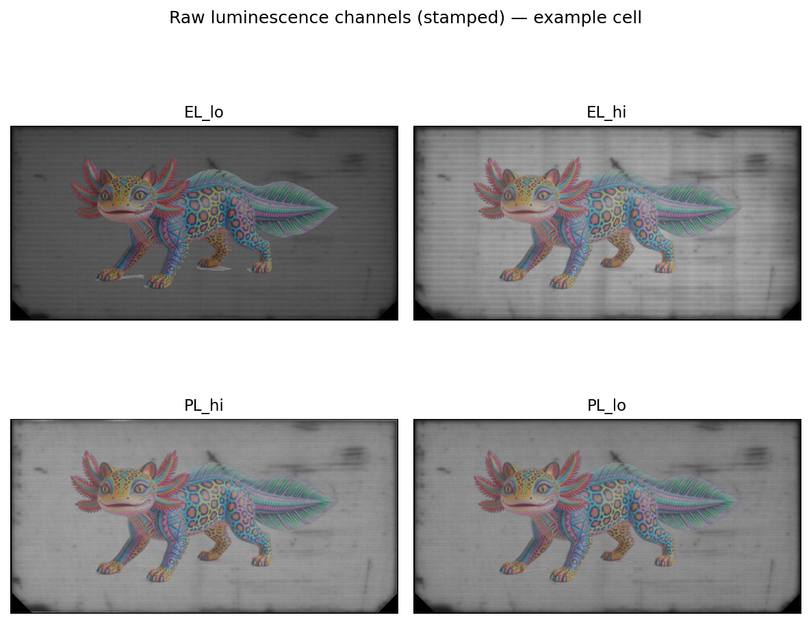

*Figure 2.2. The four raw luminescence channels (EL_lo, EL_hi, PL_hi, PL_lo) of one representative cell, each redaction-stamped with the LUCIA mark per the §2 figure policy. The three synthesised channels (`rs_map`, `log_el_pl`, `grad_el_hi`) are defined in §3.5 and Appendix E.3.*

The positioning of the half-wafer solar cells onto the measurement chuck was handled by a 6-axis robot with a high positioning accuracy of around ±0.5mm which corresponds to roughly ±3 pixels in the image. Depending on the handling automation's vision system's edge detection the cells could have been also placed at a small tilt angle with respect to the image edges.  In order to facilitate the subdivision of the active cell area sections into equal tiles a **edge detection (§2.3)** procedure was developed that allowed the later application of the **fixed canonical mask** and tiling. For details on the edge detection see the detailed documentation for [edge_detection](edge_detection.md).

After registration, the raw image data are stored in a canonical tensor `cell_stacks` of shape `(10821, 4, 558, 1108)` with type `uint8`, accompanied by a cell-level mask tensor `cell_masks` of shape `(10821, 558, 1108)`. Three additional channels, `Rs_map`, `log(EL/PL)`, and `grad(EL)`, are not stored explicitly but are derived on demand from the raw channels using `lc.synthesize_channels` (see Appendix E.3). The file structure, data schema, and row-to-cell mapping (`lucia_geometry.parquet.npy_index`) are listed in Appendix E.

### 2.2 · IV cleaning and cohort definition (NB1a)

The starting cohort is **11,203 cells**, the canonical-name set built from the source dictionary (11,203 JSON keys → 11,203 canonical names, **no key collisions**; 78 raw columns). NB1a cleans by **physical limit, not percentile**. The IV parameters are bounded with physical limits (§4.1), percentile cuts would take away the most interesting range of the high performing cells. The exclusions are summaries in the table below:

| Hard rule                       | Cells removed   |
| ------------------------------- | --------------- |
| `FF < 0.25`                     | 335             |
| `FF > 0.90`                     | 1               |
| `Voc < 0.50 (V)`                | 271             |
| `Isc < 3.0 (A)`                 | 241             |
| **Total hard-excluded** (union) | **381** (3.4 %) |
| **`iv_keep = True`**            | **10,821**      |

(The per-rule counts sum with overlap to 381 flagged by the boolean rule; `iv_keep = False` totals 382 because one further row carries a 'NaN' IV value, hence the 381/382 which are quoted in NB1a vs the NB1b combined summary; both refer to the same ≈3.4 % loss in the cohort due to IV parameters)

Two further keep-flags are merged in (cells are *flagged, never hard-deleted*): a list with cells that were not measured under standard conditions and thus not comparable to the other cells ( 71 listed, 57 within the cohort)  and a union of  manual eye-pick exclusion lists ( 49 listed, 46 within cohort). The reduced modelling cohort is thus **10,735 cells**. Candidate lower-tail cuts (`CAND_VOC_LO`, `CAND_ISC_LO`, `CAND_FF_LO`, `CAND_PMAX_LO`) are computed and printed for review but have been left in the cohort of the as-run notebook.

### 2.3 · Cohort, registration QC, and rejection accounting (NB1b + NB1-QC)

The raw frames are turned into the model-ready canonical stacks by the fused image pipeline (NB1b); the **method**, cell-edge detection, the area-preserving rigid registration into a fixed canonical frame, masking and tiling, is documented in **§3**. This subsection records the **data-quality outcome** of that pipeline, audited by a dedicated gate notebook (NB1-QC) that must print PASS on every check before modelling begins.

**Cohort cascade (NB1-QC Check 1).** Of the 11,203 cells, the **hard exclusions** (cells that
are completely unusable) are:

| Hard exclusion | Count | % of 11,203 |
|---|---|---|
| IV fail (`iv_keep = False`, §2.2) | 382 | 3.4 % |
| Missing images (≥1 of 4 channels absent) | 266 | 2.4 % |
| Geometry fail (`geom_keep = False`) | 63 | 0.6 % |
| **Combined hard exclusions** | **711** | **6.3 %** (target ≤ 10 %, PASS) |

A separate set of cells is **flagged but kept** (the data are valid and stay in the container): `saturated` 856 (7.6 %, clipped EL/PL, still carries real defect information), `ambiguous_pairing` 283 (2.5 %, image↔IV match uncertain), `shadow_masked` 57 (0.5 %), `manual_excluded` 46 (0.4 %). From these the two **modelling cohorts** follow:

- **Unpaired cohort = 10,427 cells (93.1 %)**, for image-only models (TileSetIV §5.1, ConvVAE §5.2, tabular baselines). *This is the "10,427" that appears throughout §5–§6.*
- **Paired cohort = 10,166 cells (90.7 %)**, for the contrastive image↔tabular marriage, which additionally drops the 261 ambiguous-pairing cells.

**Registration QC (NB1-QC Check 3).** The pose-fit residuals are:
**rms probe residual median 1.93 px, p99 2.31 px** (gate: median ≤ 2 px); rotation
**θ median 0.141°, p99 |θ| 0.200°, max 0.555°** (gate ≤ 1.5°); registered **cell area median
13,704.9 mm²**, inside the QC band 13,670–13,750 mm², confirming the transformation is area-preserving. Only **63 cells (0.6 %)** fail `geom_keep`. The geometry parquet (`lucia_geometry.parquet`) holds 10,555 rows = `iv_keep` (10,821) − missing-image cells (266).

**Channel- and feature-level QC (NB1-QC Checks 6–8).** The per-tile feature table has **zero
NaNs** (gate < 0.1 %); the synthesised `rs_map` tile means sit in the physical band (median 0.896, 95.8 % within 0.3–2.0); border tiles are correctly darker than internal tiles (`mean_pl_hi` 129.0 vs 151.2). Two **physics correlations**, a check on registration and the channels, both pass on the training split (n = 7,293): log(PL_hi whole-cell mean) vs Voc **ρ = +0.819** (≥ 0.79 expected) and the EL_hi internal-tile coefficient of variation vs FF **ρ = −0.678** (≤ −0.60 expected).

Outputs of the pipeline: `cell_stacks.npy` `(10821, 4, 558, 1108) uint8` (≈26 GB memmap), `cell_masks.npy` `(10821, 558, 1108)` (≈7 GB), `lucia_geometry.parquet` (pose, matrix `M`, QC, flags, `npy_index`), and `lucia_tile_features.parquet` (the per-tile features of §3).

**Table 2.1.** Cohort cascade (NB1-QC Check 1). Hard exclusions remove completely unusable cells; informational flags mark valid cells that are kept in the container; the modelling cohorts are what the models consume. The combined hard exclusion is 6.3 %, within the 10 % target.

| Stage | Cells | % of 11,203 |
|---|---|---|
| Total cells | 11,203 | 100 |
| **Hard exclusions** | | |
| IV fail (`iv_keep = False`) | 382 | 3.4 |
| Missing images | 266 | 2.4 |
| Geometry fail (`geom_keep = False`) | 63 | 0.6 |
| **Combined hard exclusion** | **711** | **6.3** |
| **Informational flags** (valid, kept) | | |
| Shadow-masked (EL artefact) | 57 | 0.5 |
| Manually excluded (corrupt) | 46 | 0.4 |
| Ambiguous pairing (image↔IV uncertain) | 283 | 2.5 |
| Saturated, any channel (real defect info) | 856 | 7.6 |
| **Modelling cohorts** | | |
| Unpaired cohort (image-only models) | 10,427 | 93.1 |
| Paired cohort (contrastive) | 10,166 | 90.7 |

![[04_Results/figures/UBELIX/qc3_rms_theta.png]]

*Figure 2.3. Registration QC distributions (NB1-QC Check 3): the rms probe residual and the rotation angle θ over the kept cells, with the rejected-geometry grid (Check 4). The registered area is not shown, because the rigid fit is area-preserving and every kept cell therefore has the same 13,704.9 mm².*

![[04_Results/figures/UBELIX/qc8_physics_correlations.png]]

*Figure 2.4. Two image-to-IV relationships (NB1-QC Check 8): Voc against the whole-cell log mean of PL_hi (ρ = +0.819), and FF against the EL_hi non-uniformity (ρ = −0.678). Each scatter shows two things at once: a clear monotone relationship between the IV parameter and the image feature, and a wide, heteroscedastic spread around it, so a single feature constrains but does not determine the parameter. That spread is why LUCIA predicts each IV parameter from the full 37-feature tile set with per-cell uncertainty (§5.1, §6.2) rather than from any single feature.*

### 2.4 · Splits and metrics

The split is built in NB1a: a **Pmax-quantile-stratified 70/15/15** train/val/test split (`SPLIT_SEED = 42`, four `pd.qcut` Pmax bins, `SPLIT_TARGETS = {train:0.70, val:0.15, test:0.15}`). Cells from one production lot **should span splits** (a `wo_group` key is recorded; 163 of 165 lots span >1 split) in order to avoid experiment or lot bias. Balance is maintained by dividing the data into Pmax quantiles before splitting ( §4.5), so that the target distributions remain matched and leakage is controlled.

 **Two split tables** are used because they are drawn at different pipeline stages, both correct: 
 
(a) on the `iv_keep` set (10,821) the assignment is **train 7,573 / val 1,624 / test 1,624**;
 
(b) restricted to the unpaired modelling cohort (10,427, after also removing missing-image, `geom_keep = False`, ambiguous, shadow and manual cells) the same split is
**train 7,293 / val 1,570 / test 1,564**.

The models in §5–§6 train and test on the unpaired cohort, so the **7,293 / 1,570 / 1,564** figures are the ones that pair with the results tables; NB1-QC confirms the split is balanced (per-split Pmax medians ≈ 3.18) and that 163/165 lots span ≥ 2 splits as designed.

Also **two metrics.** are used because R² is sensitive to the bounded tail, every result reports R² and Spearman ρ together: ρ as the rank-quality (QC) metric, R² as absolute calibration.

---

## 3 · Feature engineering, from raw frames to canonical tiles

This is the principal pre-processing stage: turning four raw frames per cell into one register-then-tile representation in which tile (i, j) addresses the same physical region in every cell. The chain is edge detection → canonicalisation by a master polygon (area-preserving rigid transform) → tiling → seven-channel synthesis → per-tile features. (The data-quality *outcome* of this chain, cohort cascade and registration QC, is in §2.3; the *method* is here.) The development scaffolding for the edge logic was a standalone edge-detection notebook (NB00b); it is **not part of the project pipeline** but was the experimentation that enabled the production registration in NB1b.

### 3.1 · Cells and placement

The cells are rear-contact, so the front-side luminescence of a 'healthy' cell is macroscopically optically uniform and carrier transport is 2-/3-dimensional (relevant for Rs, §5.4); the optical front-side uniformity is generally quite high, that is why variations in absorption and emission that may influence the luminescence signal are neglected. Each cell is imaged in four raw channels, two EL at high and low injection (`EL_hi`, `EL_lo`) and two PL at high and low injection (`PL_hi`, `PL_lo`).

### 3.2 · Locating the cell edge

The image`PL_hi` contains a useful artefact in the area outside the cell: the measurement chuck reflects NIR light that was used to generate the carriers optically and which is could not be fully suppressed by filtering, creating a brighter 'rim' in the image in the region surrounding the active cell area. Inside the cell `PL_hi` and `PL_lo` carry very similar information, so their residual is roughly flat. Across the cell boundary the residual changes sharply, because the out-of-cell reflection raises `PL_hi` but not `PL_lo`. The low-to-high transition marks the pixel of the physical edge. for more detail refer also to the  [edge_detection](edge_detection.md) documentation.

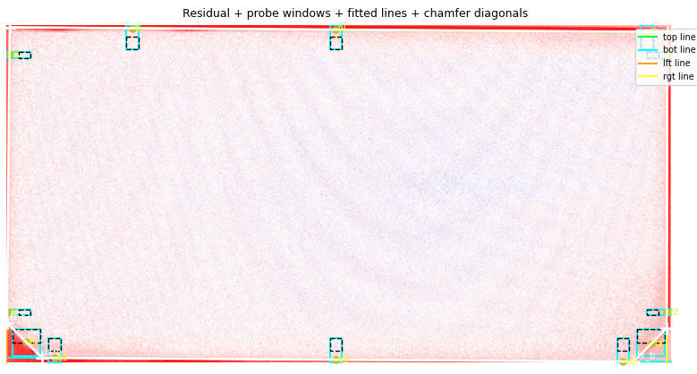
*Figure 3.1. A `PL_hi`- f *`PL_lo` residual image with the detected edge and the fitted master polygon overlaid from the conceptual phase.*

### 3.3 · Canonicalisation by master polygon

The detected edges of a large selection of cells are combined into a single **master polygon**, the canonical cell outline. This master polygon is fitted to each individual cell, and an **area-preserving transformation** later also called the 'ridig pose' brings every cell into the same canonical position. Because the transform preserves the area it corrects placement and tilt without re-scaling the cell, so absolute per-tile statistics remain comparable between cells. The result is a canonical frame of **558 × 1108 px** in which tile (i, j) is the same physical region in every cell, the precondition for the tile model (§5.1) and for spatially-resolved analysis (§5.3). Cells whose fit quality falls below threshold are flagged (`geom_keep = False`), not silently dropped.

The transformation is a **rigid pose: rotation `θ` + translation `t = (tₓ, t_y)`**, with no scaling, the cell is rotated to a level bottom edge, bottom-aligned and horizontally centred, and the 2×3 affine matrix `M` is persisted per cell. A per-cell canonical mask is rasterised from each cell's own warped polygon, and all per-tile statistics are computed only over mask-active pixels, so the out-of-cell chuck reflection, the chamfer cut-outs and the background are excluded by construction.

Registration quality is assessed using the *rms* probe residual. Cells are accepted if the residual is below `TOL_PX = 3.0 px` with refitting permitted up to 4 px when the probe-quality criterion `Q_MIN = 3.0` and the saturation threshold `SAT_THRESH = 0.005`are satisfied. The resulting registration is highly stable: the median RMS residual is 1.93 px and the 99th percentile is 2.31 px, while the median rotation angle is 0.141° and the 99th percentile of |θ| is 0.200°. The registered area has a median of 13,704.9 mm², remaining within the expected geometric band and confirming that the transformation preserves area. Only 63 cells, or 0.6%, fail the geometric criterion and are therefore flagged rather than discarded. The procedure is implemented in the py-script`lucia_registration_v4` through `reg.register_cell` and `reg.warp_to_canonical`.

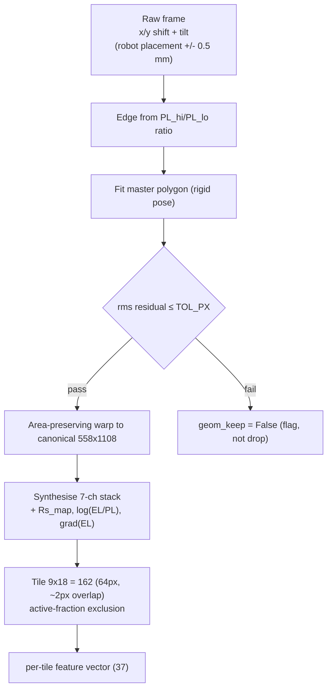
```mermaid
flowchart TD
    RAW["Raw frame<br/>x/y shift + tilt<br/>(robot placement +/- 0.5 mm)"]
    --> EDGE["Edge from PL_hi/PL_lo ratio"]
    --> FIT["Fit master polygon (rigid pose)"]
    --> QC{"rms residual ≤ TOL_PX"}
    QC -- "pass" --> WARP["Area-preserving warp to canonical 558x1108"]
    QC -- "fail" --> FLAG["geom_keep = False (flag, not drop)"]
    WARP --> SYN["Synthesise 7-ch stack<br/>+ Rs_map, log(EL/PL), grad(EL)"]
    SYN --> TILE["Tile 9x18 = 162 (64px, ~2px overlap)<br/>active-fraction exclusion"]
    TILE --> FEAT["per-tile feature vector (37)"]
```
*Figure 3.2. Schematic of the registration chain: detected edge → master polygon → area-preserving rigid fit to the canonical frame.*

### 3.4 · Tiling (overlapping)

*Figure 3.3. The fixed 9 × 18 tile grid over one canonical cell, with one overlap seam shaded and low-active-fraction border tiles greyed.*

The canonical cell is split into a left and a right half, each tiled on a **9 × 9 grid**, giving **162 tiles** total (**9 × 18**). Tiles are **64 × 64 px** over the **558 × 1108 px** active area, and the tiling is **overlapping**. Axis assignment: the **558-px axis → 9 tiles**, the **1108-px axis → 18 tiles**. The overlap gives uniform coverage: along the 9-tile axis 9 × 64 = 576 px, i.e. 18 px over the active 558, spread over 8 inter-tile seams ≈ **2 px** per seam; along the 18-tile axis 18 × 64 = 1152, i.e. 44 px over 17 seams ≈ **2.6 px**. (In NB1b the grid is built by `edge_anchored_tile_grid(tile=64)` and the overlap is derived geometrically from the canonical size, not passed as an argument.) Tiles whose intersection with the per-cell mask is empty are dropped by the **active-fraction exclusion** rather than zero-padded, so the cohort tile table (`lucia_tile_features.parquet`) holds **≈1.70 M rows** (162 × ≈10.5 k cells, minus masked-out tiles). This overlapping construction replaced an earlier non-overlapping grid that pushed all the leftover into the last two tiles; distributing a constant ≈2-px overlap across every seam fixes that unevenness.

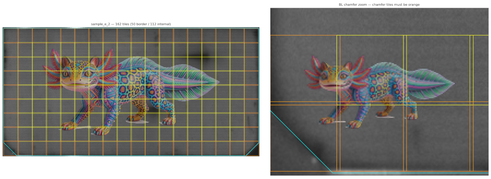

*Figure 3.4. A real canonical cell with the active edge and the 9 × 18 grid of 64-px tiles, showing the ≈2-px overlap of two adjacent tiles.*

### 3.5 · Channels and per-tile features

From the four raw channels LUCIA forms a 7-channel canonical stack, `EL_lo, EL_hi, PL_hi, PL_lo, Rs_map, log(EL_hi/PL_hi), grad(EL_hi)`, synthesised after registration so all channels share the canonical geometry. Physically, dividing EL by PL (the `log(EL_hi/PL_hi)` channel) removes the shared passivation signal and amplifies the contact-quality information that has influence on the cell's series resistance (§1).

The three synthesized channels (`rs_map`, `log_el_pl`, `grad_el_hi`) are defined in Appendix E.3. `rs_map` is a fast series-resistance electroluminescence image following the method of Haunschild et al. (2009), evaluated with the two-EL-image iterative scheme of Breitenstein et al. (2010); `log_el_pl` and `grad_el_hi` are pixel-wise operators. (QC sanity: `rs_map` tile means are physical, 95.8 % within 0.3–2.0; NB1-QC Check 6.)

**Per-tile features (37).** The statistic set is computed for all channels, no channel is
privileged a priori, importance is assessed afterwards. Each tile has two geometry/quality flags (`is_border`, `active_frac`) and, per channel, five statistics: `mean`, `std`, `uni` (= `std/mean`, first-order uniformity), `entropy`, and `skew`, **7 × 5 + 2 = 37**. The `uni` feature is a non-uniformity measure for the positive-intensity luminescence channels; for the derived channels it carries numerical caveats (mean → 0 in uniform tiles; the log-ratio crosses zero, so `std` is the relative measure there) and is kept subject to a feature-importance check rather than dropped beforehand. After tiling, each cell is a fixed, ordered array of shape **(162 tiles × 37 features)**, the input to the IV model (§5.1). The set is produced by NB1b `process_cell()` / `_tile_features()`; NB1-QC confirms **zero NaNs** across the feature columns.

Two feature representations have been chose due to prior experience with the **cell-level / ROI** feature set (`lucia_cell_features.parquet` from NB1c: per-channel `nu_cv = std(tile means)/mean(tile means)`, robust spreads, dark-tile fractions, and tile-PCA components) is kept alongside the per-tile set. The cell-level set is **position-agnostic by construction** and feeds the tabular baselines and the contrastive tabular branch. The per-tile set feeds TileSetIV: its tiles are spatially *addressed* (registration guarantees tile (i, j) is the same physical region), but AttnMIL pooling is still position-agnostic, it weights and sums tiles, so it knows tile *identity* but not *adjacency*. Full tile-position understanding is reserved for the transformer (Tier-C, §5.4), whose positional encoding + cross-tile attention make adjacency informative (connected dead-zones, current-detour topology → Rs). The progression is therefore: ROI/cell-level (position-agnostic) → per-tile with attention pooling (addressed, adjacency-agnostic) → transformer (adjacency-aware).

---

## 4 · Exploratory data analysis

### 4.1 · Target distributions

The seven IV parameters are heavy-tailed and bounded, with an upper limit set by the cell technology.

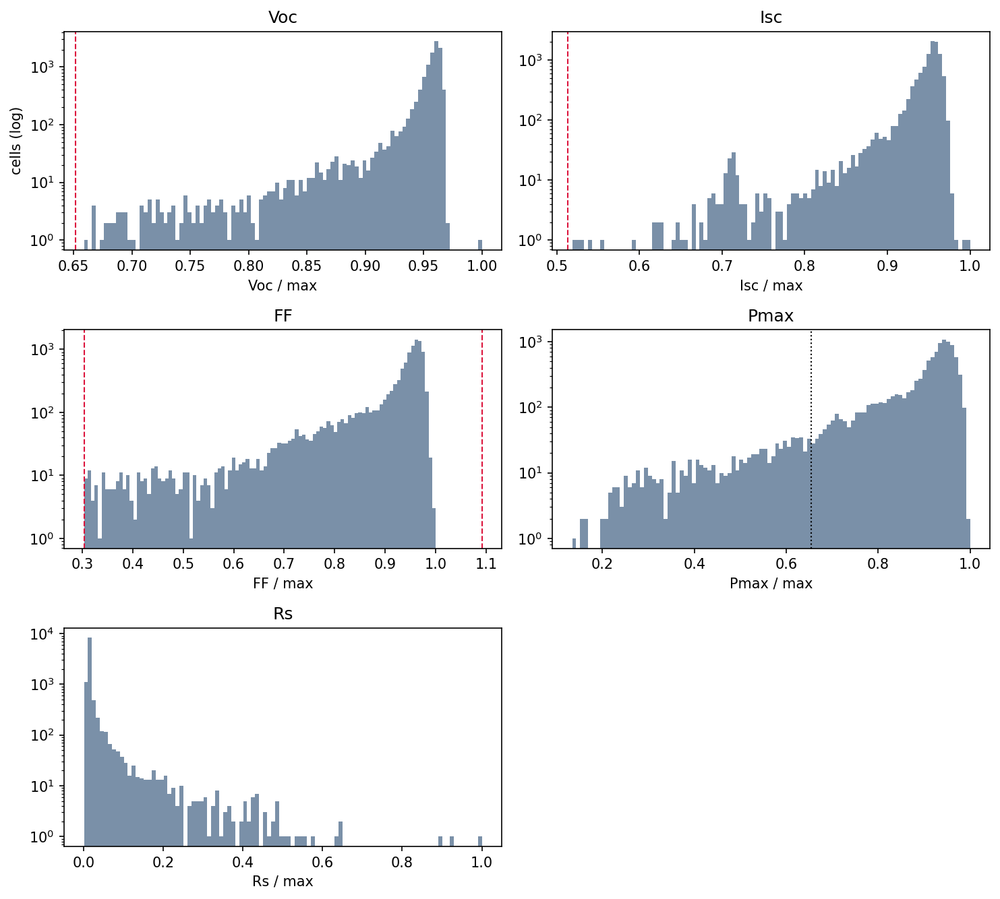

*Figure 4.1. Distributions of the five primary IV parameters in the cleaned pool (n = 10,822), each divided by its cohort maximum (3 × 2 grid). All five share the same shape family: a hard technological ceiling, most of the probability mass close to it, and a long low tail. Red dashed lines mark the applied hard cleaning bounds in normalized units; the dotted line in the Pmax panel is the 2.25 W floor reference of §4.2.*

Figure 4.1 shows the distributions of the targets. This bounded, skewed shape is the reason the cleaning in §2 uses fixed physical limits rather than percentile cuts, and the reason every result in §6 reports Spearman ρ alongside R².

**Table 4.1.** Descriptive statistics of the cleaned IV cohort (n = 10,821), each parameter
divided by its cohort maximum so all values lie in [0, 1] (§2 policy). The gap between mean and median (Pmax 0.875 vs 0.925, FF 0.905 vs 0.949) and the low minima (Pmax 0.134, FF 0.303) reflect the degraded low-end tail discussed in §4.2; the heavy Rs upper tail is visible in its small normalized median (0.013).

| stat (÷ max) | Voc | Isc | FF | Pmax | Rs |
|---|---|---|---|---|---|
| mean | 0.980 | 0.943 | 0.905 | 0.875 | 0.023 |
| std | 0.031 | 0.038 | 0.110 | 0.128 | 0.045 |
| min | 0.680 | 0.519 | 0.303 | 0.134 | 0.001 |
| 25 % | 0.982 | 0.942 | 0.901 | 0.851 | 0.012 |
| median | 0.989 | 0.953 | 0.949 | 0.925 | 0.013 |
| 75 % | 0.992 | 0.960 | 0.964 | 0.949 | 0.016 |
| max | 1.000 | 1.000 | 1.000 | 1.000 | 1.000 |

(Absolute maxima used for normalization, from NB1a: Voc 0.7441 V, Isc 5.843 A, FF 0.8245, Pmax 3.443 W, Rs 0.590 Ω. Vmax and Imax follow Voc and Isc respectively and are omitted here.)

### 4.2 · A degraded sub-population

The low end of the Pmax and FF distributions forms a distinct cluster of severely degraded cells, separated from the main population. In the cleaned pool (n = 10,822) the cluster below Pmax = 2.25 W (0.65 of the cohort maximum) contains 738 cells, 6.8 % of the pool (4.5 % below 2.0 W); its size explains the visible gap between the cohort mean and median (normalized Pmax 0.875 vs 0.925, Table 4.1). Whether the cluster is a purely physical subpopulation or partly reflects measurement artefacts in individual luminescence channels is not resolved here and is noted in §6.5. This subpopulation is the direct motivation for the abstention policy of §6.2, in which the model returns a floor value rather than a calibrated estimate for these cells.

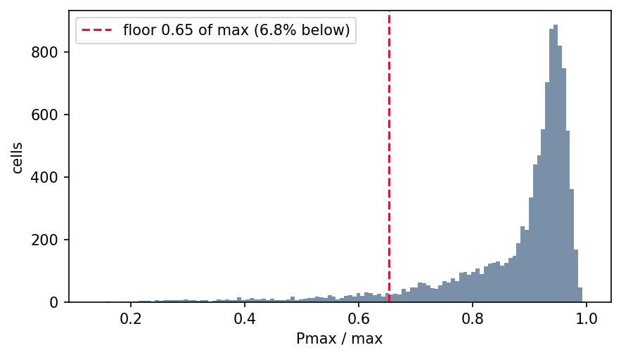

*Figure 4.2. Normalised Pmax distribution of the cleaned pool. The marked cut at 0.65 of the cohort maximum (2.25 W) separates the degraded low-end cluster: 738 cells, 6.8 % of the pool. This cluster is the population the abstention policy of §6.2 targets.*

### 4.3 · Relationships among targets

The seven targets are linked by the algebraic identities
$$
P_{\max} = V_{\max} \cdot I_{\max} = FF \cdot V_{oc} \cdot I_{sc}
$$

*Figure 4.3. Correlation between the cell-level features and the seven IV parameters. Rows are the feature groups (per-channel non-uniformity, geometry, tile-PCA components), columns the targets. The per-channel non-uniformity block shows the strongest associations with FF and Pmax, consistent with the permutation-importance check of §6.1; this is the cell-level relationship the tile model resolves at tile resolution.*

*Figure 4.4. Principal-component loadings of the 37 per-tile features: the contribution of each feature to the leading variance directions of the tile representation. The PCA serves two purposes: a redundancy check on the engineered features before modelling, and the source of the 4-channel tile-PCA block used in the cell-level baseline features (§6.1).*

The correlation structure among the targets and between features and targets is shown by the NB1c feature-IV heatmap and the tile-PCA loadings (Figures 4.3, 4.4a): Vmax correlates most strongly with Voc, Imax with Isc, and Pmax with Isc. These identities are used for **physics-informed modelling**: TileSetIV carries a differentiable soft constraint on them during training (`LAMBDA_C = 0.1`), and §6.1 reports the resulting residuals (`|Pmax − Vmax·Imax|/Pmax ≈ 2.9 %`, `|Pmax − FF·Voc·Isc|/Pmax ≈ 3.3 %`) as a consistency audit rather than a hard-imposed equality.

Brief **physics explanation with discussion**: The real independent parameters of the IV curve are `Voc, Isc, Vmax, and Imax` the other parameters are technically important but mathematically dependent, except of the series resistance `Rs` that has a strong influence on the fill factor `FF` . For very uniform solar cells with a perfect 1-dimensional transport, e.g. from the front side to the back side, the IV curve can be described analytically using a well established 1-diode model or 2-diode model. such cell would have near uniform luminescence images and would thus be a bit 'boring' for the LUCIA project. For the here presented rear contact solar cells an analytical determination of parameters becomes increasingly in-precise the more non-uniform the luminescence images are which is partly cause by the 2/3-dimensional transport properties of the devices. In a first trial only the independent target IV parameters were modelled and the other parameters than calculate which lead to strong increase in uncertainty and rendered that predictive approach useless. Thus, in the adjusted approach all 7 targets are trained and the physics-informed modelling was added as a consistency audit.

### 4.4 · Image–IV parameters relationships

Two cell-level relationships between the images and the IV parameters are measured on the training split (n = 7,293). The logarithm of the whole-cell mean of PL_hi correlates with Voc at ρ = +0.819, and the coefficient of variation (std/mean) of EL_hi over the internal tiles correlates with FF at ρ = −0.678, so a more non-uniform EL field is associated with a lower fill factor.

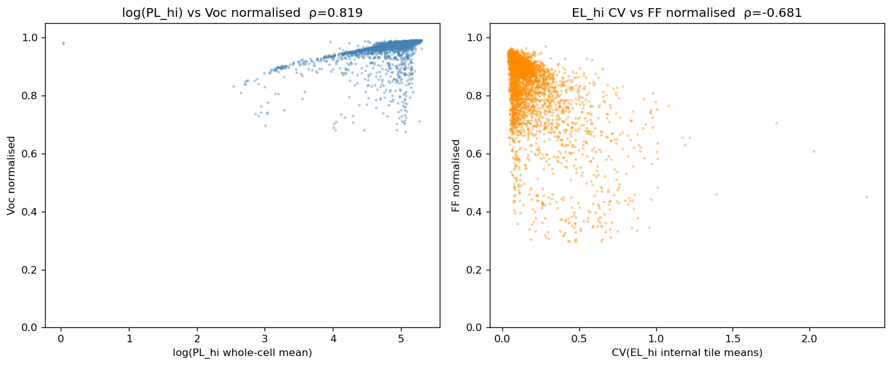
*These two scatter plots are shown in Figure 2.4. They are the cell-level IV-parameter relationships that the Tier-A model (§5.1) resolves with per-tile features at tile resolution.*

### 4.5 · Data quality and split balance

Figure 4.5 (to be generated in NB1a / NB1-QC) shows the geom_keep pass fraction, the active_frac distribution, and the train/validation/test target distributions overlaid, which together show that the split is balanced and free of obvious leakage. The geometry gate removes 63 cells (0.6 %). The cohort is balanced, with per-split Pmax medians of about 3.18, and 163 of 165 production lots span at least two splits by design; the models use the unpaired modelling cohort with the split 7,293 / 1,570 / 1,564 (§2.4). The active_frac distribution panel and any lot-imbalance note remain to be added to Figure 4.5.

---

## 5 · Machine learning analysis

LUCIA is a small stack; each model answers a different question. The pipeline below is the spine; subsections detail each block.

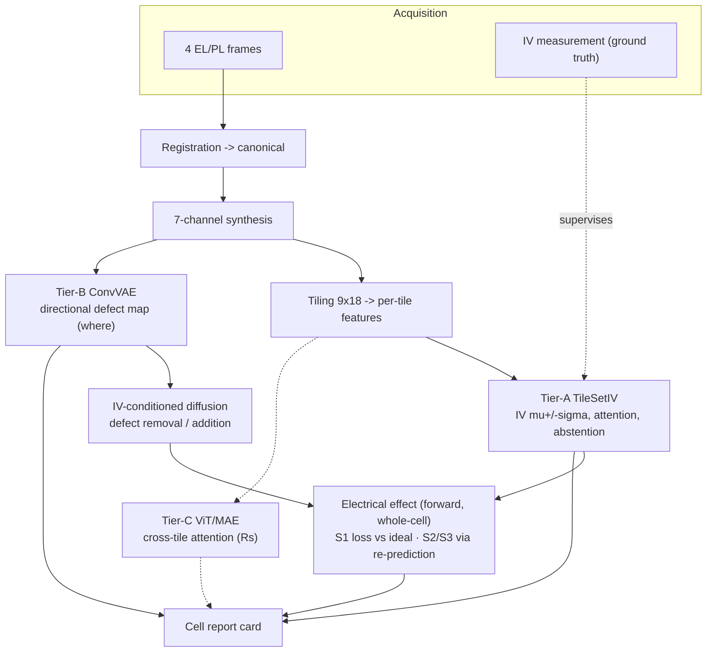
```mermaid
flowchart TD
    subgraph ACQ["Acquisition"]
      RAW["4 EL/PL frames"]
      IV["IV measurement (ground truth)"]
    end
    RAW --> REG["Registration -> canonical"]
    REG --> SYN["7-channel synthesis"]
    SYN --> TILE["Tiling 9x18 -> per-tile features"]
    TILE --> A["Tier-A TileSetIV<br/>IV mu+/-sigma, attention, abstention"]
    SYN --> B["Tier-B ConvVAE<br/>directional defect map (where)"]
    TILE -.-> C["Tier-C ViT/MAE<br/>cross-tile attention (Rs)"]
    A --> EFF["Electrical effect (forward, whole-cell)<br/>S1 loss vs ideal · S2/S3 via re-prediction"]
    B --> DIFF["IV-conditioned diffusion<br/>defect removal / addition"]
    DIFF --> EFF
    A --> CARD["Cell report card"]
    B --> CARD
    EFF --> CARD
    C -.-> CARD
    IV -. supervises .-> A
```

### 5.0 · Notebook map

**Table 5.1.** Model inventory: every model trained or evaluated in the project, its role, and its status. The table is the map of the modelling story; the subsections give the detail.

| Model | NB | Role | Input | Headline result | Status |
|---|---|---|---|---|---|
| HistGB / RF / MLP baselines | NB2 | tabular IV reference (7 direct heads) | cell-level aggregate features | e.g. Pmax R² 0.842 (HistGB) | reference |
| MLP-VAE | NB2 | latent representation of cell features | cell-feature vector | posterior collapse (silhouette −0.135) | dropped |
| ConvAE, Track A (β = 0) | NB2 | denoising reconstruction → defect maps | `el_hi`,`pl_hi` 288 × 576 | val recon 0.0239, pixel-ρ 0.982 | in use (NB4) |
| ConvVAE, Track B (small β) | NB2 | probabilistic latent for generation | `el_hi`,`pl_hi` 288 × 576 | val recon 0.0281, posterior not collapsed | in use (NB5) |
| **TileSetIV (Tier-A)** | NB3 | IV prediction, μ ± σ, abstention | 162 × 37 tile features | FF R² 0.886; Pmax R² 0.908 (confident set) | **model of record** |
| Defect classifier | NB4 | reproduce taxonomy labels | per-tile defect features | 97.6 % vs bootstrap labels | bootstrap check |
| SpatialBottleneck | NB5 | compress ConvVAE map for diffusion | 512 × H5 × W5 map | val MSE 0.0078 | in use |
| FiLM U-Net DDPM | NB5 | IV-conditioned generation / editing | spatial latent + 7 IV | generative headroom ΔFF +0.096 / ΔPmax +0.48 W; masked edits ΔIV ≈ 0 | headroom usable; S2/S3 negative |
| DirectDecoder | NB5 | faithful latent → image decode | spatial latent | val L1 0.013 | in use (S2/S3 evaluation) |
| ViT/MAE (Tier-C) | NB6 | cross-tile attention for Rs | 162 tile tokens | best balanced run: FF 0.14 / Pmax 0.17 / Rs 0.10 | negative, not pursued |

NB1a (IV cleaning) runs on a local Linux machine; NB1b, NB1c, NB1-QC and NB2 through NB7 all run on the UBELIX HPC cluster (H100). A standalone edge-detection notebook (NB00b) was **auxiliary development, not part of the project pipeline**, it prototyped the edge logic (§3.2) that enabled the production registration in NB1b.

| NB     | Purpose                                                                                                                                                    | Run on         | Status                                                                                                        |
| ------ | ---------------------------------------------------------------------------------------------------------------------------------------------------------- | -------------- | ------------------------------------------------------------------------------------------------------------- |
| NB1a   | IV cleaning, hard-exclusion + shadow/manual flags, `wo_group`, Pmax-stratified split                                                                       | local          | done                                                                                                          |
| NB1b   | Image pipeline: edge → area-preserving rigid registration → canonical masked stacks/masks (`lucia_registration_v4`) → per-tile features (`process_cell`)   | UBELIX         | done                                                                                                          |
| NB1-QC | Registration & data-quality gate (9 checks: cohort, split integrity, geometry, visual, stacks, synth channels, tile features, physics correlations, flags) | UBELIX         | done, all PASS                                                                                                |
| NB1c   | Tile → cell-level feature aggregation (`nu_cv`, robust spreads, tile-PCA)                                                                                  | UBELIX         | done (37-feature cell features regenerated; NB2 baselines re-run)                                  |
| NB2    | Baselines (RF/HistGB/MLP) + ConvAE/ConvVAE (Track A/B); MLP-VAE dropped                                                                                    | UBELIX         | done (Track A + Track B trained)                                                                              |
| NB3    | TileSetIV, IV prediction with uncertainty + abstention (Tier-A)                                                                                            | UBELIX         | done (`TileSetIV_20260628_213323`)                                                                            |
| NB4    | Defect maps + latent-MSE gate + occlusion sensitivity + counterfactual headroom + 6-class taxonomy + tile-activity map                                     | UBELIX         | done (`20260629_205142`, consumes current Tier-A)                                                             |
| NB5    | IV-conditioned diffusion + S2/S3 forward scenarios                                                                                                         | UBELIX         | done (`20260630_103347`); trained decoder + cohort occlusion; S2/S3 ΔIV≈0 (masked edits not effective)        |
| NB6    | Tier-C ViT/MAE (cross-tile attention)                                                                                                                      | UBELIX         | done (latest balanced `20260630_144408`); uniformly weak (FF 0.14, Pmax 0.17, Rs 0.10), negative; not pursued |
| NB7    | Inference, per-cell report card (abstention; PT_PARAMS from checkpoint; S1+S2+S3 panels)                                                                   | UBELIX         | done (`20260630_103347`, 5-page PDF)                                                                          |

### 5.1 · Tier-A, TileSetIV (IV predictor)

*(Vocabulary: TileSetIV is the architecture; it is referred to as Tier-A throughout, and appears as "TileSet-A" in table column headers. "Confident set" always means the abstention-filtered test set; "full set" the unfiltered one.)*

**Normalisation for modelling.** The normalisation used inside the models is distinct from the presentation-side normalize-to-max policy of §2, and it matters because it shapes the loss. The seven targets are heavy-tailed and bounded (§4.1), with a hard technological ceiling, most of the mass close to it, and a long low tail; trained directly on physical units, a Gaussian likelihood would be mis-specified and the tail cells would dominate the loss. Each target is therefore passed through a Yeo-Johnson power transform fitted on the training split and standardized, the heteroscedastic Gaussian negative log-likelihood is specified in that transformed space, and predictions are inverted back to physical units through the transform parameters stored in the checkpoint (`pt_params`; this inverse is also why floor-cell predictions can come out non-physical and are caught by the abstention guard, §6.2). The 37 tile features are standardized per feature with training-split statistics (`norm_stats_tiles_*.json`), so the attention and embedding layers see comparable scales across channels and statistics. The image models work on differently scaled inputs: the ConvVAE variants consume images scaled to [0, 1] with a sigmoid decoder, and the diffusion stage operates on per-channel standardized latents (§5.5). The presentation normalization (each parameter divided by its cohort maximum) is applied only when values are displayed, never inside a model.

Each cell is represented as 162 tiles × 37 features (§3). A shared per-tile MLP encodes each tile; gated attention-MIL pooling collapses the 162 tile embeddings to one bag embedding and emits a per-tile attention map; seven heteroscedastic heads output μ and log σ per IV parameter (`Voc, Isc, Vmax, Imax, FF, Pmax, Rs`, all predicted directly). A contrastive auxiliary branch (InfoNCE, tile-image embedding vs cell tabular features) regularises during training only and is detached at inference.

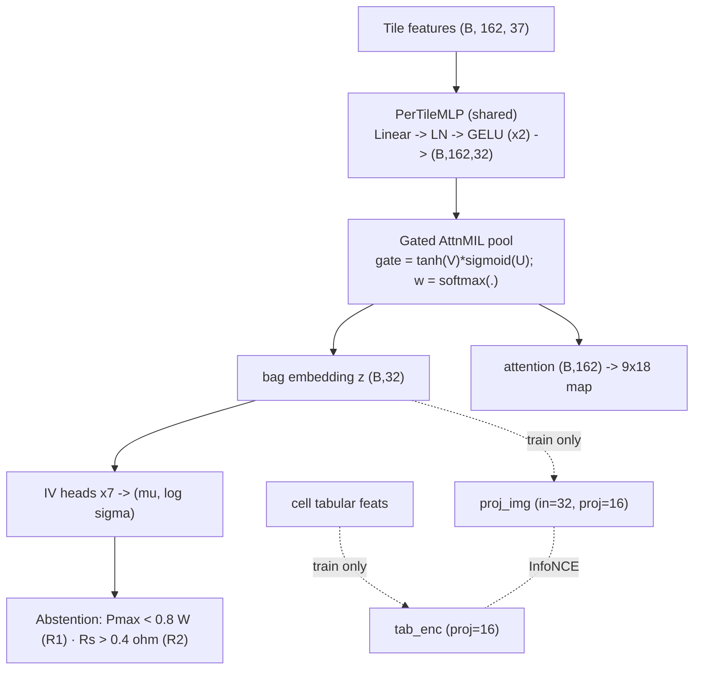
```mermaid
flowchart TD
    X["Tile features (B, 162, 37)"] --> PT["PerTileMLP (shared)<br/>Linear -> LN -> GELU (x2) -> (B,162,32)"]
    PT --> ATT["Gated AttnMIL pool<br/>gate = tanh(V)*sigmoid(U); w = softmax(.)"]
    ATT --> Z["bag embedding z (B,32)"]
    ATT --> AW["attention (B,162) -> 9x18 map"]
    Z --> H["IV heads x7 -> (mu, log sigma)"]
    H --> ABS["Abstention: Pmax < 0.8 W (R1) · Rs > 0.4 ohm (R2)"]
    Z -. train only .-> PJ["proj_img (in=32, proj=16)"]
    TAB["cell tabular feats"] -. train only .-> TE["tab_enc (proj=16)"]
    PJ -. InfoNCE .- TE
```

**Hyperparameters and training (as-run, checkpoint `TileSetIV_20260628_213323`).** PerTileMLP with dropout, gated MIL pool, 7 heteroscedastic heads, **37-feature input** (162 tiles).
Training is MSE warm-up on μ (calibrating means before σ fires) **then** β-NLL (`BETA_NLL = 0.641`) with soft physics constraints (`λ_c = 0.1`) applied after warm-up, plus the InfoNCE contrastive auxiliary (`CONTRASTIVE_W`), Adam, 200 epochs with early stop on validation NLL (best at **ep ≈ 65**, val NLL = −1.267). The IV path has **25,998 parameters** (+8,896 contrastive aux = 34,894 total), order 10⁴. A narrow embedding is used because the 37-feature tiles already carry the per-channel uniformity/entropy/skew content; the model is re-trained from scratch each run and shows run-to-run variation in the per-target R² (see §6.1), so the checkpoint id accompanies every reported number.

 **Optuna-selected hyperparameters** (study `optuna_TileSetIV_V5`, best trial 103,> val NLL = −1.911): `embed_dim = 64`, `hidden_attn = 32` (= embed_dim/2), `n_feat = 37`,> `LAMBDA_C = 0.1`, `WARMUP_NLL = 27`, `BETA_NLL = 0.6412`, `CONTRASTIVE_W = 0.05`,> `LR = 1.485e-3`, `FEAT_NOISE_SIGMA = 0.0`. The as-run checkpoint `TileSetIV_20260628_213323`> uses these values; if NB3 is re-run, keep `embed_dim = 64`.
 
 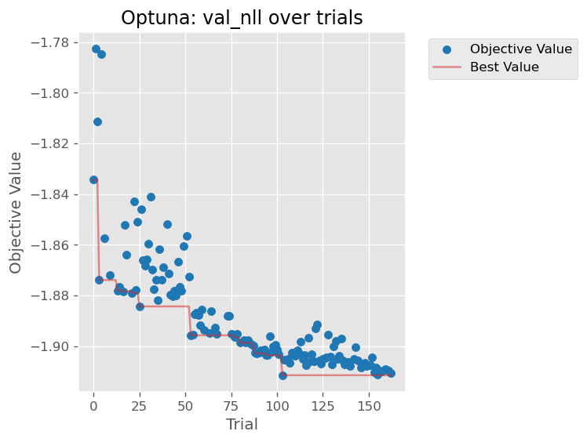
 
 
 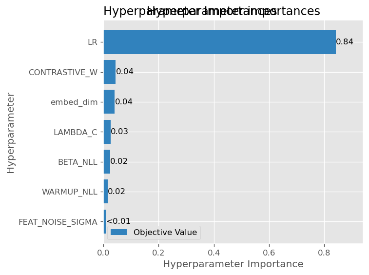
 
 
*Figure 5.1. Optuna study for Tier-A (`optuna_TileSetIV_V5`): optimisation history of the validation objective across trials (left) and the derived hyper-parameter importances (right). The best trial (103, validation NLL −1.911) fixes the final configuration; the full values are listed in Appendix A.*

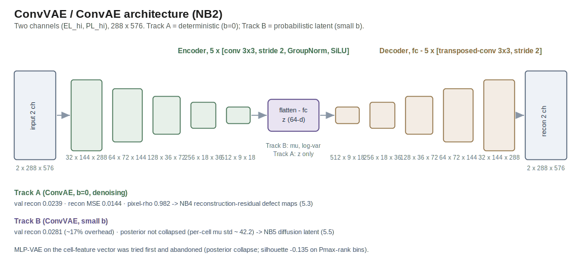

*Figure 5.2. ConvVAE / ConvAE architecture: a five-stage stride-2 encoder to a 512 × 9 × 18 map, a 64-dimensional latent, and a symmetric transposed-convolution decoder. Track A is deterministic (denoising), Track B adds a probabilistic latent.*

**Performance (test split, n = 1564, 37-feature checkpoint).** Per-target R²/ρ and the
baseline comparison are in §6.1. TileSet-A ρ is higher than each baseline's ρ on all seven targets; on R² it is higher than the baselines on Vmax, FF, Pmax, Imax and Isc, and lower on Voc and Rs (§6.1, Table 6.1). The acceptance gate is read on the abstention confident set, where it is met (§6.2).

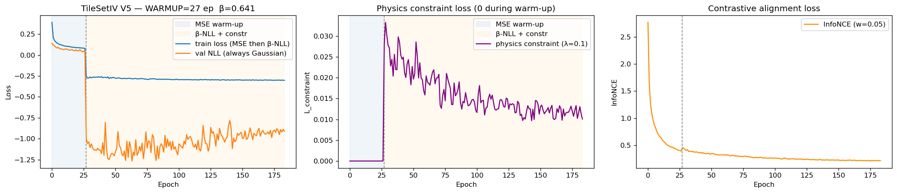

*Figure 5.3. TileSet-A (Tier-A) training curve: training and validation loss versus epoch, best validation at epoch 65.*

predictions `nb3_predictions_20260628_213323.parquet`> (72,989 rows; long-form `cell_name, split, target, mu_raw, true_raw, sigma`), comparison `nb3_comparison_table_20260628_213323.csv`, normalisation> `norm_stats_tiles_20260628_213323.json` (`n_feat = 37`).

**Tier-B (future upgrade).** A specified-but-not-yet-built variant, `TileCNN`, replaces the
per-tile MLP with a small shared CNN reading the raw 64×64 tile pixels (the same AttnMIL pool and 7 heads downstream). It targets the morphology-sensitive targets, chiefly **Rs**, the weakest here, that scalar per-tile features cannot resolve (a crack and a diffuse dim region with identical mean/std are distinguishable only from pixels). With the improved 37-feature set the expected gain is narrowed but still concentrated on Rs/FF; it is the next rung on the representation ladder (features → tile-pixels → cross-tile positional, §5.4).

### 5.2 · Tier-B, ConvVAE defect maps, quality gate, and taxonomy (NB4)

A convolutional autoencoder reconstructs a smooth healthy version of the cell (2 channels, `el_hi`/`pl_hi`); the directional residual `clip((recon−orig)/max(recon,ε),0,1)` flags where the cell is darker than its healthy reconstruction. Unsupervised; answers *where the cell looks non-uniform*, not what its electrical effect is.

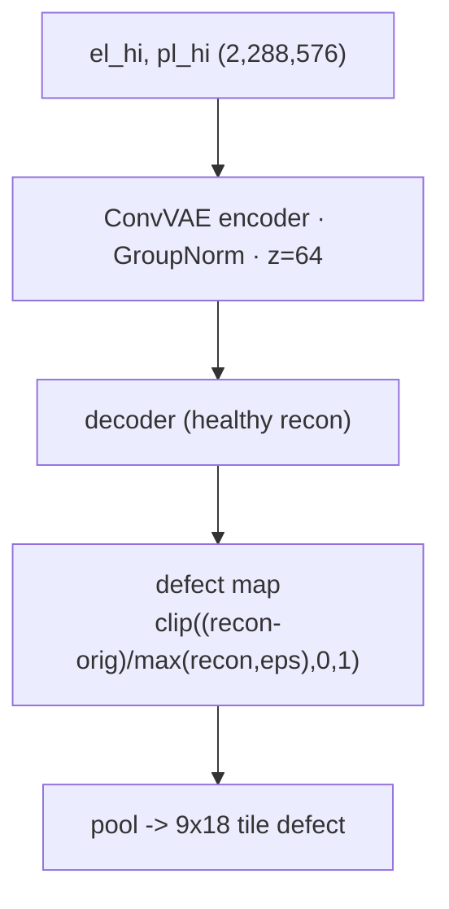
```mermaid
flowchart TD
    IMG["el_hi, pl_hi (2,288,576)"] --> ENC["ConvVAE encoder · GroupNorm · z=64"]
    ENC --> DEC["decoder (healthy recon)"]
    DEC --> RES["defect map<br/>clip((recon-orig)/max(recon,eps),0,1)"]
    RES --> GRID["pool -> 9x18 tile defect"]
```

---

- **Track A (ConvAE, deterministic, β = 0)** is a denoising autoencoder. It reaches the best
reconstruction (validation recon 0.0239; recon MSE 0.0144; pixel-ρ 0.982) and supplies the reconstruction residual that NB4 converts into defect maps (§5.3).
- **Track B (ConvVAE, small β)** adds a probabilistic latent. It reaches validation recon 0.0281,
about 17 % reconstruction overhead relative to Track A, in exchange for a smooth, sampleable latent. Its posterior does not collapse (per-cell μ std ≈ 42.2, so the latent carries cell-specific variation), which is the property the NB5 diffusion prior relies on (§5.5).

Both encoders map the two channels (`el_hi`, `pl_hi`) from 288 × 576 to a 512 × 9 × 18 feature map through five stride-2 convolution blocks, flatten to a 64-dimensional latent (for Track B, a mean and a log-variance), and decode symmetrically with transposed convolutions back to 288 × 576. The architecture schematic, with the layer dimensions annotated, is Figure 5.2 (`convvae_architecture.svg`).

**Defect maps and quality gate (NB4).** NB4 encodes the whole cohort through the **Track-A
denoising ConvAE** (`el_hi`, `pl_hi`) and forms the directional residual `clip((recon−orig)/max(recon,ε), 0, 1)`, a **fractional signal loss** in [0, 1], comparable across cells and brightness levels (luminescence defects are always *darker* than the healthy reconstruction, so `recon − orig > 0`). The residual is pooled to a per-tile grid
**`defect_tile` of shape (10427, 2, 9, 18)**, the per-cell appearance prior used downstream.

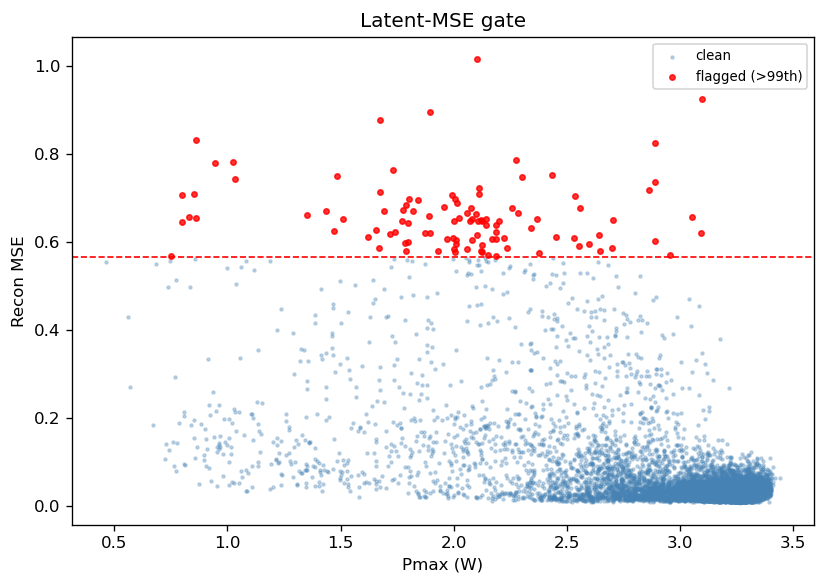

*Figure 5.4. Latent-MSE auto-reject gate (NB4): the distribution of per-cell latent reconstruction error, with the p99 threshold that flags off-manifold cells whose defect maps are unreliable.*

A **latent-MSE auto-reject gate** flags cells whose reconstruction error exceeds the 99th
percentile (`recon_mse > 0.566`) as probable registration failures, **flagged for review, not silently dropped**.

**Defect taxonomy (NB4 §5.6).** Clustering the per-tile defect features (324-d = 2 × 9 × 18,
standardised, *clustered on the defect map, not on raw latents, which removes the brightness confound*) with k-means (k = 6) yields a taxonomy that is **monotone in severity and tracks the electrical parameters**, a consistency check linking the appearance maps to the IV parameters:

| Class (bootstrap name) | n | mean defect (EL) | Pmax (W) | FF |
|---|---|---|---|---|
| intact | 8,724 | 0.017 | 3.15 | 0.770 |
| crack | 992 | 0.060 | 2.40 | 0.610 |
| finger_break | 317 | 0.248 | 2.44 | 0.648 |
| dark_area | 183 | 0.450 | 2.32 | 0.652 |
| edge_shunt | 115 | 0.783 | 2.15 | 0.642 |
| contamination | 96 | 0.803 | 1.78 | 0.613 |

A small classifier reproduces the cluster labels at 97.6 % test accuracy. Figure 5.5 shows the defect-map gallery together with the cluster gallery, with the five nearest cells per class.

*Figure 5.5. Defect-map and cluster gallery: the six appearance classes with the five nearest cells per class.*

The taxonomy should be read for what it is: an **unsupervised clustering of appearance features**, whose class names are bootstrap labels assigned by inspection, not a validated physical defect ontology. Because the clusters are formed on the defect maps and then checked against the electrical parameters, the monotone severity ordering above is a consistency result, not a claim that each class corresponds to a distinct physical defect mechanism. Promoting the taxonomy to a physically meaningful classification requires hand-labelling a subset of cells and re-training the classifier against those labels (§7).

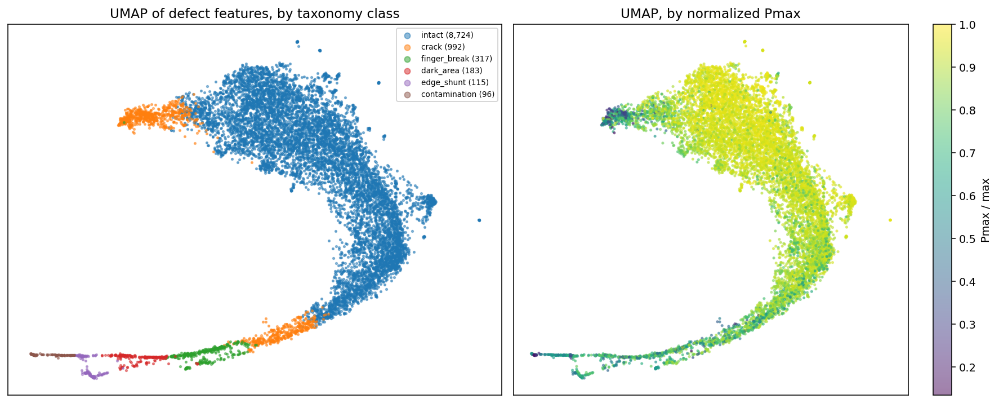

*Figure 5.6. Two-dimensional UMAP projection of the 324-dimensional defect-feature vectors, coloured left by taxonomy class and right by normalized Pmax. The embedding forms a single crescent-shaped manifold: the body of the crescent is the dominant intact population, the upper tip and the beginning of the lower tail carry the adjacent classes, and the long lower tail runs outward through the remaining classes to its tip. The class colouring and the Pmax colouring follow the same gradient along the manifold. Class names are generic without real physics attributions.*

The embedding shows that the defect representation is one continuous manifold with the taxonomy classes occupying successive segments of it, rather than a set of well-separated islands. The k-means partition therefore cuts a continuum, and cells near the segment boundaries could plausibly be assigned to the neighbouring class; a t-SNE of the same features shows the same structure with a rounder body. The taxonomy is accordingly a first selection toward self-supervised labelling, useful for ordering and triage, and refinable in future work by hand-labelling anchor cells along the manifold (§7).

### 5.3 · Electrical performance loss, forward estimation

*(Vocabulary: a **defect map** is an appearance-based non-uniformity map; "defect" makes no claim about the physical mechanism. The **S1 deficit** of a cell equals its **headroom** against the ideal reference; "deficit" is used for a single cell, "headroom" for cohort distributions.)*

Because IV is global and the cell is symmetric, loss is not attributed to a region by inverting the prediction (§1). The defect *location* is observed from the appearance (§5.2); the *electrical effect* is computed whole-cell, in three forward scenarios:

- **S1 (analytic):** predicted IV deficit of the real cell against an ideal reference, `loss_X = ideal_X − pred_X` (FF, Pmax), physical units.
- **S2 (simulation):** remove the observed defect and re-predict → whole-cell ΔIV *gain*
(image-space via NB5 healing → Tier-A; §5.5).
- **S3 (simulation):** add an artificial defect to an ideal cell and re-predict → ΔIV *loss*.

A population-referenced ideal (top-decile of the cohort) provides the S1 reference and is already available from `nb4_counterfactual_headroom_*.parquet`.

**Two concrete NB4 mechanisms realise this forward picture:**

- **Occlusion attribution (NB4 §5.4).** Each tile is neutralised in turn and the cell is
re-scored by the frozen Tier-A model: `ΔFF_k = FF_base − FF_occ_k`, `ΔPmax_k = Pmax_base − Pmax_occ_k`, giving a **9 × 18 sensitivity heatmap** (positive = that tile, when removed, hurts the prediction). Because all seven IV parameters are *direct* heads (§5.1), this attribution carries no ratio-propagation noise. This is a **forward sensitivity of the model's prediction to each tile**, it shows which regions the model leans on, and is read alongside the appearance defect map (§5.2); it is **not** a physical inverse-attribution of the measured loss to a region (which is not identifiable; §1).
- **Counterfactual headroom (NB4 §5.5, the S1 realisation).** Each cell's tiles are shifted
toward the **top-decile centroid** (mean tile features of the 730 training cells with Pmax ≥ 3.32 W) and re-predicted through Tier-A; the **headroom** ΔX = X_cf − X_base is the forward, whole-cell deficit-vs-ideal in physical units.

The same defect signal is used to build a **full-cohort tile-activity map** (NB4 §5.7, `tile_activity` (10427, 9, 18)): the top-10 %-defect tiles are the **active** tiles that become the masked-inpainting targets for the NB5 removal/addition scenarios (S2/S3).

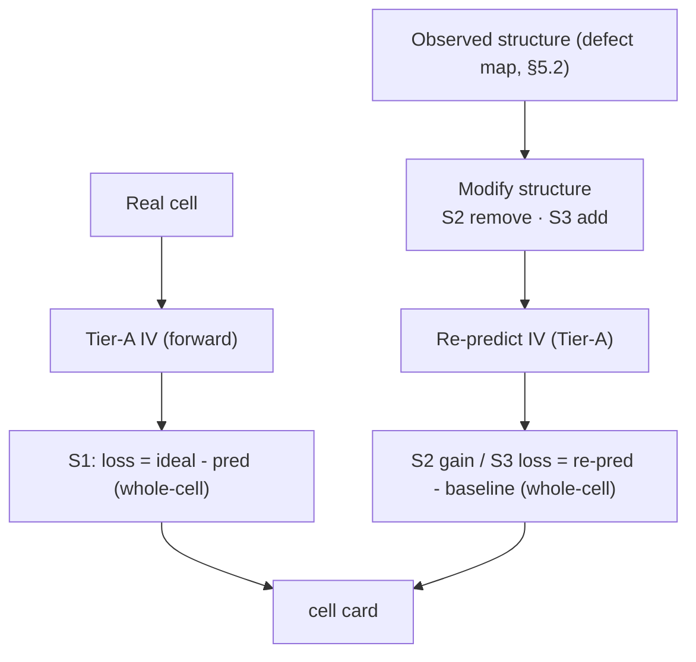
```mermaid
flowchart TD
    OBS["Observed structure (defect map, §5.2)"] --> MOD["Modify structure<br/>S2 remove · S3 add"]
    REAL["Real cell"] --> PRED["Tier-A IV (forward)"]
    PRED --> S1["S1: loss = ideal - pred (whole-cell)"]
    MOD --> REPRED["Re-predict IV (Tier-A)"]
    REPRED --> DIV["S2 gain / S3 loss = re-pred - baseline (whole-cell)"]
    S1 --> CARD["cell card"]
    DIV --> CARD
```

 
The S1 counterfactual measures each cell's headroom against an ideal reference. The reference used here is the population top-decile centroid (the mean over the 730 cells with Pmax ≥ 3.32 W), which represents the best-performing cells actually present in the cohort. The choice of reference is a deliberate degree of freedom rather than a fixed constant: it can be raised as the cell technology improves, by tracking a moving cohort top-decile, or it can be set to any chosen target cell to run simulation scenarios of the form "how much headroom would remain if the ideal were this cell, or that one". The S1 machinery is unchanged by the choice; only the reference vector changes.

The S1 headroom distributions and the occlusion-sensitivity heatmap are results and are shown once, in §6.3 (Figures 6.3 and 6.4).

### 5.4 · Tier-C, ViT/MAE (cross-tile attention)

Tier-A pools the tiles independently through attention-MIL, which weights and sums tile embeddings without using their spatial adjacency. Tier-C introduces cross-tile attention, so that every tile can attend to every other, the mechanism Tier-A lacks; masked-autoencoder pre-training is used to learn a general tile representation before the supervised fine-tune. Rs, the weakest Tier-A target (R² = 0.598 full set, 0.677 confident set), is the parameter this direction was expected to improve.

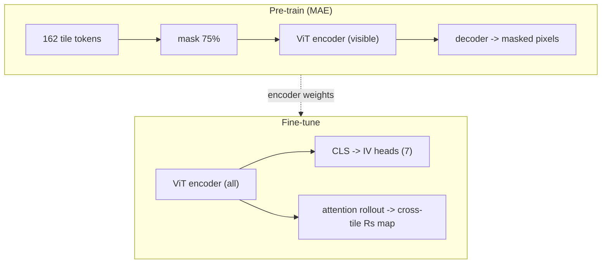
```mermaid
flowchart TD
    subgraph PRE["Pre-train (MAE)"]
      T["162 tile tokens"] --> M["mask 75%"] --> E["ViT encoder (visible)"] --> D["decoder -> masked pixels"]
    end
    subgraph FT["Fine-tune"]
      E2["ViT encoder (all)"] --> CLS["CLS -> IV heads (7)"]
      E2 --> ROLL["attention rollout -> cross-tile Rs map"]
    end
    PRE -. encoder weights .-> FT
```

**Tier-C result (NB6).** Four configurations were trained and evaluated against the Tier-A
test split and gate. (a) **Pixel tokens** (`20260628_230107`): FF 0.512, Pmax 0.651, Rs 0.205. (b) **Feature tokens, plain NLL** (`20260629_130707`): FF −0.18, Pmax 0.26, Rs 0.285 (σ collapse, training NLL → −9.93). (c) **Feature tokens, β-NLL, pooled selection** (`20260629_205140`): Voc 0.863, **Rs 0.551** but FF/Vmax/Imax collapsed to negative R² (no joint fit). (d)
**Feature tokens, β-NLL with per-target loss balancing and worst-target (min-R²) selection**
(`20260630_144408`): the per-target weights are now non-trivial (Voc 0.90, Isc 1.51, Vmax 0.63, Imax 0.96, FF 0.82, Pmax 0.67, Rs 1.50) and the σ collapse is removed (no negative R²), but the result is uniformly weak, test R² Voc 0.483, Isc 0.372, Vmax 0.107, Imax 0.348, **FF 0.140, Pmax 0.169, Rs 0.103** (min-R² +0.07). Balancing the objective converts the previous collapse into uniform mediocrity rather than a fit: with the same loss as Tier-A and a worst-target selection, the tile-token transformer reaches only ~0.1–0.5 R² across targets and never approaches Tier-A on any of them. Tier-C is therefore a **negative result**, the engineered 37-feature representation with attention pooling (Tier-A) is the model of record, and a deeper cross-tile transformer adds no usable predictive power on this cohort. No further Tier-C configuration is pursued in this project.

**Intended design and future path (NB6).** Tier-C was meant to add what the order-agnostic
attention pooling of Tier-A cannot represent: explicit **cross-tile interaction**, so that the spatial topology of non-uniformity could inform the target Rs, with masked-token pre-training learning a general tile representation before the supervised IV fine-tune. On this cohort that intent is not realised: the transformer underfits (a 5 M-parameter attention model on ~7,300 cells is data-limited), and the heteroscedastic objective collapses the predicted σ during the β-NLL phase even with a σ-floor, per-target loss balancing, a reduced-LR partial unfreeze, and worst-target selection, so the only stable checkpoint is the MSE-warm-up one, which is uniformly weak. A path to revisit it could be with a substantially larger dataset; a more stable uncertainty treatment (train μ to convergence under MSE, then fit a separate calibrated σ head rather than a joint heteroscedastic NLL); an inductive bias that encodes adjacency with fewer parameters (a small CNN or a graph over tiles instead of a full transformer); and fusing the Tier-C encoder with Tier-A rather than replacing it. These are marked as possible future work, but are not part of the present deliverable.

### 5.5 · IV-conditioned diffusion (defect removal and addition)

Latent diffusion in the ConvVAE spatial latent (compressed by a SpatialBottleneck), conditioned on IV via FiLM, sampled with DDIM; masked inpainting **removes** an observed defect (S2) or **adds** an artificial one (S3) and decodes the modified-cell image, which is then re-predicted through Tier-A for the whole-cell ΔIV.

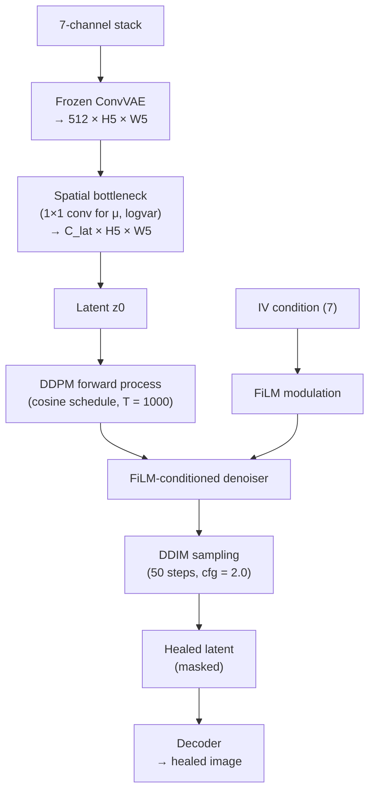
```mermaid
flowchart TD
IMG["7-channel stack"]
IMG --> VAE["Frozen ConvVAE<br/>→ 512 × H5 × W5"]
VAE --> SB["Spatial bottleneck<br/>(1×1 conv for μ, logvar)<br/>→ C_lat × H5 × W5"]
SB --> Z0["Latent z0"]
Z0 --> FWD["DDPM forward process<br/>(cosine schedule, T = 1000)"]
FWD --> DEN["FiLM-conditioned denoiser"]
IVc["IV condition (7)"] --> FILM["FiLM modulation"]
FILM --> DEN
DEN --> DDIM["DDIM sampling<br/>(50 steps, cfg = 2.0)"]
DDIM --> HEAL["Healed latent<br/>(masked)"]
HEAL --> DEC["Decoder<br/>→ healed image"]
```

**Forward scenarios and the removal/addition loop (NB5).** Stage 1 (the SpatialBottleneck
autoencoder) reconstructs the latent accurately (validation MSE 0.0078), and latent standardization keeps inpainted latents on-manifold (within about ±5). Edited latents are decoded through a trained bottleneck-free decoder (`DirectDecoder`, latent → image, validation L1 0.013), so that a masked edit in the latent is faithfully reflected in the decoded image before re-prediction. The cohort-wide occlusion table (NB4; 3,000 cells, 2,789 with electrically-active tiles) supplies the S2 and S3 samples. With this pipeline, S2 (healing 64 damaged cells toward the cohort 90th-percentile IV) and S3 (adding a central defect to 32 clean cells) both re-predict to ΔIV ≈ 0 (S2 inconclusive, all ΔIV ≈ 0; S3 0 of 32, mean ΔPmax +0.000 W). With the faithful decoder, the earlier weak S2 signal (r = +0.327) is shown to have been a decode artefact: the localized diffusion edits do not change the decoded tile statistics enough for the model to read a different IV. This is a coherent negative result, consistent with the non-identifiability premise (§1): a global IV is not recoverable from local structure, and conversely a localized structural edit has no identifiable forward IV effect. The usable forward estimate is therefore the whole-representation headroom, the NB4 counterfactual (S1, §6.3) and the NB5 generative headroom (conditioning the full generation on the cohort 90th-percentile IV, §6.12B: ΔFF +0.096 / ΔPmax +0.48 W). The masked-edit scenarios S2 and S3 are reported as not effective on this cohort.

**Models, losses, and how the diffusion is conditioned.** The generator has two stages, both trained on UBELIX (run `20260629_214259`). Stage 1 is a small variational autoencoder, the *SpatialBottleneck*, that compresses the frozen ConvVAE feature map (512 × H5 × W5) to a much thinner `C_LAT × H5 × W5` latent through 1 × 1 convolutions that output a mean and a log-variance per location. This gives a compact, smooth latent in which nearby points decode to similar-looking cells, which is the property a diffusion model needs. It is trained with reconstruction error plus a small Kullback–Leibler term (`MSE(recon) + β·KL`, β = 0.01; Adam, lr 1e-3, 30 epochs). Stage 2 is a *denoising diffusion probabilistic model* (DDPM): it learns to reverse a gradual noising process, so that starting from pure noise and denoising step by step produces a realistic latent, which the decoder turns into a cell image. The denoiser is a U-Net (an encoder–decoder with skip connections that preserve fine spatial detail). Its output is steered by the seven target IV values through *FiLM* (Feature-wise Linear Modulation): the IV vector is mapped to a per-channel scale and shift that is applied inside the network, so the same denoiser generates a cell consistent with whatever IV is requested. To make that steering adjustable at sampling time, conditioning is randomly dropped for 10 % of training examples (classifier-free guidance); at sampling, a guidance weight `cfg = 2.0` sets how strongly the requested IV is enforced. Training uses a cosine noise schedule over T = 1000 steps (AdamW, lr 3e-4, cosine learning-rate decay, mixed precision, 500 epochs); sampling uses the faster DDIM sampler with 50 steps. The overall loop is: compress to the latent, learn IV-conditioned denoising, then sample or edit a latent (remove or add structure by masked inpainting) and decode it back to an image, which is re-predicted through Tier-A for the whole-cell ΔIV.

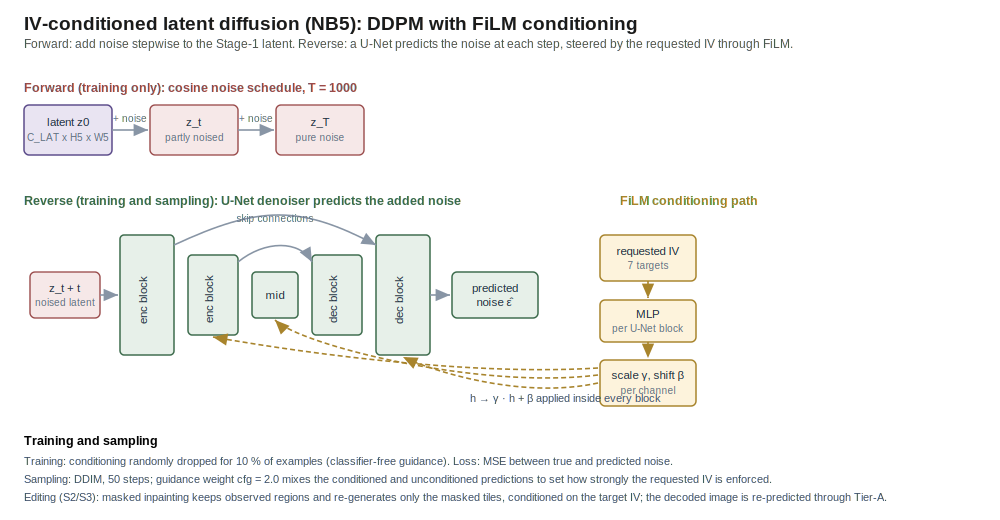

*Figure 5.7. The IV-conditioned diffusion stage in detail: the forward noising and learned reverse denoising over the Stage-1 latent, the U-Net denoiser, and the FiLM conditioning path, in which the seven requested IV values are mapped to per-channel scale and shift parameters (γ, β) applied inside each U-Net block.*

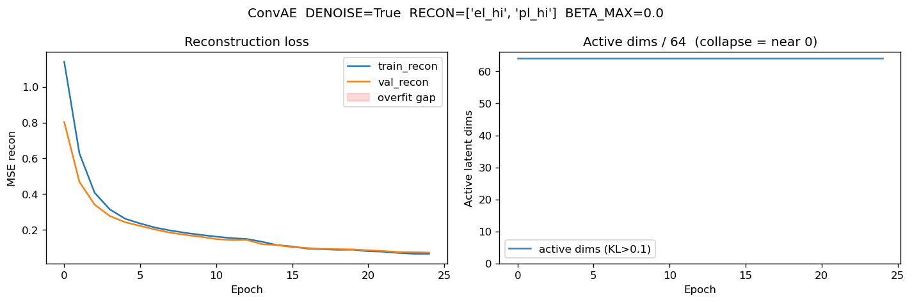

*Figure 5.8. ConvAE / ConvVAE training curves (Track A and Track B), training and validation reconstruction versus epoch.*

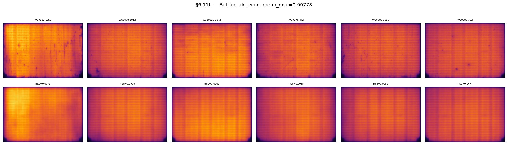

*Figure 5.9. Stage-1 SpatialBottleneck reconstruction (validation MSE 0.0078): original versus round-trip decode.*

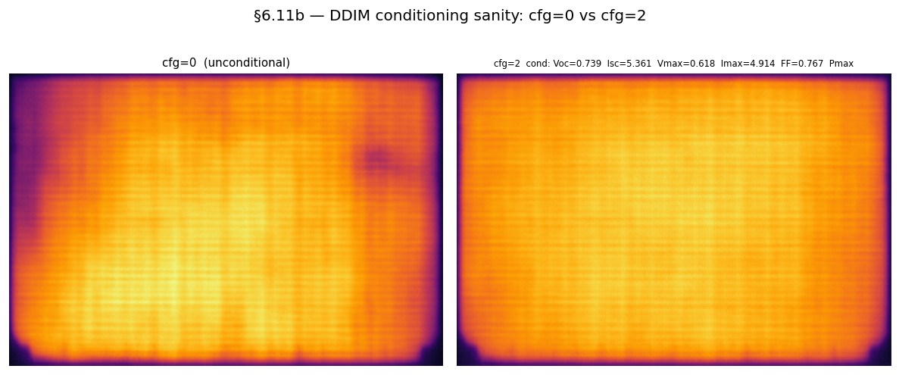

*Figure 5.10. Stage-2 conditioning sanity: samples at guidance cfg = 0 versus cfg = 2, showing that the requested IV visibly steers the generated cell.*

---

## 6 · Results and discussion

### 6.1 · IV prediction

TileSetIV (Tier-A, 37-feature checkpoint `TileSetIV_20260628_213323`) on the test split (n = 1564), reported on the full set and on the abstention **confident set** (96.6 % coverage; §6.2). The acceptance gate is read on the confident set, because abstention is part of the model. Values are from `nb3_comparison_table_20260628_213323.csv`; baselines from `nb2_baseline_comparison_20260628_111631.csv`. Per the figure policy (§2), parity (true-vs-predicted) plots and all IV-parameter axes are normalized to the maximum (each parameter divided by its cohort maximum); R² and ρ are scale-invariant, so the values below are unaffected. The absolute Pmax/Watt figures still quoted in §5 and §6 (abstention and floor thresholds, the top-decile reference, the headroom) are to be shown as their normalized-to-max equivalents in the final figures; the analysis is unchanged.

| Target   | TileSet-A R² (full) | TileSet-A R² (conf. 97 %) | HistGB R² | MLP R² | RF R² | TileSet-A ρ (full) |
| -------- | ------------------- | ------------------------- | --------- | ------ | ----- | ------------------ |
| Voc      | 0.806               | 0.916                     | 0.914     | 0.918  | 0.846 | 0.962              |
| Isc      | 0.760               | 0.822                     | 0.745     | 0.750  | 0.702 | 0.851              |
| Vmax     | 0.903               | 0.910                     | 0.830     | 0.854  | 0.802 | 0.971              |
| Imax     | 0.774               | 0.840                     | 0.832     | 0.832  | 0.773 | 0.946              |
| **FF**   | 0.886               | 0.866                     | 0.831     | 0.818  | 0.770 | 0.960              |
| **Pmax** | 0.778               | **0.908**                 | 0.842     | 0.795  | 0.794 | 0.971              |
| Rs       | 0.598               | 0.677                     | 0.669     | 0.731  | 0.472 | 0.896              |

TileSet-A Spearman ρ is ≥ 0.95 for six of seven targets (Isc 0.851) on the full set and is higher than each baseline's ρ on all seven targets.

**Acceptance gate.** Gate = FF R² ≥ 0.85 and Pmax R² ≥ 0.87. On the full set FF = 0.886 (≥ 0.85)
and Pmax = 0.778 (< 0.87) → the gate is not met on the full set; the Pmax shortfall is located in the degraded floor cluster (true `Pmax < 2.25 W`, 107 of 1564 cells, where full-set Pmax R² = 0.778 vs 0.867 on the main population). Under the abstention rule (μ_pred(Pmax) < 0.8 W, §6.2) Pmax R² = **0.908** at **96.6 % coverage**, so the gate is met on the confident set (FF 0.866, Pmax 0.908). This run differs from the preceding one (e.g. full-set Pmax 0.778 vs 0.854); the model is trained from scratch per run and exhibits run-to-run variation, so the checkpoint id is recorded with every number.

**Baseline comparison.** The NB2 baselines (HistGB, MLP, RF) use the seven direct heads and the cell-level feature representation (`lucia_cell_features.parquet`: per-channel non-uniformity, geometry, 4-channel tile-PCA). On the full set the cell-level baselines exceed Tier-A on Voc, Imax and Rs, and Tier-A is higher on Vmax, FF, Pmax and, narrowly, Isc; on the confident set Tier-A additionally leads or ties on Imax and Vmax. Tier-A's Spearman ρ is higher than every baseline on all seven targets. The pattern is consistent in representational terms: targets whose signal is carried by whole-cell aggregate statistics are captured directly by the position-agnostic cell-level features, while the tile-attention model's advantage concentrates on the spatially structured targets and on rank quality. A grouped permutation-importance check on the HistGB Pmax baseline ranks the per-channel non-uniformity highest (`nu_cv`importance +5.47, `nu_p95p5` +3.81, above the geometry and PCA groups). TileSet-A additionally produces per-cell uncertainty (heteroscedastic σ), the abstention response (§6.2), a spatial attention map (§6.5), and the per-tile pathway used by the NB4 occlusion and forward scenarios; the baselines produce point estimates only. The two are read together: the baselines give an R² reference on a position-agnostic feature set, and TileSet-A adds uncertainty, abstention, and spatial structure.

Both the baselines and TileSet-A rest on the same regenerated 37-feature generation (NB1c on UBELIX, NB2 re-run), so the comparison is on a single feature pipeline.

Physics constraints hold as soft penalties. On the test set the residuals are: `|Pmax−Vmax·Imax|/Pmax`
**6.0 %** (p95 6.7 %), `|Pmax−FF·Voc·Isc|/Pmax` **5.8 %** (p95 9.4 %),
`|Vmax·Imax−FF·Voc·Isc|/Pmax` **2.0 %**. A direct-vs-derived audit supports predicting all seven parameters as direct heads: re-deriving `Isc` as `Pmax/(FF·Voc)` gives R² = −6.75 against the direct head's 0.760, because errors in the three factors compound through the ratio. The lowest-R² target is Rs (0.598 full set, 0.677 confident set); it is the target the order-agnostic pooling resolves least well, and the motivation for the Tier-B and Tier-C directions (§5.1, §5.4).

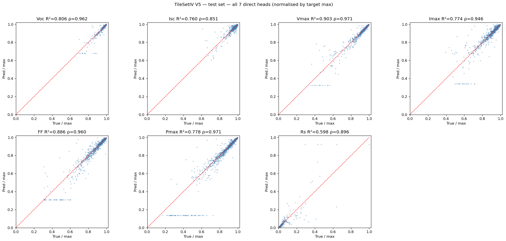

*Figure 6.1. True versus predicted values per target on the test split (n = 1,564), both axes normalized to each parameter's cohort maximum. The tight diagonal on FF, Vmax and Pmax carries the headline R²; the Pmax panel visibly contains the degraded floor cluster, whose predictions detach from the diagonal, and its handling is the subject of §6.2.*

### 6.2 · Uncertainty and abstention *(formal criterion: critical assessment + uncertainty)*

Each prediction carries σ from the heteroscedastic heads. A floor cluster of degraded cells (true `Pmax` below ≈ 2.25 W, 107 of 1564 test cells) is not predicted in absolute terms, the model returns near-floor or non-physical values there, with R² negative on that subset while ρ stays positive. The abstention policy has three rules, applied per cell: **R1** μ_pred(Pmax)
< 0.8 W (Pmax floor), **R2** μ_pred(Rs) > 0.4 Ω (Rs reliability ceiling, flagged separately),
and a **non-physical guard** μ_pred(Pmax) ≤ 0 W (the Yeo-Johnson inverse can return negative values for floor cells). A cell abstains if R1, R2, or the guard fires; flags are read from the NB3 `cell_flags_*.parquet` when present and fall back to the NB7 thresholds otherwise. Under R1, Pmax R² rises from 0.778 (full) to **0.908** on the confident set at **96.6 % coverage**, 53 of 1564 cells (3.4 %) abstained, and the acceptance gate is met on the confident set (§6.1). Per-cell flags (`abstain_r1`, `abstain_r2`, `abstain_nonphys`, `abstain`) are persisted for the downstream notebooks. The Spearman correlation between predicted σ and absolute error is
**ρ(σ, |err|) = 0.43** (Voc, scaled): σ ranks reliability rather than giving exact error bars.

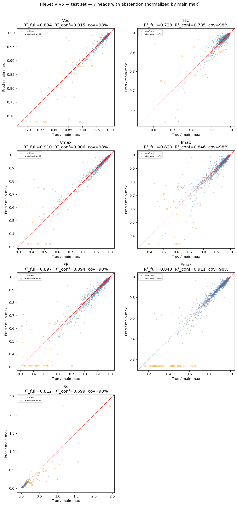

*Figure 6.2a. Predicted versus true values for all seven heads on the test split with the abstention rules applied, all axes normalized to each parameter's cohort maximum. Confident predictions and abstained cells are drawn separately, so the effect of the R1/R2 rules is visible per target: the abstained population sits at the low end of Pmax and detaches from the diagonal, while the confident set hugs it.*

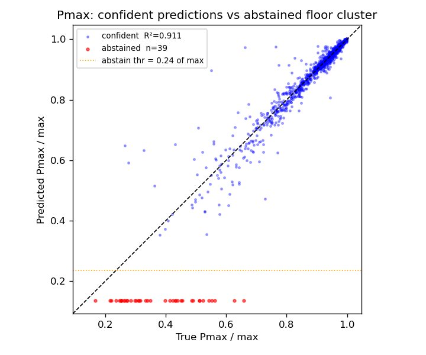

*Figure 6.2b. The Pmax head in detail: confident predictions versus the abstained floor cluster, axes normalized to the Pmax maximum, with the abstention threshold marked. The σ-calibration (per-cell σ versus absolute error) reaches ρ = 0.43, sufficient for rank-based abstention, not for absolute confidence intervals.*
### 6.3 · Electrical performance loss (forward)

**S1, counterfactual headroom (NB4).** Re-predicting each cell with its tiles shifted to the
top-decile centroid gives the whole-cell deficit-vs-ideal. Across the cohort (`nb4_counterfactual_headroom_20260629_205142.parquet`, 10,948 rows): **FF headroom median +0.011** (mean +0.052; **positive for 91.0 %** of cells) and **Pmax headroom median +0.110 W** (mean +0.259 W; **positive for 97.1 %**). The interpretation is direct: almost every cell sits below the top-decile profile, and the model quantifies by how much in physical units; the small fraction with negative headroom already exceeds the top-decile profile on that parameter. The headroom scales with the appearance defect signal (more defect-`el_hi` → larger headroom), linking *where it looks bad* to *how much it could gain*.

**Occlusion sensitivity (NB4, diagnostic).** On the example cells the ΔFF / ΔPmax tile
heatmaps concentrate on the same regions flagged by the appearance defect map, the model's prediction is most sensitive to the visibly degraded tiles. This is a model **diagnostic**, not a loss map and not an identification of a responsible region: the electrical magnitude is whole-cell (§1). A three-way tile labelling (active / non-uniform / passive) at the 75th-percentile thresholds (ΔFF₇₅ = 0.006, defect-EL₇₅ = 0.030) marks the tiles that are both electrically lossy in the occlusion sensitivity and morphologically defective as the NB5 inpainting targets.

**Taxonomy and per-class IV (NB4).** The six defect classes are monotone in both defect extent
and FF/Pmax (§5.2): mean Pmax decreases from 3.15 W (*intact*) to 1.78 W (*contamination*) and mean FF from 0.770 to 0.613. Per-class physical loss accounting follows a hand-labelled taxonomy (§7).

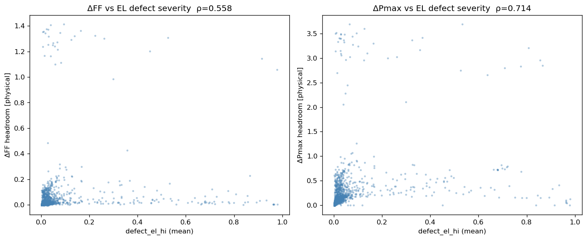

*Figure 6.3. S1 headroom distributions (FF, Pmax) and the headroom-versus-defect scatter.*

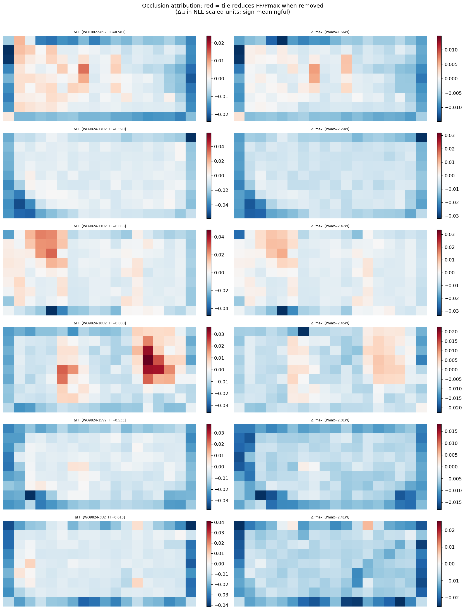

*Figure 6.4. Occlusion-sensitivity heatmap: the per-tile ΔFF / ΔPmax sensitivity map for example cells (diagnostic, NB4). Shown once here.*

**S2 status:** the NB5 now decodes with a trained bottleneck-free decoder (val L1 0.013) and samples S2/S3 from the cohort-wide occlusion table (§5.5). With faithful decoding, **S2** (heal 64 damaged cells) and **S3** (add a defect to 32 clean cells) both re-predict to **ΔIV ≈ 0**, localized diffusion edits do not move the predicted IV (the earlier r = +0.327 was a decode artifact). The masked edit scenarios are not effective on this cohort. The usable forward estimate is the whole-representation headroom: NB4 S1 (median Pmax +0.110 W) and the NB5 generative headroom (§6.12B: ΔFF +0.096 / ΔPmax +0.48 W). The defect *location* is observed (appearance) and the model *sensitivity* is localised (occlusion); the *electrical magnitude* is whole-cell forward, with no per-region attribution (§1).

### 6.4 · The cell report card *(headline deliverable)*

For one cell the card (rendered by NB7) shows: the input channels; predicted IV (μ ± σ vs truth, abstention badge, constraint-residual audit); the defect map (full-res residual + 9×18 tile grid, appearance = where); and the whole-cell electrical performance loss (S1 deficit vs the cohort-p90 ideal, and, where the cell is in the NB5 S2/S3 sets, real → healed (S2) and real → defected (S3) thumbnails with their ΔIV). The rendered set (5-page PDF) spans the performance envelope (healthy / low-FF / high-Rs-abstained); the S2/S3 ΔIV shown are ≈ 0 (§5.5), so the cards present the localized edits as appearance changes without a forward IV effect.

NB7 inference: the latest TileSetIV checkpoint is loaded; the model is rebuilt from the checkpoint's stored dimensions; the Yeo-Johnson inverse parameters are read from `nb3_ckpt['pt_params']` so predictions are returned in physical units. Abstention is evaluated **before** rendering, per cell: rules R1 (μ_pred(Pmax) < 0.8 W), R2 (μ_pred(Rs) > 0.4 Ω) and the non-physical guard (μ_pred(Pmax) ≤ 0 W); flags are taken from the NB3 `cell_flags_*.parquet` when present and from the NB7 thresholds otherwise. When a cell abstains, the S1 deficit is set to NaN (printed "S1 SUPPRESSED"), the IV panel is drawn without the deficit/loss annotations and carries an ABSTAINED badge, the appearance defect map is retained, and the loss columns are blank in the cohort-summary table. The S1 reference is the cohort p90 (FF = 0.802, Pmax = 3.319 W); the deficit is `max(0, ideal − pred)`, and predictions at or above the reference are reported as "at/above p90" rather than as a negative loss.

*Figure 6.5. Layout of the NB7 report card: header with abstention badge, the seven-channel input strip (raw channels stamped), and the three content panels, IV prediction with constraint audit, appearance defect map, and whole-cell electrical loss (S1 deficit, S2/S3 thumbnails where available), plus the optional Tier-C comparison row.*

 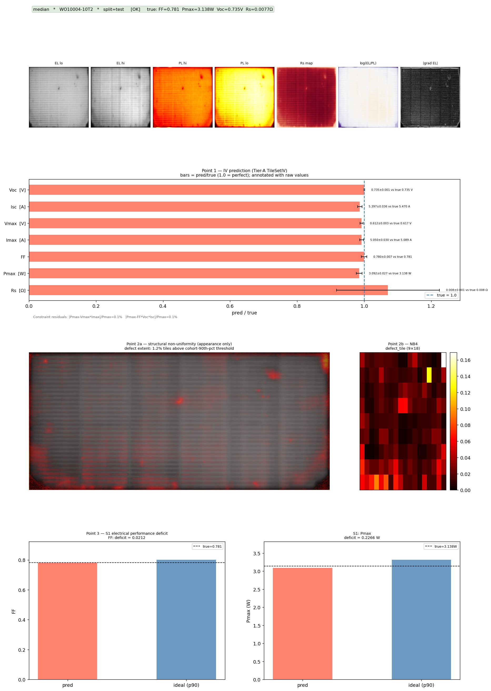
 
 
The figure above is one example card (the median cell); the full five-card set spanning the performance envelope is in Appendix G. NB7 loads the 37-feature checkpoint `TileSetIV_20260628_213323`, binds `PT_PARAMS` from the checkpoint (predictions in physical units), and evaluates abstention before rendering (rules R1/R2 and the non-physical guard). The cohort summary for the five envelope cells is Table 6.3.

**Table 6.3.** Envelope cell cards (NB7), IV values normalized to their cohort maximum. `high_rs`
abstains (its Rs prediction falls outside the valid range), so its loss columns are undefined. The S1 deficit is measured against the fixed cohort 90th-percentile reference (normalized FF 0.972, Pmax 0.964).

| label | cell | FF true | FF pred | Pmax true | Pmax pred | abstain | S1 FF deficit |
|---|---|---|---|---|---|---|---|
| high_perf | WO9998-7T2 | 0.983 | 0.979 | 0.980 | 0.978 | no | 0.000 |
| median | WO10004-10T2 | 0.947 | 0.947 | 0.911 | 0.898 | no | 0.026 |
| low_ff | WO9997-27K2 | 0.867 | 0.859 | 0.857 | 0.848 | no | 0.113 |
| low_pmax | WO10116-20T2 | 0.660 | 0.654 | 0.639 | 0.672 | no | 0.318 |
| high_rs | WO10094-39S2 | 0.304 | n/a | 0.249 | n/a | yes | n/a |

The card is an illustration across the envelope, not a quantitative result: the defect map shows *where* structure is (appearance), and the S1 deficit is the whole-cell forward estimate, with no attribution of loss to a region (§1).

### 6.5 · Limitations

Isc and the Isc-linked Pmax plateau at R² ≈ 0.76–0.78 on the full set, which indicates the luminescence images carry limited information about these current-related targets. The attention map has two components: it localises to low-emission (defective) regions (Spearman ρ between tile mean emission and attention weight is **−0.65 / −0.58 / −0.58** for EL_lo/EL_hi/PL_hi) and it has a border/perimeter component (border ρ =
**+0.80**, grad(EL) ρ = +0.50); it is therefore used as a model diagnostic and as the appearance
prior, not directly as a loss signal. These two components are shown in Figure 6.6: the cohort-mean attention grid makes the perimeter weighting visible, and the per-channel decomposition shows the same map correlated against each channel's tile-mean emission. Loss is not attributed to a region, IV is global and the cell symmetric (§1); the forward estimates are whole-cell; the S2/S3 re-prediction loop is closed and returns ΔIV ≈ 0 (§5.5), so S1 and the generative headroom are the forward estimates of record. Rs has the lowest R² (0.598 full set, 0.677 confident set; §5.4). Soft-constraint residuals are 5.8–6.0 % (§6.1). Single cohort; no external validation yet. The per-target R² varies run-to-run (each run is trained from scratch); reported numbers are tied to a named checkpoint.

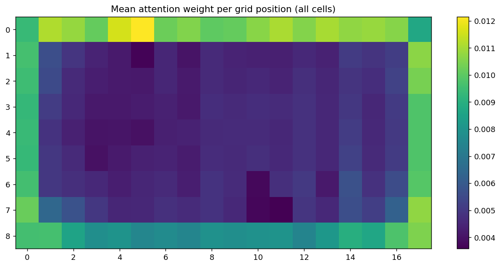

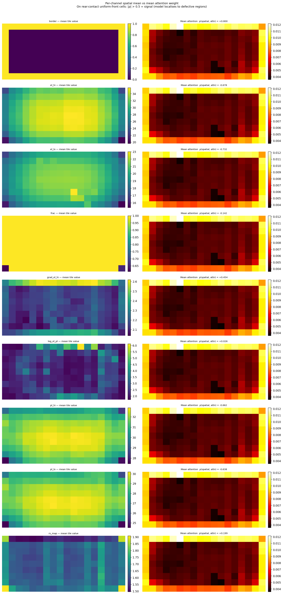

*Figure 6.6. Tier-A attention diagnostic (NB3). Left/top: the cohort-mean gated-attention weight over the fixed 9 × 18 tile grid, revealing the border/perimeter component (border ρ = +0.80). Right/bottom: the same attention decomposed per channel against each channel's tile-mean emission, showing the low-emission localisation (ρ = −0.65 / −0.58 / −0.58 for EL_lo/EL_hi/PL_hi). The map is read as a model diagnostic and as the appearance prior, not as a per-region loss attribution (§1).*

The 37 per-tile features are marginal per-channel statistics; inter-channel structure enters only through the two engineered ratio channels, so inconsistencies between the four luminescence images (for example single-channel measurement artefacts) are visible to the models only indirectly. A cross-channel consistency audit, joint tile features and a consistency-based QC gate are defined as the next data-quality increment; the unresolved cause of the §4.2 floor cluster (physical degradation versus per-channel measurement artefacts) is part of that increment.

Two later-tier results are negative and are reported in full where they arise: the Tier-C cross-tile transformer does not reach Tier-A on any target (§5.4), and the S2/S3 masked-edit scenarios re-predict to ΔIV ≈ 0 (§5.5), consistent with the non-identifiability premise (§1). Their consequence for the deliverable is stated once here: Tier-A remains the model of record, and the forward estimate of record is the whole-representation headroom (S1 and the generative headroom), not localized editing.

---

## 7 · Conclusion and Outlook

LUCIA delivers an integrated report card from luminescence imaging that combines three outputs: a calibrated prediction of solar-cell IV performance with abstention where appropriate, an appearance-based defect map, and a forward estimate of the whole-cell electrical performance loss associated with the observed structure.

What is established in this project is the Tier-A tile model (NB3) and the supporting image representation on which it depends. The Tier-A model predicts the seven IV parameters from the registered per-tile features and provides both per-cell uncertainty and an abstention response. On the test split, it reaches FF R² = 0.886, and on the confident set it reaches Pmax R² = 0.908 at 96.6% coverage. For six of the seven targets, Spearman ρ ≥ 0.95, so the acceptance gate is met on the confident set. This predictive layer is enabled by the register-then-tile representation developed in NB1 and NB1b and by its quality gate in NB1-QC. NB4 adds the corresponding appearance layer: defect maps, a six-class taxonomy that is monotone in FF and Pmax (classifier 0.976), an occlusion-sensitivity diagnostic, and the S1 counterfactual headroom estimate with median gains of +0.011 in FF and +0.110 W in Pmax. Together, these components constitute the project deliverable.

At the same time, several later-tier directions remain negative or open. The Tier-C ViT/MAE approach (NB6), evaluated in four configurations including the Tier-A objective with per-target balancing, does not match Tier-A on any target; in the balanced run, the reported values are 0.14 for FF, 0.17 for Pmax, and 0.10 for Rs. On this cohort, a deeper cross-tile transformer therefore adds no usable predictive power. Likewise, the NB5 masked-edit scenarios, S2 removal and S3 addition, were evaluated using a faithful trained decoder together with a cohort-wide occlusion table and re-predict to approximately ΔIV ≈ 0. In other words, localized diffusion edits do not measurably move the predicted IV, which is consistent with the non-identifiability premise introduced in §1. The forward performance-loss estimate that does operate meaningfully is therefore the whole-representation headroom, namely NB4 S1 with median Pmax +0.11 W and the related NB5 generative headroom, rather than localized editing.

There are also two important limitations on the present comparisons. First, the NB2 baselines still use the legacy cell-feature set, so the comparison in §6.1 rests on a single feature generation only after NB1c is regenerated and NB2 is re-run. Second, all reported results come from a single cohort and have not yet been externally validated.

**Outlook:** The next steps follow directly from these findings. The first priority is to regenerate the 37-feature cell features in NB1c and re-run the NB2 baselines so that the comparison in §6.1 rests on one consistent feature generation. The second is to replace the NB4 bootstrap taxonomy by a hand-labelled set in order to support per-class physical loss accounting. The third is external validation on a held-out lot. The fourth is extension from cell-level analysis to the module level. By contrast, the later-tier directions that were negative on this cohort, namely a cross-tile transformer for Rs and localized generative editing for forward loss estimation, should be regarded as recorded negative results under the present data regime and would require a substantially larger, multi-lot dataset before reconsideration.

A further methodological direction is flexible ROI aggregation based on the registered tile basis. Instead of representing the cell only through a fixed cell-level vector, the legacy ROIs could be reconstructed as selectable tile aggregates such as left versus right, border versus inner, or centre-8 groups. These could then be added to TileSetIV as an explicit ablation, for example as additional border/inner ROI features. Since the current AttnMIL pooling does not construct such groupings explicitly, this would provide a controlled intermediate step between the legacy hand-designed ROIs and the group structure that a transformer with cross-tile attention would, in principle, learn directly.

---

## 8 · Acknowledgements

I like to acknowledge and thank the former R&D Team for Meyer Burger Research that developed and processed the investigated cell technology of rear contacted silicon solar cells, the tutors of the CAS AML (25-26) that inspired and enabled the data science aspects of the is project and the supportive environment, that gave me the trust and encouragement to carry out this project from start to end.

---

## References

1. Haunschild, J.; Glatthaar, M.; Kasemann, M.; Rein, S.; Weber, E. R. (2009). Fast series resistance imaging for silicon solar cells using electroluminescence. *physica status solidi (RRL)* 3(7-8), 227-229. doi:10.1002/pssr.200903175.
2. Breitenstein, O.; Khanna, A.; Augarten, Y.; Bauer, J.; Wagner, J.-M.; Iwig, K. (2010). Quantitative evaluation of electroluminescence images of solar cells. *physica status solidi (RRL)* 4(1-2), 7-9. doi:10.1002/pssr.200903304.
3. Ilse, M.; Tomczak, J. M.; Welling, M. (2018). Attention-based deep multiple instance learning. *ICML*.
4. He, K.; Chen, X.; Xie, S.; Li, Y.; Dollár, P.; Girshick, R. (2022). Masked autoencoders are scalable vision learners. *CVPR*.
5. Ho, J.; Jain, A.; Abbeel, P. (2020). Denoising diffusion probabilistic models. *NeurIPS*.
6. Nichol, A.; Dhariwal, P. (2021). Improved denoising diffusion probabilistic models. *ICML*.
7. Seitzer, M.; Tavakoli, A.; Antic, D.; Martius, G. (2022). On the pitfalls of heteroscedastic uncertainty estimation with probabilistic neural networks (β-NLL). *ICLR*.
8. Kingma, D. P.; Welling, M. (2014). Auto-encoding variational Bayes. *ICLR*.
9. Yeo, I.-K.; Johnson, R. A. (2000). A new family of power transformations to improve normality or symmetry. *Biometrika* 87(4), 954-959.
10. CAS Advanced Machine Learning course materials, University of Bern (2025-2026).
11. Data source: proprietary rear-contact silicon solar-cell luminescence dataset (withheld; see Data availability).

---

## Appendix

### Appendix A, IV parameters, channels, and Tier-A configuration

**A.1, the seven IV parameters.**

| Parameter | Meaning |
|---|---|
| Voc | open-circuit voltage |
| Isc | short-circuit current |
| Vmax, Imax | voltage and current at the maximum-power point |
| FF | fill factor, Pmax / (Voc · Isc) |
| Pmax | maximum power |
| Rs | series resistance |

**A.2, channels and the property they report.**

| Channel | Acquisition | Reports |
|---|---|---|
| `EL_lo` | electroluminescence, low injection (≈ 0.5 A) | injection at low bias |
| `EL_hi` | electroluminescence, high injection (≈ 6 A) | passivation and contact quality |
| `PL_hi` | photoluminescence, ≈ 1 sun (red + IR) | recombination; out-of-cell edge artefact present |
| `PL_lo` | photoluminescence, ≈ 0.5 sun (red only) | recombination; clean edges |
| `rs_map` | synthesized (E.3) | local series resistance |
| `log_el_pl` | synthesized (E.3) | contact quality separated from passivation |
| `grad_el_hi` | synthesized (E.3) | cracks, finger interruptions |

**A.3, Tier-A configuration (Optuna study `optuna_TileSetIV_V5`, best trial 103, study
validation NLL −1.911; checkpoint `TileSetIV_20260628_213323`, best training-run validation NLL
−1.267 at epoch 65).**

| Hyperparameter | Value |
|---|---|
| `n_feat` | 37 |
| `embed_dim` | 64 |
| `hidden_attn` | 32 (embed_dim / 2) |
| `LR` | 1.485e-3 |
| `WARMUP_NLL` | 27 epochs (MSE warm-up before the NLL phase) |
| `BETA_NLL` | 0.6412 |
| `LAMBDA_C` | 0.1 (soft physics-consistency penalty) |
| `CONTRASTIVE_W` | 0.05 |
| `FEAT_NOISE_SIGMA` | 0.0 |
| parameters | ≈ 26 k |

### Appendix B, full comparison and selective prediction

Table 6.1 (§6.1) is the complete per-target comparison (Tier-A full and confident sets, HistGB,
MLP, RF, and Spearman ρ). The Pmax selective-prediction breakdown behind Figure 6.2b:

| Set | n | R² | ρ | Coverage |
|---|---|---|---|---|
| All cells | 1 564 | 0.778 | 0.971 | 100 % |
| Confident | 1 511 | 0.908 | 0.968 | 96.6 % |
| Abstained | 53 | n/a | n/a | 3.4 % |

Gate R² ≥ 0.87 on the confident set: met.

### Appendix C, registration QC

On the kept cells: rms probe residual median 1.93 px (p99 below the 3.0 px tolerance), rotation
θ median 0.141°, registered area median 13 704.9 mm² (band 13 640 to 13 780, area-preserving by
construction). Registration tiers: `probes_rigid` 6 594, `probes_refit` 3 898, `reject` 63
(0.6 %, `geom_keep = False`). Distributions: Figure 2.3; method: `edge_detection.md`.

### Appendix D, per-tile feature dictionary

Each of the 162 tiles carries 37 features: two geometry/quality flags, `is_border` and
`active_frac`, plus five statistics for each of the seven channels of A.2, computed over
mask-active pixels only: mean, standard deviation, uniformity (std/mean), entropy, and skew.
Feature names follow `<stat>_<channel>` (for example `mean_el_hi`, `uniformity_rs_map`). The
model input per cell is the fixed, ordered array of 162 × 37 values.

### Appendix E, data artefacts, formats, and schemas

The complete artefact catalogue (image tensors, parquet schemas, model checkpoints, result
files, and conventions) is maintained as the companion document
**`LUCIA_appendix_data_artefacts.md`** in the same folder; row counts marked (verify) there are
to be confirmed against the filesystem once before submission.

### Appendix E.3, synthesized channels

The three engineered channels are computed by `lc.synthesize_channels` (single source of truth, used identically by the feature extraction and the PyTorch dataset), with ε = 1, `V_T = 0.02585 V`, `T_hi = 40 ms`, `T_lo = 600 ms`.

**Series-resistance image (`rs_map`).** A fast series-resistance electroluminescence image following Haunschild et al. (2009), using two EL images at different injection currents and the two-image iterative evaluation of Breitenstein et al. (2010). For each pixel the local EL intensity is Φ_i = C_i·exp(U_i/U_T); from two bias images the local voltage and local diode saturation current are estimated and the local series resistance R_{s,i} is iterated to convergence, with a scaling factor chosen so the mean of the local image matches the global series resistance of the cell. The implemented result is clipped to [0, 5] Ω·cm² and, in the kept cohort, has physical tile means (median 0.896, 95.8 % within 0.3–2.0; NB1-QC Check 6).

**EL/PL ratio (`log_el_pl`).** `log_el_pl = ln[(EL_hi + ε)/(PL_hi + ε)]`.

**EL gradient (`grad_el_hi`).** `grad_el_hi = |∇ EL_hi| = hypot(∂ₓEL_hi, ∂_yEL_hi)`, sensitive to cracks and finger interruptions.

### Appendix F.0, runs of record

| Artefact | Checkpoint / run-id |
|---|---|
| Tier-A model of record | `TileSetIV_20260628_213323` |
| NB2 autoencoders (Track A/B) | `RUN_ID 20260628_111631` |
| NB4 defect maps, taxonomy, occlusion, S1 | `20260629_205142`; cohort occlusion `20260630_102726` |
| NB5 diffusion, S2/S3, previews | `20260630_103347` |
| NB6 Tier-C final (balanced) | `20260630_144408` |
| NB7 cards + cohort summary | `20260630_103347` |

---

### Appendix G, the five envelope cell cards

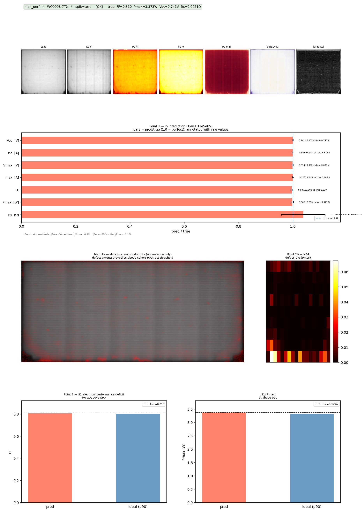

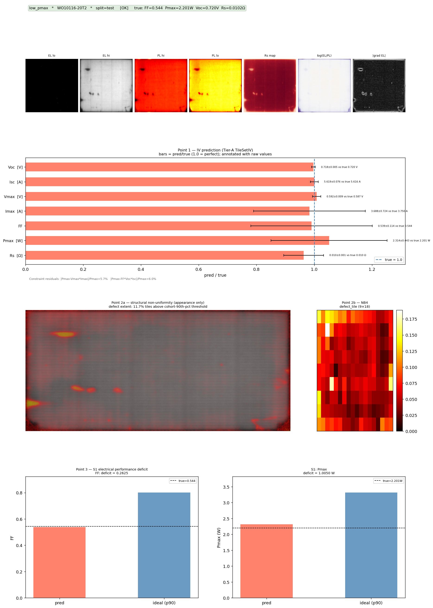
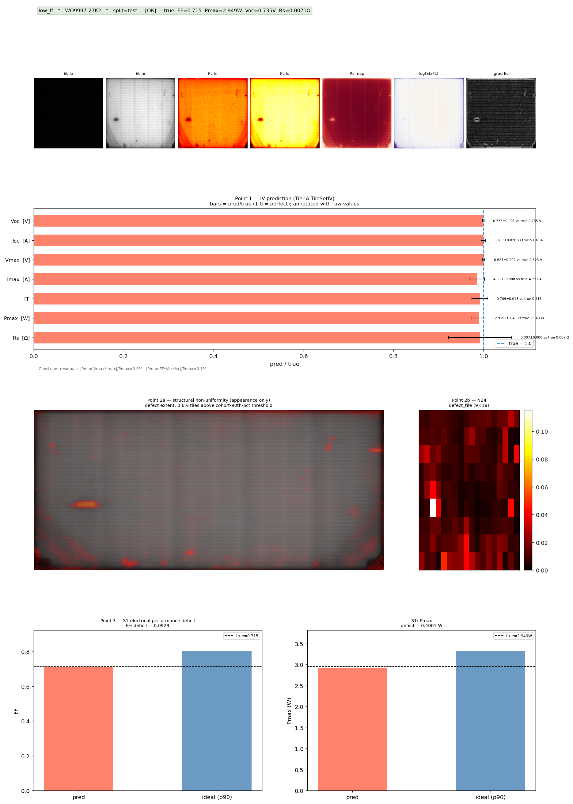
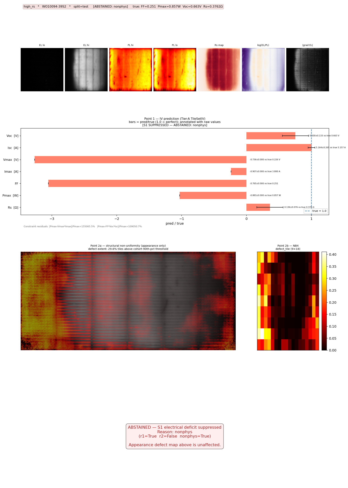

*Figures G.1–G.5. NB7 report cards across the performance envelope (high-performing, median, low-FF, low-Pmax, high-Rs/abstained); IV values normalized to max. Note before public release: the card filenames and panels carry the real cell identifiers; rename the files and redact the identifier text on the cards.*

